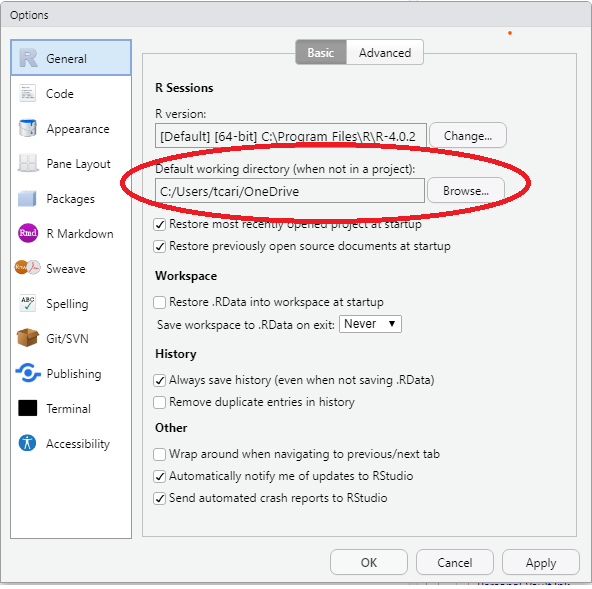
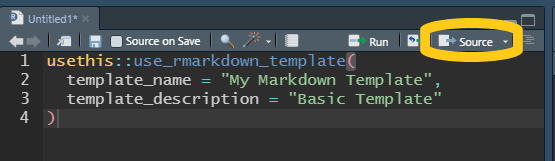
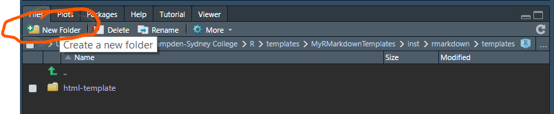

# Introduction {#intro}

In this chapter we will offer description of R, RStudio, and R Markdown. These are the software/programs you will need throughout the manual. 

## Install R and RStudio

R is an open source statistical package that is free and platform independent.  R can be downloaded for any platform [The Comprehensive R Archive Network (CRAN)](https://cran.r-project.org).   After clicking the link, choose the appropriate (Linux, (Mac) OS X, or Windows) installation file for R. Download and install R on your computer.  

All of the work will in this companion has been done in RStudio. We strongly recommend the use of RStudio as opposed to the R GuI to do your work in R.  RStudio is an integrated development environment (IDE) for R.  It includes a console, syntax-highlighting editor that supports code execution, as well as tools for plotting, history, debugging, workspace management, and report writing.  Like R, RStudio is open source and free to download and use.  Follow the link [RStudio Desktop](https://www.rstudio.com/products/rstudio/download/#download) to choose the appropriate version for your environment.    

RStudio is also available in a cloud based version at [RStudio Cloud](https://rstudio.cloud/) which can be used with an web browser without having to perform a local install of R or RStudio.  There is a free version of this as well.

In addition, since you will need to write reports, [R Markdown](https://rmarkdown.rstudio.com/index.html) gives you the ability to integrate documents with your code to produce outputs in a variety of formats.  R Markdown is an integrated part of RStudio.  This companion was written using R Markdown.

An R Notebook makes it easy to test and iterate when writing code.  R Notebooks can be shared as `html` documents with individuals who don't have RStudio.  And for those who do have RStudio, the R Notebook's `html` file has the code embedded in it so that it can be opened in RStudio.

RStudio also includes a code editor which allows you to maintain a file of your 'scripts' as you complete your code.  This script file also allows for relatively easy editing and debugging of your code as you write it.  

### Suggested Global Option Settings

We strongly encourage the following options be set in *Tools > Global Options...* drop down menu.

(@)  **Workspace**
    a. un-check *Restore .RData into workspace at startup.*^[This will ensure that you start with a clean session when you start RStudio.]
    a. Choose *Never* from the drop down menu in *Save workspace to .RData on exit:*
    

    
(@) Default working directory

We suggest that you create a folder to keep all your work for this course with a name that makes sense to you given your institution.^[For example, at Hamdpen-Sydney College you might name it *econ306*.] Set the directory in *Tools > Global Options...* as below:^[We suggest that browse the directory and chose it unless you are confident with path names.]  Each time you start RStudio it will start in the directory for this course. 



(@) Code Display options

In the *Tools > Global Options...* dialog box chose *Code* then chose the *Display* tab. Check the boxes to *Allow scroll past the end of document*, *Highlight R function calls*, and *Rainbow Parenthesis*.


## Using RStudio

RStudio contains 4 panes that make elements of R easier to work with than they would be working in R GUI. 

### Source Pane

The Source Pane in the upper left contains your code and can be accessed with the keyboard shortcut `ctrl+1`.  This pain includes any R Markdown files, R Notebook files, and R Script files that you may have opened.  It will also contain any data that you `view` or information about attributes of an object when clicked in the environment pane.


### Environment/History Pane

You'll find the Environment/History pane in the top right.  The Environment tab shows you the names of all the data objects you have defined in the Global Environment of the current R session.  You can directly access the environment with `ctrl+8`. This tab is `objects()` command mentioned in the text on steroids. By clicking on the triangle icon next the object name you receive the same information as calling `str()` or `tibble::glimpse()` on the object. Clicking on the grid icon the right of the name will call `view()` and the object will be displayed in the Source Pane.  `view` will display all of the data in a data frame.  `head()` displays the first six observations.  The History tab contains all the code you that you've run.  You can directly access the history tab with `ctrl+4`.  If you'd like to re-use a line from your history, click the To Console icon to send the command to the Console Pane, or the To Source icon to send the command to the Source Pane.  


### Console Pane

The Console Pane in the bottom left is essentially what you would see if you were using the R GUI without R Studio.  It is where the code is evaluated.  You can type code directly into the console and get an immediate response.  You can access the Console Pane directly with `ctrl+2`.  With your cursor in the Console you can access any previous code with `ctrl+up` and use the arrow keys to pick the line you'd like to use.  Using the up arrow will show the lines of code one at a time from the last line ran to the first line available in the R session. If you type the first letter of the command followed by `ctrl+up` you will get all of the commands that you have used that begin with that letter.  Highlight the command and press return to place the command at the prompt.

### Files/Plots/Packages/Help Pane

The last pane is on the bottom right.  The files tab (`ctrl+5`) will show you the files in the current working directory.  The plots tab (`ctrl+6`) will contain any plots that you have generated with the base R plotting commands. The packages tab (`ctrl+7`) will show you all of the packages you have installed with checks next to the ones you have loaded.  Packages are collections of commands that perform specific tasks and are one of the great benefits of being part of the R community.  Finally, the help tab (`ctrl+3`) will allow you get help on any command in R, similarly to `?commandname`.  Initially understanding R help files can be difficult; follow the link [A little more about R](https://socviz.co/appendix.html#a-little-more-about-r) from Kieran Healy's *Data Visualization* for a good introduction.  In addition `args(commandname)` displays the argument names and corresponding default values (if any) for any command.  

Double clicking a `csv` file in the Files tab will open the data in the Source Pane.

Find a nice overview of R Studio at [RStudio Layout](https://rbasics.netlify.app/3-rstudiobasics.html#rstudio-layout)

## R Markdown

You will complete your homework, reports, etc. using [R Markdown](https://bookdown.org/yihui/rmarkdown/). R Markdown gives you the ability to integrate text with your code to produce outputs in a variety of formats.  

R Markdown allows you to combine R code with your report for seamless integration.  R code can be included in a markdown file as [Code Chunks](https://rmarkdown.rstudio.com/lesson-3.html) or directly within the [text](https://rmarkdown.rstudio.com/lesson-4.html).

To create an new R Markdown file inside of RStudio by clicking `File > New File > R Markdown...` or `alt-f-f-m` A dialog box will appear choose a title that is descriptive of the work you are doing, click `OK`. This will create a default R Markdown.  The first thing it creates is yaml header.  The header includes the title, author, date, and default output file type.  You will want to retain this.  It will also generate R code chunk with knitr^[knitr is an engine for dynamic report generating within R.] options.  You will want to retain this R chunk.  You need not retain any of the remaining parts of the file generated. 

To create an new R Notebook file inside of RStudio by clicking `File > New File > R Notebook` or `alt-f-n-n`.  An R Notebook allows you to directly interact act with R in a way that allows you to create reproducible documents that can be viewed in a web browser.
For more on R Notebooks see [Notebook](https://bookdown.org/yihui/rmarkdown/notebook.html) in *R Markdown: The Definitive Guide*

Markdown is a simple formatting syntax for authoring HTML, PDF, and MS Word documents. For more details on using R Markdown see <http://rmarkdown.rstudio.com>.

When you click the **Knit** button a document will be generated that includes both content as well as the output of any embedded R code chunks within the document. 

Scroll down to the **Overview** at <https://github.com/rstudio/rmarkdown> for more on markdown.  I strongly suggest you work through the [Markdown formatting](https://www.markdowntutorial.com/) tutorial for an introduction to basic formatting in Markdown.

For more help getting started in R Markdown, please see the [R Markdown website](https://rmarkdown.rstudio.com/lesson-1.html).

### Create R Markdown Templates

Create your own R Markdown templates to prevent having to delete the boilerplate in the default R Markdown file.  

#### Introduction

We will learn to make our own R Markdown template(s). You will create and install a package that includes one or more templates that you wish to use. You can use a user defined template by choosing **File \> New File \> R Markdown...**, choosing **From Template**, and choosing your custom template from the list in the dialog box.

Follow the steps below to create and install your custom template.

#### Required Packages

We will use the devtools and usethis packages to create and load the template(s). Check for installation with:

```{r installed, eval = FALSE}
(installed.packages()[,1] == "devtools") %>% sum()
(installed.packages()[,1] == "usethis") %>% sum()
```

If a 1 is returned, we have the package installed. If a 0 is returned we don't have the package. If you haven't installed these packages you will need to install them with:

```{r install-packages, eval = FALSE}
install.packages("usethis")
install.packages("devtools")
```

#### Create a project

Before you begin these steps, find or create a directory for your templates.[^1]

[^1]: I strongly suggest that you create a directory (folder) to keep all your R work in and make that your default working directory in **Tools \> Global Options**. Each time you open R it will default to that directory. I also suggest creating a directory (folder) named **data** and a directory (folder) named **images** inside your default R directory (folder).

1.  Create a project to house your template go **File -\> New Project**


2.  Choose **New Directory**


3.  Choose **R Package**


4.  Name the package and choose the directory in which to place it. Choose **Open in new session**.


5.  Click **Create Project**

You can close the `hello.R` file. We won't be using it.

#### Create template folders & files

Create a new script file with **File -\> R Script**.


To create the files necessary to create the template call

```{r eval = FALSE}
usethis::use_rmarkdown_template(
  # give your template a name that will be shown in the template menu
  template_name = "Template Name", 
  # describe the template - this will help you identify the template when
  # you are creating a markdown file.
  template_description = "My Template's Description"
)

```


Execute the code in the script by clicking the Source button in the Source Pane.



Your files pane should look similar to this:


#### Edit `skeleton.Rmd` {.tabset .tabset-pills .tabset-fade}

Find and edit **skeleton.Rmd**. This edited copy will be your basic R Markdown document each time you choose to open from your template.

In the files pane click **inst -\> rmarkdown -\> templates -\> my-markdown-template -\> skeleton -\> skeleton.Rmd**[^2]

[^2]: If you did not call the template **my-markdown-template** click whatever you called it. Keep clicking until you get to **skeleton.Rmd**.

Your skeleton.Rmd file should look like this.


Edit it to suit your needs.

R Markdown can create the following types of documents - html\
- pdf\
- Microsoft Word\
- OpenDocument text\
- Rich Text Format - Markdown\
- Github compatible markdown\
- ioslides HTML slides\
- slidy HTML slides\
- Beamer pdf slides

Below are examples with some description of the reason for each change. You need do only one of these.  In the next section you will learn how to have multiple templates in a single package.  

##### HTML Document


This is a simple template with a blank title, your name, a date that will update each time you knit your file that will create an html document with a floating table of contents, and print tables that can be paged (only ten rows will show at a time.)

I have also edited the setup R chunk. I have set the following defaults for the document:

1.  `echo = TRUE` causes all the R chunks to be included in the final document.\
2.  `comment = NA` removes the \`\#\`\`s at the beginning of each line of output.\
3.  `options(digits = 3)` sets the number of significant figures to 3.\
4.  `options(scipen = 999)` suppresses scientific notation.
5.  `library(tidyverse)` loads the tidyverse.

I have also deleted the boiler-plate text.

##### Microsoft Word Document

To create a template that creates a Microsoft Word document, change the output line in the YAML header to `word_document`[^3] The template would look like this:

[^3]: While `toc` can be used as a sub-option for `word_document`, `toc_float` and `df_print` can not be used as sub-options.


##### PDF Document

To create a template that creates PDF file, change the output line in the YAML header to `pdf_document`.^[You will need to have a Tex app on your computer, *e.g.*, MikeTex] 


#### Multiple Templates

To have multiple templates in one package you will need to duplicate and rename the sub-directories (folders) in the templates folder created by `usethis::use_rmarkdown_template()`. 

Let's create a package that has an HTML template, a Word template, and a PDF template. You can do this from RStudio in the files pane. Open the Files Pane by clicking on the tab in the southeast quadrant of RStudio, or use `Ctrl+5`. Since you have a project open you will see something like this:


Click **inst -\> rmarkdown -\> templates**


I created a template named `html-template`. Let's add a template to create a word document.  We need to copy this folder and its contents, change the name of the folder, and edit the contents to reflect the changes in the YAML header in particular. Create a new folder by clicking the New Folder Button in the files plane.  Let's call it `word-template`.




Next we have to copy the files and folders from `html-template` to `word-template`.  Click on `html-template`. 


We see the contents of the `html-template` folder.  


Check the box next to the skeleton folder


Now click


Chose **Copy To...**

You will be taken out of RStudio to the final manager in your system.  Navigate to the `word-template` folder you created and chose it. 


Type skeleton in the File Name box.  Make sure you are in the word-template folder.  You will now have the skeleton folder and its contents in the word-template folder.


Repeat the process for `template.yaml` to put a copy in the `word-template` folder.

Navigate back to the templates directory.  


We need to edit `template.yaml` and `skeleton.Rmd`. Click **word-template -/> template.yaml** to open the `template.yaml` in RStudio Editor. Edit the name and description fields to reflect the new template.  


Save your edits.  Click **skeleton -/> skeleton.Rmd** to edit the `skeleton.Rmd` file.


Save your edits.  

Repeat this process for a PDF template, etc.  You can create as many templates as you'd like here. Save and close all of your documents.  Close the project.

#### Install package (templates)

Now that you have created the package you have to install it to make available to RStudio.^[Please note: if you wish to make changes in any of your templates, you will have to install the package again after making and saving the changes.]  Change your working directory to the folder that contains your project with **Ctrl + Shift + H**. Chose the appropriate folder.  It should appear similar to this in the Console Pane:  
 

Your Files Pane should appear similar to this:


Use **Ctrl + 2** to navigate to the console.  In the console call the function `devtools::install_local("MyRMarkdownTemplates")`.  The message in your console will be similar to this:


#### Confirm Installation

Create a new R Markdown file.  Be sure to choose the option From Template.  You should see each of your templates.

