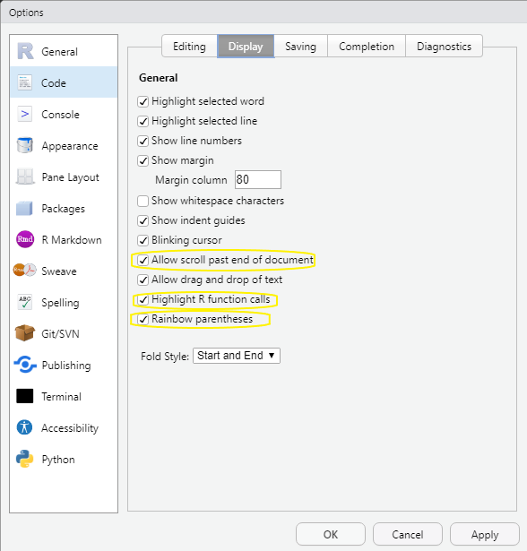

# Introduction {#intro}

In this chapter we will offer description of R, RStudio, and R Markdown. These are the software/progams you will need throughout the manual. 

## Install R and RStudio

R is an open source statistical package that is free and platform independent.  R can be downloaded for any platform [The Comprehensive R Archive Network (CRAN)](https://cran.r-project.org).   After clicking the link, choose the appropriate (Linux, (Mac) OS X, or Windows) installation file for R. Download and install R on your computer.  

All of the work will in this companion has been done in RStudio. We strongly recommend the use of RStudio as opposed to the R GuI to do your work in R.  RStudio is an integrated development environment (IDE) for R.  It includes a console, syntax-highlighting editor that supports code execution, as well as tools for plotting, history, debugging, workspace management, and report writing.  Like R, RStudio is open source and free to download and use.  Follow the link [RStudio Desktop](https://www.rstudio.com/products/rstudio/download/#download) to choose the appropriate version for your environment.    

RStudio is also available in a cloud based version at [RStudio Cloud](https://rstudio.cloud/) which can be used with an web browser without having to perform a local install of R or RStudio.  There is a free version of this as well.

In addition, since you will need to write reports, [R Markdown](https://rmarkdown.rstudio.com/index.html) gives you the ability to integrate documents with your code to produce outputs in a variety of formats.  R Markdown is an integrated part of RStudio.  This companion was written using R Markdown.

An R Notebook makes it easy to test and iterate when writing code.  R Notebooks can be shared as `html` documents with individuals who don't have RStudio.  And for those who do have RStudio, the R Notebook's `html` file has the code imbedded in it so that it can be opened in RStudio.

RStudio also includes a code editor which allows you to maintain a file of your 'scripts' as you complete your code.  This script file also allows for relatively easy editing and debugging of your code as you write it.  

### Suggested Global Option Settings

We strongly encourage the following options be set in *Tools > Global Options...* drop down menu.

(@)  **Workspace**
    a. uncheck *Restore .RData into workspace at startup.*^[This will ensure that you start with a clean session when you start RStudio.]
    a. Choose *Never* from the drop down menu in *Save workspace to .RData on exit:*
    

    
(@) Default working directory

We suggest that you create a folder to keep all your work for this course with a name that makes sense to you given your institution.^[For example, at Hamdpen-Sydney College you might name it *econ306*.] Set the directory in *Tools > Global Options...* as below:^[We suggest that browse the directory and chose it unless you are confident with path names.]  Each time you start RStudio it will start in the directory for this course. 

(@) Code Display options

In the *Tools > Global Options...* dialog box chose *Code* then chose the *Display* tab. Check the boxes to *Allow scroll past th end of document* and *Highlight R function calls*.

## Using RStudio

RStudio contains 4 panes that make elements of R easier to work with than they would be working in R GUI. 

### Source Pane

The Source Pane in the upper left contains your code and can be accessed with the keyboard shortcut `ctrl+1`.  This pain includes any R Markdown files, R Notebook files, and R Script files that you may have opened.  It will also contain any data that you `view` or information about attributes of an object when clicked in the environment pane.

### Environment/History Pane

You'll find the Environment/History pane in the top right.  The Environment tab shows you the names of all the data objects you have defined in the Global Environment of the current R session.  You can directly access the environment with `ctrl+8`. This tab is `objects()` command mentioned in the text on steroids. By clicking on the triangle icon next the object name you receive the same information as calling `str()` or `tibble::glimpse()` on the object. Clicking on the grid icon the right of the name will call `view()` and the object will be displayed in the Source Pane.  `view` will display all of the data in a data frame.  `head()` displays the first six observations.  The History tab contains all the code you that you've run.  You can directly access the history tab with `ctrl+4`.  If you'd like to re-use a line from your history, click the To Console icon to send the command to the Console Pane, or the To Source icon to send the command to the Source Pane.  

### Console Pane

The Console Pane in the bottom left is essentially what you would see if you were using the R GUI without R Studio.  It is where the code is evaluated.  You can type code directly into the console and get an immediate response.  You can access the Console Pane directly with `ctrl+2`.  With your cursor in the Console you can access any previous code with `ctrl+up` and use the arrow keys to pick the line you'd like to use.  Using the up arrow will show the lines of code one at a time from the last line ran to the first line available in the R session. If you type the first letter of the command followed by `ctrl+up` you will get all of the commands that you have used that begin with that letter.  Highlight the command and press return to place the command at the prompt.

### Files/Plots/Packages/Help Pane

The last pane is on the bottom right.  The files tab (`ctrl+5`) will show you the files in the current working directory.  The plots tab (`ctrl+6`) will contain any plots that you have generated with the base R plotting commands. The packages tab (`ctrl+7`) will show you all of the packages you have installed with checks next to the ones you have loaded.  Packages are collections of commands that perform specific tasks and are one of the great benefits of being part of the R community.  Finally, the help tab (`ctrl+3`) will allow you get help on any command in R, similarly to `?commandname`.  Initially understanding R help files can be difficult; follow the link [A little more about R](https://socviz.co/appendix.html#a-little-more-about-r) from Kieran Healy's *Data Visualization* for a good introduction.  In addition `args(commandname)` displays the argument names and corresponding default values (if any) for any command.  

Double clicking a `csv` file in the Files tab will open the data in the Source Pane.

Find a nice overview of R Studio at [RStudio Layout](https://rbasics.netlify.app/3-rstudiobasics.html#rstudio-layout)

## R Markdown

You will complete your homework, reports, etc. using [R Markdown](https://bookdown.org/yihui/rmarkdown/). R Markdown gives you the ability to integrate text with your code to produce outputs in a variety of formats.  

R Markdown allows you to combine R code with your report for seamless integration.  R code can be included in a markdown file as [Code Chunks](https://rmarkdown.rstudio.com/lesson-3.html) or directly within the [text](https://rmarkdown.rstudio.com/lesson-4.html).

To create an new R Markdown file inside of RStudio by clicking `File > New File > R Markdown...` or `alt-f-f-m` A dialog box will appear choose a title that is descriptive of the work you are doing, click `OK`. This will create a default R Markdown.  The first thing it creates is yaml header.  The header includes the title, author, date, and default output file type.  You will want to retain this.  It will also generate R code chunk with knitr^[knitr is an engine for dynamic report generating within R.] options.  You will want to retain this R chunk.  You need not retain any of the remaining parts of the file generated. 

To create an new R Notebook file inside of RStudio by clicking `File > New File > R Notebook` or `alt-f-n-n`.  An R Notebook allows you to directly interact act with R in a way that allows you to create reproducible documents that can be viewed in a web browser.
For more on R Notebooks see [Notebook](https://bookdown.org/yihui/rmarkdown/notebook.html) in *R Markdown: The Definitive Guide*

Markdown is a simple formatting syntax for authoring HTML, PDF, and MS Word documents. For more details on using R Markdown see <http://rmarkdown.rstudio.com>.

When you click the **Knit** button a document will be generated that includes both content as well as the output of any embedded R code chunks within the document. 

Scroll down to the **Overview** at <https://github.com/rstudio/rmarkdown> for more on markdown.  I strongly suggest you work through the [Markdown formatting](https://www.markdowntutorial.com/) tutorial for an introduction to basic formatting in Markdown.

For more help getting started in R Markdown, please see the [R Markdown website](https://rmarkdown.rstudio.com/lesson-1.html).
