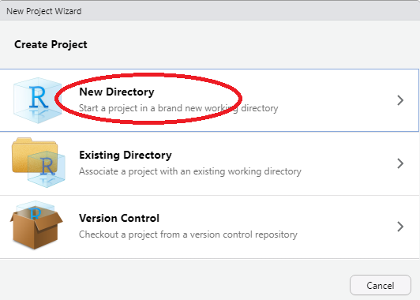
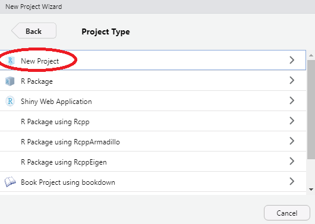
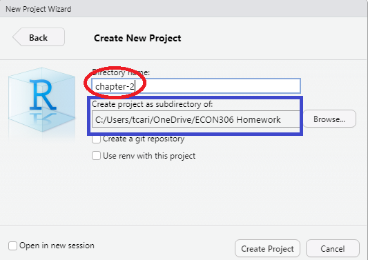

# The Quest for Causality {#chp1}

```{r, chp1-setup, include=FALSE}
knitr::opts_chunk$set(echo = TRUE, comment = NA, message = FALSE, warning = FALSE,
                      options(digits = 3, scipen = 999))
```

## Introduction

In order to familiarize you with the R code necessary to complete the assignments in *Real Econometrics*, I will reproduce all examples from Chapter 1.  As I present the examples, I will explain the syntax for each piece of code.  You will also be introduced to using R Markdown to produce a seamless integration of your code, your output, and your reports.

In subsequent chapters, I will take you through examples of the relevant code necessary to complete the exercises in R.

## Table 1.1

Table 1.1 contains the necessary information to produce Figures 1.2 and 1.3.  Creating Table 1.1 will give you an opportunity to create a data frame from four vectors.  A data frame is used for storing data tables.  A data frame is one of the many data structures in R.  The others include vector, list, matrix, factors, and tables.  A data frame is collection of vectors of the same length. 

A vector is the most common and basic data structure in R.  Vectors can be of two types: atomic vectors or lists.  An atomic vector is a collection of observations of a single variable.  The vectors in a data frame can be different types, however.  Each vector must be of a single type. The atomic vector types or classes in R are logical, integer, numeric (real or decimal), complex, and character.  A logical vector is one in which all of the values are TRUE, FALSE, and NA.  An integer vector contains only integers, a real vector contains only reals, etc.  If a vector contains more than one type of value, the vector and each element of it is coerced to the most general class in the vector. 

Let's start by creating each vector in Table 1.1.  To assign values to a vector, use the assignment operator `<-` and the concatenate or combine function `c()`.

```{r table-1-1}
observation_number <- c(1:13) 
# The colon tells R to create a sequence from 1 to 13 by 1.  This a vector of integers.
name <- c("Homer", "Marge", "Lisa", "Bart", "Comic Book Guy", "Mr. Burns",
          "Smithers", "Chief Wiggum", "Principle Skinner", "Rev. Lovejoy",
          "Ned Flanders", "Patty", "Selma")
# Each "string" is enclosed in quotes.  This is a character vector.
donuts_per_week <- c(14, 0, 0, 5, 20, 0.75, 0.25, 16, 3, 2, 0.8, 5, 4) 
# This is a numeric vector.
weight <- c(275, 141, 70, 75, 310, 80, 160, 263, 205, 185, 170, 155, 145) 
# This is a numeric vector.
```

To help you understand what's going on in the above chunk, think about what the code is doing like this: *assign the numbers 1 through 13 to an object name `observation_number`*. 

Note in the code chunk above that the symbol, #, is used to create comments within the code.  Those things set off by the # will not be executed as code.  These are useful for creating notes to yourself or collaborators about what you are doing with certain lines of code.  

We now have four named vectors that we can put into a data frame.  A note on naming conventions in R.  While there are many name conventions in R, I recommend using snake case where each word is separated by an under score and no capital letters are used.  See [Hadley Wickhams Style Guide](http://adv-r.had.co.nz/Style.html) for style suggestions for all parts of R programming, not just variable names.  Following these guidelines will make your code easier to read and edit.

```{r dataframe, message=F, warning=F}
library(tidyverse) 
# load the tidyverse package
donuts <- tibble(observation_number, name, donuts_per_week, weight) 
# create the donuts tibble
save(donuts, file = "donuts.RData")
# save the data frame as R Data
```

A tibble is an update to the traditional data frame.  For most of what we will do, it will act the same as a data frame.  The two main differences in data frames and tibbles are printing and subsetting. For more on tibbles type `vignette("tibble")` in the console. 

The `tidyverse` is an opinionated collection of R packages that share an underlying philosophy, grammar, and data structures.^[Tidyverse](https://www.tidyverse.org/). 

## Packages

An R  package is shareable bundle of code, data, documentation, tests, etc. To use a package, it must first be installed and then be loaded.  To install a package, call `install.packages("package_name")`^[You need install a package only once].  To make use of a package, load it by calling `library(packagename)`^[You must load the package during each R session to make use of it.].  Currently there are more than 16,000 packages available, to see the packages visit [Contributed Packages](https://cran.r-project.org/web/packages/). [CRAN Task Views](https://cran.r-project.org/web/views/) shows relevant packages by task.  You may want to visit [CRAN Task View: Econometrics](https://cran.r-project.org/web/views/Econometrics.html) to see the extensive array of packages for use in econometrics.

The `tidyverse` package is a collection of packages that share an underlying design philosophy, grammar, and data structures. For more on the tidyverse follow this [link](https://www.tidyverse.org).  The `dplyr` package loaded below is a grammar of data manipulation that can be used to solve most data manipulation problems.

```{r tibble, message=F}
# Print the tibble to the console by typing its name.
donuts
# glimpse will provide information about the data frame, its observations, variables, and their class.
dplyr::glimpse(donuts)
# using a package name with :: allows you to use the package without loading it
# it also makes clear the package a command comes from
```

We can reproduce Table 1.1 with the `kable` function in `knitr`.

```{r kable-table}
knitr::kable(donuts, 
             caption = 'Table 1.1 Donut Consumption and Weight', 
             col.names = c("Observation</br> number", 
                           # </br> is html code to insert a line break
                           "Name", "Donuts</br> per week",
                           "Weight</br> (pounds)"), 
             escape = F,  # necessary to force the line breaks
             align = 'cccc') # request that the four columns be centered
```

Or we can create an interactive table with the `DT` package.

```{r DT-table}
donuts %>% 
  DT::datatable(caption = 'Table 1.1 Donut Consumption and Weight')
```

## Figure 1.2

To create Figure 1.2 we will use the [ggplot2](https://ggplot2.tidyverse.org/) package.  `ggplot2`, also part of the `tidyverse`, is a system for declarative creating graphics, based on [The Grammar of Graphics](https://www.springer.com/in/book/9780387245447). The Grammar of Graphics is built on two principles.  First, graphics are built with distinct layers of grammatical elements.  Second, meaningful plots are formed through aesthetic mappings.  

Seven elements comprise the grammar of graphics: data, aesthetics, geometries, facets, statistics, coordinates, and themes.  Every graphic must contain, at a minimum, data, aesthetics, and geometries.  Data, typically a data frame or tibble, is the data set being plotted.  Aesthetics are the scales onto which data are mapped.  Aesthetics include x-axis, y-axis, color, fill, size, labels, alpha (transparency), shape, line width, and line type.  Geometries are how we want the data plotted, *e.g.*, as points, lines, bars, histograms, boxplots, etc.  Facets allow us to create multiple plots by a characteristic or categorical variable, statistics allow us to add elements like error bands, regression lines, etc.  Coordinates allow us to control the space into which we plot the data.  Finally, themes are all non-data ink in a graphic.

Follow this link for an overview of [ggplot2](https://ggplot2.tidyverse.org).  The Learning ggplot2 section points to three useful places to learn more about using ggplot2.  While the use of data visualization is not emphasized in the econometrics, understanding the basic principles will help your data analysis.

```{r figure1-2}
donuts %>% 
  ggplot(data = donuts, mapping = aes(x = donuts_per_week, y = weight)) + 
# map donuts per week onto the x-axis and weight on the y-axis
  geom_point()
# Add the geometry that creates the scatter plot
```

We introduced ` %>% ` in the above chunk (it is loaded as part of the `tidyverse`). `%>%`, the pipe operator inserts the argument before the pipe as the first argument into the subsequent function call.  We can parse the above line of code in English as "Use the `donuts` data and then create a ggplot with the aesthetics..."  Since the first argument in most function calls in R is data, this will make writing code easier and more readable because it avoids excessive nesting in function calls.  For example, suppose we have a vector `y` that we would like to call the functions `f`, `g` and `h` on in turn.  We could write the code in two ways: 

```{r nest-vs-pipe, eval = FALSE}
# nested
g(h(f(y)))
# or with  %>% 
y %>% 
  f() %>% 
  g() %>% 
  h()
```

Each is equivalent, but the second is easier to read as a human.  

This basic plot can be transformed into the figure in the text by adding layers to the graphic to change its appearance.  

```{r fig1-2-1}
# start with the original graphic

donuts %>% 
  ggplot(data = donuts, mapping = aes(x = donuts_per_week, y = weight)) + 
  geom_point() + 
# add axis labels and a caption 
  labs(x = "Donuts", y = "Weight (in pounds)", 
       caption = "Figure 1.2: Weight and Donuts in Springfield") + 
# add a vertical line
  geom_vline(xintercept = 0, color = "gray80", size = 1.25)
```
  
The vertical line is in front of the points so will re-arrange the geometries.

```{r fig1-2-2}
donuts %>% 
  ggplot(data = donuts, mapping = aes(x = donuts_per_week, y = weight)) + 
  geom_vline(xintercept = 0, color = "gray80", size = 1.25) +
  geom_point() + 
  labs(x = "Donuts", y = "Weight (in pounds)", 
       caption = "Figure 1.2: Weight and Donuts in Springfield")
```

```{r fig1-2-3}  
donuts %>% 
  ggplot(data = donuts, mapping = aes(x = donuts_per_week, y = weight)) + 
  geom_vline(xintercept = 0, color = "gray80", size = 1.25) +
  geom_point() + 
  labs(x = "Donuts", y = "Weight (in pounds)", 
       caption = "Figure 1.2: Weight and Donuts in Springfield") +
# Add the name labels by mapping the string name onto label
  geom_text(aes(label = name))
```
The names are not in aesthetically pleasing positions.  The `ggrepel` package "cleans" up labels in `ggplot2`.


```{r fig1-2-4}
# Clean up the name labels with the ggrepel package
library(ggrepel)
donuts %>% 
  ggplot(data = donuts, mapping = aes(x = donuts_per_week, y = weight)) + 
  geom_vline(xintercept = 0, color = "gray80", size = 1.25) +
  geom_point() + 
  labs(x = "Donuts", y = "Weight (in pounds)", 
       caption = "Figure 1.2: Weight and Donuts in Springfield") +
# Add the name labels by mapping the string name onto label
  geom_text_repel(aes(label = name))
```

```{r fig1-2-5}
# Use theme to adjust the non data elements
# \n in the y label creates a new line
donuts %>% 
  ggplot(data = donuts, mapping = aes(x = donuts_per_week, y = weight)) + 
  geom_vline(xintercept = 0, color = "gray80", size = 1.25) +
  geom_point() + 
# change the y-axis so that is on 2 lines \n means "new line"
  labs(x = "Donuts", y = "Weight\n(in pounds)", 
       caption = "Figure 1.2: Weight and Donuts in Springfield") +
  geom_text_repel(aes(label = name)) +
# adjust some of the non-data ink or theme elements
  theme(axis.title.y = element_text(angle = 0), # change orientation of y-axis label
          panel.grid = element_blank(), # remove the background grid
          panel.background = element_blank(), # remove the background
          axis.line = element_line(), # add x and y axes
          plot.caption = element_text(hjust = 0)) #move the caption to the left.
```

We can make the graph in one step and save it as an object `p` that we could add to later if we desire.

```{r figure1.2 again}
p <- 
  donuts %>% 
  ggplot(mapping = aes(x = donuts_per_week, y = weight)) + 
  geom_vline(xintercept = 0, color = "gray80", size = 1) +
  geom_point() + 
  labs(x = "Donuts", 
       y = "Weight\n(in pounds)", # \n creates a new line
       caption = "Figure 1.2: Weight and Donuts in Springfield") + 
  geom_text_repel(aes(label = name)) +
  theme(axis.title.y = element_text(angle = 0), 
          panel.grid = element_blank(), 
          panel.background = element_blank(), 
          axis.line = element_line(), 
          plot.caption = element_text(hjust = 0)) 
# print the graphic
p 
```

## Figure 1.3

To create Figure 1.3, we start with the plot above we saved as an object, p.  We add an additional geometry, geom_smooth to add the regression line.

```{r figure1.3, warning=FALSE, message=FALSE}
p + 
  labs(caption = "Figure 1.3: Regression Line for Weight and Donuts in Springfield") + 
# method specifies the fit,  se = F turns off the error band.
  geom_smooth(method = "lm", se = F) + 
  annotate("text", label = expression(beta[1]*" (the slope)"), # text annotation
           y = 205, # position of the text
           x = 8,   # position of the text
           angle = 20, # angle of the text
           color = "Blue") + # color of the text
# create the dotted blue line on the y-axis
  geom_segment(aes(y = 121.613, x = 0, xend = 0, yend = 0),
               color = "blue",
               linetype = "dotted",
               size = 1) + 
# add text to the graph
  annotate("text", label = expression(beta[0]*" = 121.613"),
           y = 115, x = 1.75, size = 3.5, color = "blue")
```

## Reading Data into R

The data we worked with in the above examples we manually entered into *vectors* and then combined those vectors into a rectangular data form called a *data frame.*  Data is rarely, if ever, manually entered into R.  Instead it comes to us in a file.  One of the most common types of files is a *csv* file.^[**c**omma **s**eparated **v**alues. A *csv* file is a *flat file* (text only) where each row is an observation and the variables are separated by commas.] Let's see how we read a *csv* file into R.^[Other types of files *xlsx*, *JSON*, etc are ready similarly.] We will use `readr::read_csv` to read the data.  

## A detour on projects

Before we read the a csv file let's take a brief tour on great way to organize your work using *projects*.  RStudio projects make it straightforward to divide your work into multiple contexts, each with their own working directory, workspace, history, and source documents. For a more detailed introduction to RStudio projects see [Using Projects](https://support.rstudio.com/hc/en-us/articles/200526207-Using-Projects). We suggest that you create a project for each new chapter within your default directory. To start a new project follow *File > New Project...* or click the Project drop down above the environmnet pane.

(@) Choose **New Directory**



(@) Choose **New Project**




(@) Create the directory name.

Ensure that you are in the directory you created for this course, name the new directory *chapter-x* where *chapter-x* is the chapter you are working on.



Outside of RStudio in your operating system (Windows, macOS) make copies of your data files in the directory you just created.  While you working within the project everything you save will be saved in the directory.

## Back to reading data

Let's suppose you have a *csv* file in your project named *my_data.csv*. Let's read the data and assign it to the object *my_data*.  The data will be read into a *tibble* named my_data.  

```{r read-csv-file, eval=FALSE}

my_data <- readr::read_csv("my_data.csv")

```

The data frame is now available for you to use.  