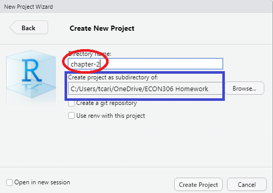

--- 
title: "R Companion to *Real Econometrics*"
author: "Tony Carilli"
date: "`r Sys.Date()`"
site: bookdown::bookdown_site
documentclass: book
bibliography: [book.bib, packages.bib]
biblio-style: apalike
link-citations: yes
description: "R, RStudio IDE, and the tidyverse companion to Bailey's Real Econometrics"
---

# Preface {-}

The intended audience for this book is anyone making using of *Real Econometrics: The Right Tools to Answer Important Questions* 2nd ed. by Michael Bailey who would like to learn to use R, RStudio, and the `tidyverse` to complete empirical examples from the text.  

RStudio is an integrated development environment that includes a console, syntax-highlighting editor, and tools to integrate report writing with empirical work, etc. [RStudio IDE Features](https://rstudio.com/products/rstudio/features/) for more.    

The `tidyverse` (a collection of packages that shares an underlying design philosophy, grammar, and data structures).  We also make use of a variety of packages (bundles of code) to make coding more straightforward in terms of writing, understanding, and editing.  

This book will be of use to anyone interested in learning to make use of R, RStudio, and the `tidyverse` to "do" econometric work.


```{r include=FALSE}
# automatically create a bib database for R packages
knitr::write_bib(c(
  .packages(), 'bookdown', 'knitr', 'rmarkdown'
), 'packages.bib')
```

<!--chapter:end:index.Rmd-->

# Introduction {#intro}

In this chapter we will offer description of R, RStudio, and R Markdown. These are the software/programs you will need throughout the manual. 

## Install R and RStudio

R is an open source statistical package that is free and platform independent.  R can be downloaded for any platform [The Comprehensive R Archive Network (CRAN)](https://cran.r-project.org).   After clicking the link, choose the appropriate (Linux, (Mac) OS X, or Windows) installation file for R. Download and install R on your computer.  

All of the work will in this companion has been done in RStudio. We strongly recommend the use of RStudio as opposed to the R GuI to do your work in R.  RStudio is an integrated development environment (IDE) for R.  It includes a console, syntax-highlighting editor that supports code execution, as well as tools for plotting, history, debugging, workspace management, and report writing.  Like R, RStudio is open source and free to download and use.  Follow the link [RStudio Desktop](https://www.rstudio.com/products/rstudio/download/#download) to choose the appropriate version for your environment.    

RStudio is also available in a cloud based version at [RStudio Cloud](https://rstudio.cloud/) which can be used with an web browser without having to perform a local install of R or RStudio.  There is a free version of this as well.

In addition, since you will need to write reports, [R Markdown](https://rmarkdown.rstudio.com/index.html) gives you the ability to integrate documents with your code to produce outputs in a variety of formats.  R Markdown is an integrated part of RStudio.  This companion was written using R Markdown.

An R Notebook makes it easy to test and iterate when writing code.  R Notebooks can be shared as `html` documents with individuals who don't have RStudio.  And for those who do have RStudio, the R Notebook's `html` file has the code embedded in it so that it can be opened in RStudio.

RStudio also includes a code editor which allows you to maintain a file of your 'scripts' as you complete your code.  This script file also allows for relatively easy editing and debugging of your code as you write it.  

### Suggested Global Option Settings

We strongly encourage the following options be set in *Tools > Global Options...* drop down menu.

(@)  **Workspace**
    a. uncheck *Restore .RData into workspace at startup.*^[This will ensure that you start with a clean session when you start RStudio.]
    a. Choose *Never* from the drop down menu in *Save workspace to .RData on exit:*
    

    
(@) Default working directory

We suggest that you create a folder to keep all your work for this course with a name that makes sense to you given your institution.^[For example, at Hamdpen-Sydney College you might name it *econ306*.] Set the directory in *Tools > Global Options...* as below:^[We suggest that browse the directory and chose it unless you are confident with path names.]  Each time you start RStudio it will start in the directory for this course. 


(@) Code Display options

In the *Tools > Global Options...* dialog box chose *Code* then chose the *Display* tab. Check the boxes to *Allow scroll past the end of document* and *Highlight R function calls*.


## Using RStudio

RStudio contains 4 panes that make elements of R easier to work with than they would be working in R GUI. 

### Source Pane

The Source Pane in the upper left contains your code and can be accessed with the keyboard shortcut `ctrl+1`.  This pain includes any R Markdown files, R Notebook files, and R Script files that you may have opened.  It will also contain any data that you `view` or information about attributes of an object when clicked in the environment pane.


### Environment/History Pane

You'll find the Environment/History pane in the top right.  The Environment tab shows you the names of all the data objects you have defined in the Global Environment of the current R session.  You can directly access the environment with `ctrl+8`. This tab is `objects()` command mentioned in the text on steroids. By clicking on the triangle icon next the object name you receive the same information as calling `str()` or `tibble::glimpse()` on the object. Clicking on the grid icon the right of the name will call `view()` and the object will be displayed in the Source Pane.  `view` will display all of the data in a data frame.  `head()` displays the first six observations.  The History tab contains all the code you that you've run.  You can directly access the history tab with `ctrl+4`.  If you'd like to re-use a line from your history, click the To Console icon to send the command to the Console Pane, or the To Source icon to send the command to the Source Pane.  


### Console Pane

The Console Pane in the bottom left is essentially what you would see if you were using the R GUI without R Studio.  It is where the code is evaluated.  You can type code directly into the console and get an immediate response.  You can access the Console Pane directly with `ctrl+2`.  With your cursor in the Console you can access any previous code with `ctrl+up` and use the arrow keys to pick the line you'd like to use.  Using the up arrow will show the lines of code one at a time from the last line ran to the first line available in the R session. If you type the first letter of the command followed by `ctrl+up` you will get all of the commands that you have used that begin with that letter.  Highlight the command and press return to place the command at the prompt.

### Files/Plots/Packages/Help Pane

The last pane is on the bottom right.  The files tab (`ctrl+5`) will show you the files in the current working directory.  The plots tab (`ctrl+6`) will contain any plots that you have generated with the base R plotting commands. The packages tab (`ctrl+7`) will show you all of the packages you have installed with checks next to the ones you have loaded.  Packages are collections of commands that perform specific tasks and are one of the great benefits of being part of the R community.  Finally, the help tab (`ctrl+3`) will allow you get help on any command in R, similarly to `?commandname`.  Initially understanding R help files can be difficult; follow the link [A little more about R](https://socviz.co/appendix.html#a-little-more-about-r) from Kieran Healy's *Data Visualization* for a good introduction.  In addition `args(commandname)` displays the argument names and corresponding default values (if any) for any command.  

Double clicking a `csv` file in the Files tab will open the data in the Source Pane.

Find a nice overview of R Studio at [RStudio Layout](https://rbasics.netlify.app/3-rstudiobasics.html#rstudio-layout)

## R Markdown

You will complete your homework, reports, etc. using [R Markdown](https://bookdown.org/yihui/rmarkdown/). R Markdown gives you the ability to integrate text with your code to produce outputs in a variety of formats.  

R Markdown allows you to combine R code with your report for seamless integration.  R code can be included in a markdown file as [Code Chunks](https://rmarkdown.rstudio.com/lesson-3.html) or directly within the [text](https://rmarkdown.rstudio.com/lesson-4.html).

To create an new R Markdown file inside of RStudio by clicking `File > New File > R Markdown...` or `alt-f-f-m` A dialog box will appear choose a title that is descriptive of the work you are doing, click `OK`. This will create a default R Markdown.  The first thing it creates is yaml header.  The header includes the title, author, date, and default output file type.  You will want to retain this.  It will also generate R code chunk with knitr^[knitr is an engine for dynamic report generating within R.] options.  You will want to retain this R chunk.  You need not retain any of the remaining parts of the file generated. 

To create an new R Notebook file inside of RStudio by clicking `File > New File > R Notebook` or `alt-f-n-n`.  An R Notebook allows you to directly interact act with R in a way that allows you to create reproducible documents that can be viewed in a web browser.
For more on R Notebooks see [Notebook](https://bookdown.org/yihui/rmarkdown/notebook.html) in *R Markdown: The Definitive Guide*

Markdown is a simple formatting syntax for authoring HTML, PDF, and MS Word documents. For more details on using R Markdown see <http://rmarkdown.rstudio.com>.

When you click the **Knit** button a document will be generated that includes both content as well as the output of any embedded R code chunks within the document. 

Scroll down to the **Overview** at <https://github.com/rstudio/rmarkdown> for more on markdown.  I strongly suggest you work through the [Markdown formatting](https://www.markdowntutorial.com/) tutorial for an introduction to basic formatting in Markdown.

For more help getting started in R Markdown, please see the [R Markdown website](https://rmarkdown.rstudio.com/lesson-1.html).

<!--chapter:end:01-Intro.Rmd-->


# The Quest for Causality {#chp1}

```{r, chp1-setup, include=FALSE}
knitr::opts_chunk$set(echo = TRUE, comment = NA, message = FALSE, warning = FALSE,
                      options(digits = 3, scipen = 999))
```

## Introduction

In order to familiarize you with the R code necessary to complete the assignments in *Real Econometrics*, I will reproduce all examples from Chapter 1.  As I present the examples, I will explain the syntax for each piece of code.  You will also be introduced to using R Markdown to produce a seamless integration of your code, your output, and your reports.

In subsequent chapters, I will take you through examples of the relevant code necessary to complete the exercises in R.

## Table 1.1

Table 1.1 contains the necessary information to produce Figures 1.2 and 1.3.  Creating Table 1.1 will give you an opportunity to create a data frame from four vectors.  A data frame is used for storing data tables.  A data frame is one of the many data structures in R.  The others include vector, list, matrix, factors, and tables.  A data frame is collection of vectors of the same length. 

A vector is the most common and basic data structure in R.  Vectors can be of two types: atomic vectors or lists.  An atomic vector is a collection of observations of a single variable.  The vectors in a data frame can be different types, however.  Each vector must be of a single type. The atomic vector types or classes in R are logical, integer, numeric (real or decimal), complex, and character.  A logical vector is one in which all of the values are TRUE, FALSE, and NA.  An integer vector contains only integers, a real vector contains only reals, etc.  If a vector contains more than one type of value, the vector and each element of it is coerced to the most general class in the vector. 

Let's start by creating each vector in Table 1.1.  To assign values to a vector, use the assignment operator `<-` and the concatenate or combine function `c()`.

```{r table-1-1}
observation_number <- c(1:13) 
# The colon tells R to create a sequence from 1 to 13 by 1.  This a vector of integers.
name <- c("Homer", "Marge", "Lisa", "Bart", "Comic Book Guy", "Mr. Burns",
          "Smithers", "Chief Wiggum", "Principle Skinner", "Rev. Lovejoy",
          "Ned Flanders", "Patty", "Selma")
# Each "string" is enclosed in quotes.  This is a character vector.
donuts_per_week <- c(14, 0, 0, 5, 20, 0.75, 0.25, 16, 3, 2, 0.8, 5, 4) 
# This is a numeric vector.
weight <- c(275, 141, 70, 75, 310, 80, 160, 263, 205, 185, 170, 155, 145) 
# This is a numeric vector.
```

To help you understand what's going on in the above chunk, think about what the code is doing like this: *assign the numbers 1 through 13 to an object name `observation_number`*. 

Note in the code chunk above that the symbol, #, is used to create comments within the code.  Those things set off by the # will not be executed as code.  These are useful for creating notes to yourself or collaborators about what you are doing with certain lines of code.  

We now have four named vectors that we can put into a data frame.  A note on naming conventions in R.  While there are many name conventions in R, I recommend using snake case where each word is separated by an under score and no capital letters are used.  See [Hadley Wickhams Style Guide](http://adv-r.had.co.nz/Style.html) for style suggestions for all parts of R programming, not just variable names.  Following these guidelines will make your code easier to read and edit.

```{r dataframe, message=F, warning=F}
library(tidyverse) 
# load the tidyverse package
donuts <- tibble(observation_number, name, donuts_per_week, weight) 
# create the donuts tibble
save(donuts, file = "donuts.RData")
# save the data frame as R Data
```

A tibble is an update to the traditional data frame.  For most of what we will do, it will act the same as a data frame.  The two main differences in data frames and tibbles are printing and subsetting. For more on tibbles type `vignette("tibble")` in the console. 

The `tidyverse` is an opinionated collection of R packages that share an underlying philosophy, grammar, and data structures.^[Tidyverse](https://www.tidyverse.org/). 

## Packages

An R  package is shareable bundle of code, data, documentation, tests, etc. To use a package, it must first be installed and then be loaded.  To install a package, call `install.packages("package_name")`^[You need install a package only once].  To make use of a package, load it by calling `library(packagename)`^[You must load the package during each R session to make use of it.].  Currently there are more than 16,000 packages available, to see the packages visit [Contributed Packages](https://cran.r-project.org/web/packages/). [CRAN Task Views](https://cran.r-project.org/web/views/) shows relevant packages by task.  You may want to visit [CRAN Task View: Econometrics](https://cran.r-project.org/web/views/Econometrics.html) to see the extensive array of packages for use in econometrics.

The `tidyverse` package is a collection of packages that share an underlying design philosophy, grammar, and data structures. For more on the tidyverse follow this [link](https://www.tidyverse.org).  The `dplyr` package loaded below is a grammar of data manipulation that can be used to solve most data manipulation problems.

```{r tibble, message=F}
# Print the tibble to the console by typing its name.
donuts
# glimpse will provide information about the data frame, its observations, variables, and their class.
dplyr::glimpse(donuts)
# using a package name with :: allows you to use the package without loading it
# it also makes clear the package a command comes from
```

We can reproduce Table 1.1 with the `kable` function in `knitr`.

```{r kable-table}
knitr::kable(donuts, 
             caption = 'Table 1.1 Donut Consumption and Weight', 
             col.names = c("Observation</br> number", 
                           # </br> is html code to insert a line break
                           "Name", "Donuts</br> per week",
                           "Weight</br> (pounds)"), 
             escape = F,  # necessary to force the line breaks
             align = 'cccc') # request that the four columns be centered
```

Or we can create an interactive table with the `DT` package.

```{r DT-table}
donuts %>% 
  DT::datatable(caption = 'Table 1.1 Donut Consumption and Weight')
```

## Figure 1.2

To create Figure 1.2 we will use the [ggplot2](https://ggplot2.tidyverse.org/) package.  `ggplot2`, also part of the `tidyverse`, is a system for declarative creating graphics, based on [The Grammar of Graphics](https://www.springer.com/in/book/9780387245447). The Grammar of Graphics is built on two principles.  First, graphics are built with distinct layers of grammatical elements.  Second, meaningful plots are formed through aesthetic mappings.  

Seven elements comprise the grammar of graphics: data, aesthetics, geometries, facets, statistics, coordinates, and themes.  Every graphic must contain, at a minimum, data, aesthetics, and geometries.  Data, typically a data frame or tibble, is the data set being plotted.  Aesthetics are the scales onto which data are mapped.  Aesthetics include x-axis, y-axis, color, fill, size, labels, alpha (transparency), shape, line width, and line type.  Geometries are how we want the data plotted, *e.g.*, as points, lines, bars, histograms, boxplots, etc.  Facets allow us to create multiple plots by a characteristic or categorical variable, statistics allow us to add elements like error bands, regression lines, etc.  Coordinates allow us to control the space into which we plot the data.  Finally, themes are all non-data ink in a graphic.

Follow this link for an overview of [ggplot2](https://ggplot2.tidyverse.org).  The Learning ggplot2 section points to three useful places to learn more about using ggplot2.  While the use of data visualization is not emphasized in the econometrics, understanding the basic principles will help your data analysis.

```{r figure1-2}
donuts %>% 
  ggplot(data = donuts, mapping = aes(x = donuts_per_week, y = weight)) + 
# map donuts per week onto the x-axis and weight on the y-axis
  geom_point()
# Add the geometry that creates the scatter plot
```

We introduced ` %>% ` in the above chunk (it is loaded as part of the `tidyverse`). `%>%`, the pipe operator inserts the argument before the pipe as the first argument into the subsequent function call.  We can parse the above line of code in English as "Use the `donuts` data and then create a ggplot with the aesthetics..."  Since the first argument in most function calls in R is data, this will make writing code easier and more readable because it avoids excessive nesting in function calls.  For example, suppose we have a vector `y` that we would like to call the functions `f`, `g` and `h` on in turn.  We could write the code in two ways: 

```{r nest-vs-pipe, eval = FALSE}
# nested
g(h(f(y)))
# or with  %>% 
y %>% 
  f() %>% 
  g() %>% 
  h()
```

Each is equivalent, but the second is easier to read as a human.  

This basic plot can be transformed into the figure in the text by adding layers to the graphic to change its appearance.  

```{r fig1-2-1}
# start with the original graphic

donuts %>% 
  ggplot(data = donuts, mapping = aes(x = donuts_per_week, y = weight)) + 
  geom_point() + 
# add axis labels and a caption 
  labs(x = "Donuts", y = "Weight (in pounds)", 
       caption = "Figure 1.2: Weight and Donuts in Springfield") + 
# add a vertical line
  geom_vline(xintercept = 0, color = "gray80", size = 1.25)
```
  
The vertical line is in front of the points so will re-arrange the geometries.

```{r fig1-2-2}
donuts %>% 
  ggplot(data = donuts, mapping = aes(x = donuts_per_week, y = weight)) + 
  geom_vline(xintercept = 0, color = "gray80", size = 1.25) +
  geom_point() + 
  labs(x = "Donuts", y = "Weight (in pounds)", 
       caption = "Figure 1.2: Weight and Donuts in Springfield")
```

```{r fig1-2-3}  
donuts %>% 
  ggplot(data = donuts, mapping = aes(x = donuts_per_week, y = weight)) + 
  geom_vline(xintercept = 0, color = "gray80", size = 1.25) +
  geom_point() + 
  labs(x = "Donuts", y = "Weight (in pounds)", 
       caption = "Figure 1.2: Weight and Donuts in Springfield") +
# Add the name labels by mapping the string name onto label
  geom_text(aes(label = name))
```
The names are not in aesthetically pleasing positions.  The `ggrepel` package "cleans" up labels in `ggplot2`.


```{r fig1-2-4}
# Clean up the name labels with the ggrepel package
library(ggrepel)
donuts %>% 
  ggplot(data = donuts, mapping = aes(x = donuts_per_week, y = weight)) + 
  geom_vline(xintercept = 0, color = "gray80", size = 1.25) +
  geom_point() + 
  labs(x = "Donuts", y = "Weight (in pounds)", 
       caption = "Figure 1.2: Weight and Donuts in Springfield") +
# Add the name labels by mapping the string name onto label
  geom_text_repel(aes(label = name))
```

```{r fig1-2-5}
# Use theme to adjust the non data elements
# \n in the y label creates a new line
donuts %>% 
  ggplot(data = donuts, mapping = aes(x = donuts_per_week, y = weight)) + 
  geom_vline(xintercept = 0, color = "gray80", size = 1.25) +
  geom_point() + 
# change the y-axis so that is on 2 lines \n means "new line"
  labs(x = "Donuts", y = "Weight\n(in pounds)", 
       caption = "Figure 1.2: Weight and Donuts in Springfield") +
  geom_text_repel(aes(label = name)) +
# adjust some of the non-data ink or theme elements
  theme(axis.title.y = element_text(angle = 0), # change orientation of y-axis label
          panel.grid = element_blank(), # remove the background grid
          panel.background = element_blank(), # remove the background
          axis.line = element_line(), # add x and y axes
          plot.caption = element_text(hjust = 0)) #move the caption to the left.
```

We can make the graph in one step and save it as an object `p` that we could add to later if we desire.

```{r figure1.2 again}
p <- 
  donuts %>% 
  ggplot(mapping = aes(x = donuts_per_week, y = weight)) + 
  geom_vline(xintercept = 0, color = "gray80", size = 1) +
  geom_point() + 
  labs(x = "Donuts", 
       y = "Weight\n(in pounds)", # \n creates a new line
       caption = "Figure 1.2: Weight and Donuts in Springfield") + 
  geom_text_repel(aes(label = name)) +
  theme(axis.title.y = element_text(angle = 0), 
          panel.grid = element_blank(), 
          panel.background = element_blank(), 
          axis.line = element_line(), 
          plot.caption = element_text(hjust = 0)) 
# print the graphic
p 
```

## Figure 1.3

To create Figure 1.3, we start with the plot above we saved as an object, p.  We add an additional geometry, geom_smooth to add the regression line.

```{r figure1.3, warning=FALSE, message=FALSE}
p + 
  labs(caption = "Figure 1.3: Regression Line for Weight and Donuts in Springfield") + 
# method specifies the fit,  se = F turns off the error band.
  geom_smooth(method = "lm", se = F) + 
  annotate("text", label = expression(beta[1]*" (the slope)"), # text annotation
           y = 205, # position of the text
           x = 8,   # position of the text
           angle = 20, # angle of the text
           color = "Blue") + # color of the text
# create the dotted blue line on the y-axis
  geom_segment(aes(y = 121.613, x = 0, xend = 0, yend = 0),
               color = "blue",
               linetype = "dotted",
               size = 1) + 
# add text to the graph
  annotate("text", label = expression(beta[0]*" = 121.613"),
           y = 115, x = 1.75, size = 3.5, color = "blue")
```

## Reading Data into R

The data we worked with in the above examples we manually entered into *vectors* and then combined those vectors into a rectangular data form called a *data frame.*  Data is rarely, if ever, manually entered into R.  Instead it comes to us in a file.  One of the most common types of files is a *csv* file.^[**c**omma **s**eparated **v**alues. A *csv* file is a *flat file* (text only) where each row is an observation and the variables are separated by commas.] Let's see how we read a *csv* file into R.^[Other types of files *xlsx*, *JSON*, etc are ready similarly.] We will use `readr::read_csv` to read the data.  

## A detour on projects

Before we read the a csv file let's take a brief tour on great way to organize your work using *projects*.  RStudio projects make it straightforward to divide your work into multiple contexts, each with their own working directory, workspace, history, and source documents. For a more detailed introduction to RStudio projects see [Using Projects](https://support.rstudio.com/hc/en-us/articles/200526207-Using-Projects). We suggest that you create a project for each new chapter within your default directory. To start a new project follow *File > New Project...* or click the Project drop down above the environmnet pane.

(@) Choose **New Directory**


(@) Choose **New Project**


(@) Create the directory name.

Ensure that you are in the directory you created for this course, name the new directory *chapter-x* where *chapter-x* is the chapter you are working on.



Outside of RStudio in your operating system (Windows, macOS) make copies of your data files in the directory you just created.  While you working within the project everything you save will be saved in the directory.

## Back to reading data

Let's suppose you have a *csv* file in your project named *my_data.csv*. Let's read the data and assign it to the object *my_data*.  The data will be read into a *tibble* named my_data.  

```{r read-csv-file, eval=FALSE}

my_data <- readr::read_csv("my_data.csv")

```

The data frame is now available for you to use.  

<!--chapter:end:02-Chp1.Rmd-->

# Stats in the Wild: Good Data Practices {#chp2}

```{r chp2-setup, include=FALSE}
knitr::opts_chunk$set(echo = TRUE, comment = NA, message = FALSE, warning = FALSE,
                      options(digits = 3, scipen = 999))
library(magrittr)
library(gt)
```

## Introduction

I will introduce some additional R commands and packages through reproducing Table 2.1, Table 2.2, Table 2.5, and Figure 2.3.  In addition, we will go through the *Computing Corner*.

## Table and Figure Reproduction

### Table 2.1

Since we saved the data frame we created in Chapter 1 as donuts.RData, we will `load` the file into global environment. We are only interested in the summary statistics for Weight and Donuts.  We can get a basic set of summary statistics by calling `summary` on the data frame.  But, `stargazer` from 
the stargazer package.  The stargazer produces well formatted tables in LaTex code, HTML code, and ASCII text. 

We will make use of the pipe operator from the `magrittr` package (also part of the `tidyverse`), as well.  The pipe operator `%>%` (ctr-shift-m shortcut in R Studio) allows for more intuitive reading of code especially when nesting commands inside of each other.  Take a simple example of finding calling the `str` command on a data frame, `df`.  Without the pipe operator ` %>% `, we would call the command like this `str(df)` and you might read this aloud alike this find the structure of df.  With the pipe operator, call the command like this `df %>% str()`.  Read aloud it might be something like this "take the `df` data and find its structure."  The pipe operator really shines when functions are nested together, as we shall see below.

```{r chp2-read-donut-data, comment=NA, warning=F, message=F}
load("donuts.RData")
library(tidyverse)
library(stargazer)
donuts %>% 
  # choose and rename the columns
  select("Weight" = weight, "Donuts" = donuts_per_week) %>% 
  # stargazer doesn't play nice with tibbles so we coerce donuts to a data frame
  as.data.frame %>%
  # tell stargazer to produce an ASCII text version of the table
  stargazer(type = "text", 
              title = "Table 2.1", 
  # omit the default 1st and 3rd quartiles
              omit.summary.stat = c("p25", "p75"))
```

We can return similar summary statistics with `descr` from the `summarytools` package.  

```{r chp2-dsecribe-donut-data}
donuts %>% 
  # choose the variables we'd like to summarize
  # here we choose "away" from observation number
  # descr will ignore non-numeric vectors
  select(Weight = weight, Donuts = donuts_per_week) %>% 
  summarytools::descr(stats = c("n.valid", "mean", "sd", "min", "max"),
                      round.digits = 3,
                      transpose = TRUE) %>% 
  DT::datatable(caption = htmltools::tags$caption(
                style = "caption-side: bottom; text-align: left;",
                "Table 2.1"),
                class = "cell-border stripe",
                colnames = c("N", "Mean", "St. Dev.", "Min", "Max"),
                options = list(dom = "t"))
  
```

### Table 2.2

To reproduce Table 2.2 we will need to add a variable named male which will take on the value 1 for each observation in the data that represents a male and a 0 otherwise.

$$male = 
\begin{cases}
1 & \text{if observation is male} \\
0 & \text{if observation is female}
\end{cases}$$

We will make use of `mutate()` from the `dplyr` package. We use `mutate()` when we want to create a new variable from existing variables in the data frame.

```{r chp2-load-donutRdata}
load("donuts.RData")
donuts$name # this syntax reads "print the variable name from the donuts data frame".
```

The square brackets `[]` indicate the position of each observation in the vector.  So, in position `[9]` is Principle Skinner.

Making use of donuts$name we see that the observations 1, 4, 5, 6, 7, 8, 9, 10, 11 are male and observations 2, 3, 12, 13 are not. We add the variable male to the donuts data frame as follows:

```{r chp2-male-vector}
donuts$male <- c(1, 0, 0, 1, 1, 1, 1, 1, 1, 1, 1, 0, 0)
```

Call `table` to create a rudimentary version of Table 2.2

```{r chp2-table}
donuts$male %>% 
  table()
```

### Table 2.5

To reproduce Table 2.5 we must first retrieve the data.  We will retrieve the data directly from the agencies responsible for their collection. You can retrieve the data as a comma-separated values (`csv`) file.  A `csv` file is a plain text file in which the data are stored in a tabular format with values separated by a comma.^[These types of files are often referred to as *flat files*.] 

The crime data can be found on the U.S. Department of Justice Federal Bureau of Investigation Uniform Crime Reporting Statistics [website](https://www.ucrdatatool.gov/). The single parent, urban, and poverty data can found on the U.S. Census [website](https://www.census.gov/).

An investigation of the `CrimeOneYearofData.csv` file shows that there is meta information contained in the file along with the data.  We could open the csv file in Excel and edit it to remove the information or we could read it directly into R using `read_csv` from the `readr` package^[`readr` is part of the Tidyverse.] with options to ignore the meta information. The readr package has many advantages over the base R read functions, see `vignette("readr")` for more information.^[All of the text's data files are available in `csv` format, so we will make repeated use of `read_csv`.]

We can view the file by clicking on it in the Files tab of the pane in the lower right corner.  Choose the view file option and a new tab will open in the source pane.^[We could also open the file with either Excel or text editor.] We see tat the first nine rows are either blank or contain information about the data and that rows 63 to 183 contain footnotes and other additional information about the data.  The names of the variables are in row ten of the csv file; so, we will skip the first nine rows using the argument `skip`.  We will choose the rows that contain the states and Washington, D.C., with the `n_max` option.  


```{r chp2-crime-data, warning=F, message=F}
crime_one_year_of_data <- 
  # read the data from its location
  read_csv("Data/CrimeOneYearofData.csv", 
                               skip = 9, # start at row 10
                               n_max = 51) # use only 51 records
crime_one_year_of_data
```

Similar to `ggplot` being based on the grammar of graphics, `dplyr` is a grammar of data manipulation.  dplyr consists of a set of "verbs" to help solve common data manipulation problems.  To learn more about dplyr read `vignette("dplyr")`,  visit [dplyr](https://dplyr.tidyverse.org/), or for a good introduction visit the [data import chapter](https://r4ds.had.co.nz/transform.html) in *R for Data Science*.  

Using `glimpse` from dplyr, we see that we have a tibble with 51 observations and 9 variables.  `glimpse` is similar to `str`.

```{r chp2-glimpse-crime-data, warning=F, message=F}
crime_one_year_of_data %>% 
  glimpse
```

We see that State is a character vector and Violent Crime Rate is a numeric vector.  Looking at the names of the variables we can see they do not adhere to the stylistic guidelines discussed above.  The State variable begins with a capital letter and the Violent Crime Variable has capital letters and spaces in its name (the spaces are why you see the tick mark "`" before and after the name).  The state names are spelled out, but to reproduce Figure 2.3 we need to change those to two-letter abbreviations.  

To bring the names into stylistic guidelines we can use `clean_names` from the `janitor` package, `snake case` is the default conversion.  Note, the versatility of the ` %>% ` operator.  If we did not use the ` %>% ` operator, the code would have been written as `glimpse(crime_one_year_of_data <- clean_names(crime_one_year_of_data))`  

```{r chp2-clean-names, message=F, warning=F}
library(janitor)
crime_one_year_of_data <- 
  crime_one_year_of_data %>% 
  clean_names() 
crime_one_year_of_data %>% 
  glimpse
```

The names of the variables follow good practice. 

We will read the other data in a similar fashion. 

```{r chp2-acs-data, message=F, warning=F}
# Source: U.S. Census Bureau, 2009 American Community Survey, Table C23008
acs_09_1yr_c23008_with_ann <- read_csv("Data/ACS_09_1YR_C23008_with_ann.csv", 
    skip = 1,
    n_max = 51) %>% 
  clean_names() 

acs_09_1yr_c23008_with_ann

```

To create the percentage of children with single parents, add those under 6 living with one parent to those between 6 and 17 living with one parent and divide by the estimated total.  We create the new variable with the `mutate` verb from dplyr and `select` geography as state and percent with single parents into a new data frame.

```{r chp2-parent-data, message=F, warning=F}
single_parents <- 
acs_09_1yr_c23008_with_ann %>% 
  mutate(percent_single_parents = 
           (estimate_under_6_years_living_with_one_parent + 
              estimate_6_to_17_years_living_with_one_parent) / 
           estimate_total) %>% 
  select(state = geography, percent_single_parents) 

single_parents
```

```{r chp2-poverty-data, message=F, warning=F}
# Source: U.S. Census Bureau, 2009 American Community Survey, Table S1701
acs_09_1yr_s1701_with_ann <- 
  read_csv("Data/ACS_09_1YR_S1701_with_ann.csv", skip = 1, n_max = 51) %>% 
  clean_names() %>% 
  select("state" = geography, # directly name the variables when selected
         "percent_poverty" =
           percent_below_poverty_level_estimate_population_for_whom_poverty_status_is_determined)

acs_09_1yr_s1701_with_ann
```

To create the percent urban in 2009, we need to interpolate using the 2000 and 2010 censuses.  After reading each set of data we will combine them into one data frame using `right_join` from the `dplyr` package.  More on that below.  First, let's read the data. 

```{r chp2-urban-data}
# Source: U.S. Census Bureau, Table P002
dec_00_sf1_p002_with_ann <- read_csv("Data/DEC_00_SF1_P002_with_ann.csv", skip = 1) %>% 
  clean_names() %>%
  select(state = geography, total_00 = total , urban_00 = urban)

dec_00_sf1_p002_with_ann

# Source: U.S. Census Bureau, Table H2
dec_10_sf1_p2_with_ann <- read_csv("Data/DEC_10_SF1_P2_with_ann.csv", skip = 1) %>% 
  clean_names() %>%
  select("state" = geography, "total_10" = total , "urban_10" = urban) 

dec_10_sf1_p2_with_ann
```

Note the message returned by `read_csc` telling us how it parsed each column into an atomic vector type. In particular, note that `Total` in the 2010 data was parsed as a character vector. This means that there is at least one observation that includes characters.  In fact, we can see at least 3 of the observations include parenthetical notes.  

```{r chp2-pull-total-10}
dec_10_sf1_p2_with_ann %>% 
  # the pull call returns the vector pulled as a vector
  pull(total_10)
```

We have confirmed that undesirable string has the same form in each position it exists.  We must remove those comments and coerce the variable to numeric to proceed.  We can determine how many instances of these comments occur using `str_detect` from the `stringr` package.  `str_detect` will return a logical vector, so we need only sum the vector to count the number of times this occurs. We need to remove the parentheses and what is between them. 

When calling `sum` on a logical vector, TRUE is treated as 1 and FALSE as 0, so summing the vector "counts" the number of TRUE occurrences.  A regular expression, *regex* or *regexp*, is a sequence of characters that define a search pattern, to learn more visit [regexr.com](https://regexr.com/).  The pattern we are looking for here is given by "\\(.+\\)".  Since the parenthesis is a special character, it must be escaped with \\, the `.` is a wild card, the `+` means 1 or more occurrence of the wild card, so the `.+` means find anything that appears 1 or more times.  So the expression can be read as start with ( find anything which occurs one or more times and end with ).  

```{r chp2-clean-data-1}
str_detect(dec_10_sf1_p2_with_ann$total_10, "\\(.+\\)") %>% 
  sum()
```

The pattern occurs `r sum(str_detect(dec_10_sf1_p2_with_ann$total_10, "\\(.+\\)"))` times.  We need to remove the string and coerce the character vector to a numeric vector.  `str_replace_all` will remove all occurrences of the string.  `as.numeric` will coerce the character vector to a numeric vector.  We will make use of the "two-way" pipe operator `%<>%` in each function call.  This operator takes the left hand side passes it to to the function and returns the result back to the original vector effectively overwriting it.

```{r chp2-clean-data-2, message=F, warning=F}
# the  %<>% operator is a "two way" pipe that sends the result back to the left hand side.
dec_10_sf1_p2_with_ann$total_10 %<>% str_replace_all("\\(.+\\)", "") # "" replaces the string with blank
dec_10_sf1_p2_with_ann$total_10 %<>% as.numeric()
dec_10_sf1_p2_with_ann %>% 
 glimpse()
```

We see that `total_10` is now a numeric vector. 

We can now combine the two data frames using `right_join` from the dplyr package.  Since each data frame contains `state`, `right_join` will join the columns from the 2010 census to the end (right) of the 2000 census matching observations by state.  We will assign the result to percent_urban.

```{r chp2-join-data}
urban <- dec_00_sf1_p002_with_ann %>% 
  right_join(dec_10_sf1_p2_with_ann)

urban 
```

We can, now, interpolate the 2009 observations from the 2000 and 2010 observations.  Since 2009 is nine tenths of the distance to 2010 from 2000, we will add 9/10 of the difference between the two observations to the 2000 observation.  

```{r chp2-urban-variable}
urban %<>% 
  mutate(percent_urban = (.9 * (urban_10 - urban_00) + urban_00) / 
           (.9 * (total_10 - total_00) + total_00) * 100) %>% 
  select(state, percent_urban)

urban
```

We now have 4 data frames containing the information we need to create Table 2.5 and Figure 2.3.  We will create a one data frame by joining the four data frames using the dplyr package.  

```{r chp2-join-all-data}
crime_df <- crime_one_year_of_data %>% 
  right_join(single_parents) %>% 
  right_join(urban) %>% 
  right_join(acs_09_1yr_s1701_with_ann) %>% 
  select(state, violent_crime_rate, percent_single_parents,
         percent_urban, percent_poverty)

crime_df
```

Figure 2.3 includes state abbreviations rather than state names.  We will change the names into abbreviations with the help of a built in character vector. `state.name` is character vector of state names, excluding Washington DC, built into R. We can concatenate that vector with the character string "District of Columbia", sort the new character vector alphabetically, convert the names to abbreviations with `state2abbr` from the `openintro` package, and assign the result to the state vector in the crime_one_year_of_data data frame.

```{r chp2-state-abbs, message=F, warning=F}
library(openintro)
state_abb <- c(state.name, "District of Columbia") %>% 
  sort() %>% 
  state2abbr()
crime_df$state <- state_abb  
crime_df %>% glimpse
```

We proceed as we did with Table 2.1 to reproduce Table 2.5.  This time we will use the `gt` package.

```{r chp2-table2-5, comment=NA, warning=F, message=F}
crime_df %>% 
  select("Percent poverty" = percent_poverty,
         "Percent single parents" = percent_single_parents,
         "Percent urban" = percent_urban,
         "Violent crime rate (per 100,00 people)" = violent_crime_rate) %>%
  summarytools::descr(stats = c("n.valid", "mean", "sd", "min", "max"),
                      round.digits = 2,
                      transpose = TRUE) %>%
  as_tibble() %>% 
  mutate(Variable = c("Percent poverty",
         "Percent single parents",
         "Percent urban",
         "Violent crime rate (per 100,00 people)"),
         .before = N.Valid) %>% 
  rename(N = N.Valid) %>% 
  arrange(desc(Variable)) %>% 
  gt() %>% 
  tab_header(title = "Table 2.5 Descriptive Statistics for State Crime Data") %>% 
  opt_align_table_header(align = "left") 
  # DT::datatable(caption = htmltools::tags$caption(
  #               style = "caption-side: top; text-align: left;",
  #               "Table 2.5 Descriptive Statistics for State Crime Data"),
  #               class = "cell-border stripe",
  #               colnames = c("N", "Mean", "St. Dev.", "Min", "Max"),
  #               options = list(dom = "t"))
  # as.data.frame() %>% 
  # stargazer(type = "text", 
  #           title = "Table 2.3",
  #           omit.summary.stat = c("p25", "p75")) 
```

### Figure 2.3

We will use `ggplot` from the `ggplot2` package to reproduce Figure 2.3.  We will use the `plot_grd` from `cowplot` package to create a grid of the three individual plots after we create them individually.

```{r chp2-fig-2-3, comment=NA, warning=F, message=F}
plot_urban <- 
  crime_df %>% 
  ggplot(aes(x = percent_urban, y = violent_crime_rate)) +
  labs(x = "Percent urban\n(0-to-100 scale)", # \n creates a new line
       y = "Violent\ncrime\nrate\n(per\n100,000\npeople)") +
  geom_text(aes(label = state), color = "blue") +
  scale_y_continuous(breaks = seq(200, 1200, 200)) + # creates a sequence from 200 to 1200 by 200
  scale_x_continuous(breaks = seq(40, 100, 10)) + # creates a sequence from 40 to 100 by 10
  theme(axis.title.y = element_text(angle = 0), 
        panel.grid = element_blank(), 
        panel.background = element_blank(), 
        axis.line = element_line())

plot_single <- 
  crime_df %>% 
  ggplot(aes(x = percent_single_parents, y = violent_crime_rate)) +
  labs(x = "Percent single parent\n(0-to-1 scale)", # \n creates a new line
       y = "") +
  geom_text(aes(label = state), color = "blue") +
  scale_y_continuous(breaks = seq(200, 1200, 200)) +
  theme(axis.title.y = element_text(angle = 0), 
        panel.grid = element_blank(), 
        panel.background = element_blank(), 
        axis.line = element_line())

plot_poverty <- 
  crime_df %>% 
  ggplot(aes(x = percent_poverty, y = violent_crime_rate)) +
  labs(x = "Percent poverty\n(0-to-100 scale)", # \n creates a new line
       y = "") +
  geom_text(aes(label = state), color = "blue") +
  scale_y_continuous(breaks = seq(200, 1200, 200)) +
  scale_x_continuous(breaks = seq(8, 22, 2)) +
  theme(axis.title.y = element_text(angle = 0), 
        panel.grid = element_blank(), 
        panel.background = element_blank(), 
        axis.line = element_line())

library(cowplot)
plot_grid(plot_urban, plot_single, plot_poverty,  ncol = 3)

```

FIGURE 2.3: Scatterplots of Violent Crime against Percent Urban, Single Parent, and Poverty

## Computing Center

### Reading Data

There are packages available to read data formatted in a variety of ways into R. A partial list is 

|Package|Type of Data|
|-------|------------|
|`haven`|SPSS, Stata, & SAS|
|`httr`|Web APIs|
|`readxl`|.xls & .xlsx sheets|
|`rvest`|web scraping|
|`jsonlite`|JSON|
|`DBI`|relational databases|
|`xml2`|XML|

Data can also be imported using the Import Dataset icon in the Environment/History pane.  When learning to import data, this method can be useful as it will create the command line necessary to import the data, which you can then paste into your source file.

### Manually Entering Data

In Chapter 1 we saw that we can directly (manually) enter data into R as well. Below is the appropriate syntax for doing so. The function call `c()` *combines* or *concatenates* elements into a vector.  

```{r chp2-manual-data-entry}
name <- c("Homer", "Marge", "Lisa", "Bart", "Comic Book Guy", "Mr. Burns", "Smithers", "Chief Wiggum", "Principle Skinner", "Rev. Lovejoy", "Ned Flanders", "Patty", "Selma")
donuts_per_week <- c(14, 0, 0, 5, 20, 0.75, 0.25, 16, 3, 2, 0.8, 5, 4)
weight <- c(275, 141, 70, 75, 310, 80, 160, 263, 205, 185, 170, 155, 145)
```

We can combine this into a single "file" called a *data frame* as follows:

```{r chapter-2-donut-dataframe}
Donuts <- data.frame(name, donuts_per_week, weight)
Donuts %>% 
  str()
# could also use the modern version of data.frame
tibble(name, donuts_per_week, weight) %>% 
  str()
```

The character vector "name" is coerced to a Factor by default.  Factors in R are store as a vector of integer values with a corresponding set of character values.  We will see that Factors are very useful, however, in this case we want name to remain a character vector.  If we add the option `stringsAsFactors = FALSE` to our call of `data.frame` we can prevent the coercion. Our we can call `tibble` as described in Chapter 1. 

We can see the difference above. 

```{r chapter-2-donut-dataframe-2}
Donuts <- data.frame(name, donuts_per_week, weight, stringsAsFactors = FALSE)
Donuts %>% str()
```

You can see in the Global Environment tab of the Environment/History pane that you have an object named Donuts that has 13 observations on 3 variables.  In addition, you can see under values you have each variable as well.  

### Simple Statistics

R has many built in calls to get basic statistics on data.  For example, to get the mean of a variable call `mean()`.  Be aware, that if there are missing values in the data the function call will return `NA` as it's result. `NA` is contagious, *i.e.*, if any of the observations are `NA` function calls will generally return `NA`.  The upshot of this is it forces you into having a strategy to deal with `NAs`.    The donuts data frame contains to missing values "NA", so it won't be a problem.  Some simple exploratory data analysis will let you know if you have any issues in the data.  We saw one of those problems above when we had a variable that we thought was numeric, but was read in as a character vector.  `summary` is a good place to start. 

```{r chp2-summary-donuts}
donuts %>% 
  summary()
```

The `summarytools` package has a variety of tools to expand on the capabilities of `summary`.

```{r chp2-descr-donuts}
summarytools::descr(donuts)
```

Note that `descr` ignores any character vectors.

We can get a table formatted for R Markdown with the argument `style = "rmarkdown"`
```{r chp-descr-donuts-rmarkdown}
donuts %>% 
  summarytools::descr(style = "rmarkdown")
```

We confirmed that there are no missing values in our data.  If there were, we can easily deal with them with the argument `na.rm = TRUE`. 

```{r chp2-mean-weight}
donuts$weight %>% 
  mean(na.rm = TRUE)  
```

Call `var` or `sd` to return the sample variance or sample standard deviation.  Of course the standard deviation can also be calculated by calling `sqrt` on the result of the `var` call.  There are multiple ways to retrieve the number of observations of a variable or data frame. The minimum and maximum values are returned by calling `min` and `max`. As described in the text, we can call `sum` on the result of the call `is.finite`.  `nrow` will return the number of observations in a data frame, `NROW` will return the number of observations of a vector or single variable. 

```{r chp2-descriptive-stats}
donuts$weight %>% var()
donuts$weight %>% var() %>% sqrt()
donuts$weight %>% sd()
donuts$weight %>% min()
donuts$weight %>% max()
donuts$weight %>% NROW()
```

### Subsetting

Subsetting in R can be accomplished in a variety of ways.  In Base R, use `[]` syntax. Use brackets can be used to call specific rows and columns from a matrix or data frame. To return the observation in the 12^th^ row and 3^rd^ column call `donuts[12,3]`.  To return all of the observations in a specific row or column, leave the row or column number out of the call.  To return all of the observations from the 3rd column call `donuts[,3]`.  To return the observations for an individual record, say the 4^th^ row, call `donuts[4,]`.  To choose (subset) all of those records where, e.g,, donuts eaten per week is 0, call `donuts[donuts$donuts_per_week == 0,]`; to choose all those records where donuts donuts are not equal to 0, call `donuts[donuts$donuts_per_week != 0,]`.  We can also subset using `filter` from `dplyr`. An advantage of subsetting with `dplyr` is that the resulting tibble can be piped into the another function call.

```{r chp2-subsetting}
donuts[12,3]
donuts[,3]
donuts[4,]
donuts[donuts$donuts_per_week == 0,]
donuts[donuts$donuts_per_week != 0,]
donuts %>% 
  filter(donuts_per_week == 0)
donuts %>% 
  filter(donuts_per_week != 0)

```

We can subset on more than one variable as well.  Using Base R we can choose all those males who consumed some donuts per week by calling `donuts[donuts$donuts_per_week != 0 & donuts$male == 1]`.  We can choose all those observations where donut consumption per week is more than 15 or the person is female by using the or operator | in call `donuts[donuts$donuts_per_week > 15 | donuts$male != 1,]`.  `filter` can be used as well.

```{r chp2-subsetting-2}
donuts[donuts$donuts_per_week != 0 & donuts$male == 1,]
donuts %>% 
  filter(donuts_per_week != 0 & male == 1)
# a slightly more intuitive alternative is:
donuts %>% 
  filter(donuts_per_week != 0, male == 1) 
donuts[donuts$donuts_per_week > 15 | donuts$male != 1,]
donuts %>% 
  filter(donuts_per_week > 15 | male != 1)

```

We can modify Figure 2.2 to include only males by modifying our original code by piping the filtered results into `ggplot`.  

```{r figure2.2mod, message = F, warning=F}
library(ggrepel)
donuts %>% 
  filter(male == 1) %>% 
  ggplot(mapping = aes(x = donuts_per_week, y = weight)) + 
  geom_vline(xintercept = 0, color = "gray80", size = 1) +
  geom_point(color = "blue", size = 2) + 
  labs(x = "Donuts", 
       y = "Weight\n(in pounds)", # \n creates a new line
       caption = "Figure 2.2: Weight and Donuts in Springfield") + 
  geom_text_repel(aes(label = name), color = "blue") +
  theme(axis.title.y = element_text(angle = 0), 
          panel.grid = element_blank(), 
          panel.background = element_blank(), 
          axis.line = element_line(), 
          plot.caption = element_text(hjust = 0)) 
```


<!--chapter:end:03-Chp2.Rmd-->


# Bivariate OLS: The Foundation of Econometric Analysis {#cph3}

```{r chp3-setup, include=FALSE}
knitr::opts_chunk$set(echo = TRUE, comment = NA, message = FALSE, warning = FALSE,
                      options(digits = 3, scipen = 999))
library(tidyverse)
load("donuts.RData")
```

We will work through the *Computing Corner*.

## Estimating a simple regression

To run a simple regression in R, call the function `lm()`. 

### A short detour on some R basics. 

Some basic principles of R.

1. Everything in R is an **object** including functions.
1. Everything that happens in R is a **function call**.
  i) *function calls* act on objects
  i) *function calls* return objects
  i) objects returned by *function calls* may be used in *function calls*

It may help to think of *objects* as nouns and *function calls* as verbs.  

*Objects* are created with the assignment operator `<-` (keyboard shortcut: `Alt + -`).  We can name an object almost anything we'd like.^[Call `?Reserved` to see names that you can't use.]  It is good practice to avoid function names like `c`, `T`, `mean`, etc., to not avoid starting a name with a number, to putting spaces in names. See [The tidyverse style guide](https://style.tidyverse.org/) for an example of a consistent philosophy.  We advocate the use of snake case when naming objects with longer names, *e.g.*, we might name GDP per capita as `gpd_per_capita`.  So we might assign 95 to the current temperature like this:

```{r assign-temp, eval=FALSE}
current_temp <- 95
```

*Functions* act on objects and return objects.  Calling a function means to "run" it. All functions have two broad categories of arguments one that supplies the **data** (object) to be acted on and another to control the **details** of the computation.  Let's look at the function call `mean()` as an example.

```{r function-arguments-mean, eval=FALSE}
mean(x, trim = 0, na.rm = FALSE, ...)
```

`mean` has a data argument *x* and two control arguments *trim* and *na.rm*.^[The ... represent further arguments passed to or from other methods.] *x* is an R object, typically a vector. *trim* is argument that controls the fraction of observations to be ignored on each end of *x* when calculating the mean.  *trim* has default value of 0 (`trim = 0`).  The *na.rm* argument controls whether mean ignores `NAs` in the data.  The default value is FALSE (`na.rm = FALSE`).  Since the control arguments have default values, the mean requires you give it only one argument to run, *x*.  Of course, you can change the default values of any control arguments. 

R evaluates (looks for arguments in) functions in 3 steps.  First it uses **exact matching** of the argument name.  If the arguments aren't named exactly, it uses **partial matching**  of the argument name.  Finally, it uses the **position** of the argument.  All arguments *do not* have to be specified.  Arguments not specified will use default values.  If an argument necessary to the function call is not used R will *throw* an error. 

Good practice in calling functions requires that we specify non-optional arguments first in our function calls and that we specify the names of all optional arguments.  Good practice yields easier code auditing and editing and replicability.  

Let's look at the ways we can call `mean()`

```{r call-mean}
# let's assign an object y.
y <- c(NA, 1:10, NA)

# we can name the arguments exactly

mean(x = y, trim = 0, na.rm = TRUE)

# or we could use the position of the argument

mean(y, 0, TRUE) 

# we could use a combination of the two

mean(y, na.rm = TRUE)

```

Notice in each case `mean()` returned a vector of length 1, that's why the [1] precedes the value of the mean.  The object returned by a function call can be used as an argument in subsequent function call.  For example, suppose we'd like to take the square root of the mean we just calculated.  We can pass the object returned by the mean to the function `sqrt()` as an argument like this:

```{r pass-return-to-function}
sqrt(mean(y, na.rm = TRUE))
```

We could do this repeatedly. Let's take the log of that.

```{r chp3-sqrt-mean-nest}
log(sqrt(mean(y, na.rm = TRUE)))
```

As you might imagine, after a while this "nesting" process get's ugly and difficult to follow fast.   This is where the pipe operator ` %>% ` (keyboard short-cut `Ctrl-Shift-M`) shines.  The pipe operator ` %>% ` works by making the object preceding it the first argument in the function call following it.  Let the `bar` be the firs argument in the function call `foo`, we could call the function like this `foo(bar)` or using the pipe operator like this `bar %>%  foo()`.  In simple cases like this there isn't much to gained from the pipe operator.^[Possibly it is clear to say take `bar` and do `foo` to it than to say do `foo` on `bar`.]  The pipe operator shines when multiple function calls are performed in a sequence.  It prevents ugly nesting or having to create assign intermediate objects to call functions on later. Below is the code from above using the ` %>% ` operator.

```{r chp3-sqrt-mean-pipe}
y %>% 
  mean(na.rm = TRUE) %>% 
  sqrt() %>% 
  log()
```

While code is written to get R to do something it is also written for and by human beings. We can translate this code like this "take y, then calculate its mean while removing NA's, then take the square root, then take the log."

We can find the arguments and their default values, if any, in a variety of ways in R Studio.  To estimate a regression, call the function `lm()`.  Let's find the arguments required by `lm()` to estimate a simple linear regression. 

If we simply want a list of the arguments for any function call `args()` with the function name as the argument.^[Remember everything in R is an object--even a function!] `args(lm)` will return the arguments for the `lm` function.

```{r lm-args}
args(lm)
```
To get more detailed information on the function call and the arguments use `?function_name`. This opens the help page in the Files/Plots/Packages/Help Pane, which can also be accessed by typing "lm" in the search in the same pane.  Below we see a portion of the help on `lm`.

```{r lm-help, eval=FALSE}
?lm
```


### Estimating an OLS model

Estimating a regression using `lm` requires only one argument, a formula.^[This is one of few functions that does not have the data as its first argument.] Formulas are structured with a `~`.  To estimate $y_i=\beta_0+\beta_1x_i+\epsilon_i$  the formula argument takes the form `y ~ x`.  If `x` and `y` exist in the global environment, *e.g.* not in data frame, run the regression by calling `lm(y ~ x)`. 

```{r ols-x-y-no-dataframe}
# create y and x in the global environment as follows

y <- c(275, 141,  70,  75, 310,  80, 160, 263, 205, 185, 170, 155, 145)
x <- c(14,  0,  0,  5, 20,  0.75,  0.25, 16,  3,  2,  0.80,  5,  4)

# estimate the regression
lm(y ~ x)
```

It is typically impractical to use data (variables) within the global environment.  Data sets are typically collected together in data frames.  When data "live" in data frame `lm` requires a second argument to find the data.  

Let's estimate the regression $\textit{weight}_i = \beta_0+\beta_1\textit{donuts per week}_i+\epsilon_i$. The data are in a data frame named `donuts`. 

```{r donuts-lm-1}
# including the arguments by name
lm(formula = weight ~ donuts_per_week, data = donuts)
# including the arguments by position
lm(weight ~ donuts_per_week, donuts)
```


Recall that the pipe operator ` %>% ` makes an object the first argument in a function call.  So, it appears that we are out of look if we'd like to use it to pipe the data into an `lm` call.  Appearances aside, we can use ` %>% ` any function call to insert an object into as an argument in any position in the argument list by using the "pronoun" `.`. The object will be place wherever the pronoun is.  

```{r donuts-lm-1-pipe}
donuts %>% 
  lm(weight ~ donuts_per_week, data = .)
#  or
donuts %>% 
  lm(weight ~ donuts_per_week, .)
```

There are advantages to using ` %>% `. It allows auto-completion of variable names because R knows which data frame we are using.  Later we will see that the use of ` %>% ` will simplify things like subsetting, creating new variables, etc.

#### Viewing the output

`lm` prints the values of the coefficients.  Where are the fitted values, residuals, statistics, etc?

Since `lm` is a function call it must return an object...it does.  The object returned by `lm` is a special kind of vector called a list.  This is where the fitted values, ect. "live".  Let's look at the list.

```{r chp3-ols-donuts-per-week}
donuts %>% 
  lm(weight ~ donuts_per_week, .) %>% 
  glimpse()
```

The list contains 12 elements. Here are some we are likely to interested in:

1. coefficients
1. residuals
1. fitted values
1. df.residual

Let's assign this list to the object `lm_donuts`


```{r ols-donuts}
lm_donuts <- 
donuts %>% 
  lm(weight ~ donuts_per_week, .)
```

We can extract any of the elements of the list with one of three operators `$` `[` `[[` and the name of the element or its position in the list.  Each of these operators returns an object `$` and `[[` return vectors while `[` returns a list.  Let's extract the residuals from `lm_donuts`

```{r chp3-ols-residuals}
lm_donuts$residuals
lm_donuts[[2]]
lm_donuts[2]
```

#### Regression output summaries

There are myriad function calls to "dig out" the elements of an `lm` list in nicely formatted ways depending on our purpose.  Let's look at a few of them.  We can call these functions at the end of a pipeline without the intermediate step of naming the `lm` object or we can call them on the named object.  Let's do the former for this exercise.

##### `summary`

`summary` from base R extracts the coefficient estimates, their standard errors, their t-statistics, and their p-values.  We also get degrees of freedom, r-squared, adjusted r-squared, F-stat for overall significance and some summary stats on the dependent variable.

```{r lm-donuts-summary}
donuts %>% 
  lm(weight ~ donuts_per_week, .) %>% 
  summary()
```


##### The `broom` package

The `broom` package has three functions that extract different elements of the `lm` object and always return a tibble. Rather than loading the broom package with `library` we will use it direclty by using its name and `::`.  

```{r lm-donuts-tidy}
donuts %>% 
  lm(weight ~ donuts_per_week, .) %>% 
  broom::tidy() 
```

```{r lm-donuts-glance}
donuts %>% 
  lm(weight ~ donuts_per_week, .) %>% 
  broom::glance()
```

```{r lm-donuts-augment}
donuts %>% 
  lm(weight ~ donuts_per_week, .) %>% 
  broom::augment()
```


##### `jtools` package

`jtools` provides an array of ways to summarize and visualize regression model.  `jtools::sum` includes a variety of arguments to add additional statistics and evaluations to any model. 

```{r lm-donuts-jtools}
donuts %>% 
  lm(weight ~  donuts_per_week, .) %>% 
  jtools::summ()
```

##### Publication formatted tables

In addition we can also create publication ready tables. Let's look at the `gt` package and the `stargazer` package.


```{r lm-donuts-gt}
donuts %>% 
  lm(weight ~ donuts_per_week, .) %>% 
  broom::tidy() %>% 
  gt::gt()
```

```{r lm-donuts-star, warning=FALSE}
donuts %>% 
  lm(weight ~ donuts_per_week, .) %>% 
  stargazer::stargazer(type = "text")
```

There are multiple arguments for each of these function calls to change the appearance of any of the tables.  Reading the vignettes for each for guidance.


## Scatter Plot with Regression Line

`ggplot2` makes adding a fitted regression line to a scatter plot very easy.  You need only add a geometry called `geom_smooth` with the appropriate method argument to plot.  The default is to include a confidence interval estimate around the fitted line.  To remove the error band include the argument `se = FALSE`.

Let's start with the scatter diagram.

```{r donuts-ggplot-point}
donuts %>%
  ggplot(aes(x = donuts_per_week, y = weight)) +
  geom_point() +
  labs(x = "Donuts per week",
       y = "Weight")
```

Adding the regression line means adding an additional layer.

```{r donuts-lm-scatter-line}
donuts %>%
  ggplot(aes(x = donuts_per_week, y = weight)) +
  geom_point() +
  geom_smooth(method = "lm") 
```

## Subsetting Data for Regressions

There are a few ways to subset data to use in the `lm` call: the `[` operator, the `subset` argument, or `dplyr::filter`.  

### The `[` operator 

The `[` operator is the most basic way to subset vectors in R.  We can exclude Homer's observation directly in the `lm` call like this:

```{r lm-without-homer-old-school}
lm(weight[name != "Homer"] ~ donuts_per_week[name != "Homer"], data = donuts) %>% 
  summary()
```

Let's subset the donuts data frame to exclude Homer's record. Data frames have two dimensions rows and columns (`df[r,c]`) To subset a data frame using `[` by row, write the requirement for the row in position r and leave position c blank (means use all columns).

```{r lm-without-homer-subset-data-frame}
lm(weight ~ donuts_per_week, data = donuts[donuts$name != "Homer",]) %>% 
  summary()
```

We can pipe this into the `lm` call.

```{r lm-basic-subset}
donuts[donuts$name != "Homer",] %>% 
  lm(weight ~ donuts_per_week, .) 
```

### Subset argument

Subsetting can be directly done with the `subset` argument in the `lm` call.  To run a regression that excludes the Homer observation, use the option `subset = (name != "Homer")`^[We will use ` %>% ` to avoid having to assign the `lm` object as an intermediate step.]

```{r ols-homer-subset}
donuts %>% 
  lm(weight ~ donuts_per_week, data = ., 
     subset = (name != "Homer")) 
```

### `dplyr::filter`

Alternatively we can make use of `filter` from the `dplyr` package.  Recall, `filter` is the data manipulation verb that chooses observations in a data frame. `filter` is easier for human reading and auditing.   

```{r ols-homer-filter}
donuts %>%
  filter(name != "Homer")  %>% 
  lm(weight ~ donuts_per_week, .) 
```

To include those observations where weight is greater than 100:

```{r ols-weight}
donuts %>%
  filter(weight > 100) %>%
  lm(weight ~ donuts_per_week, .)
```

## Heteroscesdasticity-consistent standard errors.  

### `estimatr` package

The `estimatr` package allows you to directly calculate robust standard errors.  

Install the package by calling `install.packages("estimatr")`

R Studio allows you to install packages in the Files/Plots/Packages/Help Pane by clicking on the Install icon on the Packages tab; as you type the name of the package, you will see completion suggestions.  Choose the package you wish to install and R Studio will install it.  

Call `lm_robust()` to estimate an OLS model with robust standard errors with the `se_type = "HC2` argument for the most common method of generating robust standard errors.

```{r ols-robust}
library(estimatr)
donuts %>% 
  lm_robust(weight ~ donuts_per_week, ., se_type = "HC2") %>% 
  summary()

donuts %>% 
  lm_robust(weight ~ donuts_per_week, ., se_type = "HC2") %>% 
  tidy()
```

### `jtools` package

`summ` includes an argument to produce and display heteroscesdasticity-consistent standard errors.  We can create robust standard errors by adding the argument `robust = "HC0"` to `summ()`

```{r lm-robust-jtools}
donuts %>% 
  lm(weight ~ donuts_per_week, .) %>% 
  jtools::summ(robust = "HC2")
```


## Generating Random Numbers 

Random numbers can be useful in variety of applications in econometrics.  One application is simulation, where we simulate observations to demonstrate properties of OLS estimators, *e.g.*  Once you've decided the distribution from which your random numbers will be drawn and the number of draws you wish to make, you will create a vector of those observations.  

The most intuitive form of random number generation is `sample`.  Suppose you wanted to simulate the role of a single die, use `sample(1:6,1)` or using the pipe operator `1:6 %>% sample(1)`.  Read the command aloud like this "from the integers 1, 2, 3, 4, 5, 6, choose a sample of size 1."  You can choose larger samples by changing the size argument.  The size argument can not be larger than the number of integers unless the default argument `replace = FALSE`, is changed to `replace = TRUE`.  To generate a simulation of 100 rolls of a single die call `1:6 %>% sample(100, replace = TRUE)`.  

Random numbers may be generate from any probability distribution.  The random number generator function for a given probability distribution begins with the letter r followed by the name of the distribution in r.  To generate uniform random numbers between 0 and 1, use `runif`, from a normal distribution use `rnorm`, etc.  Use `args(distribution name)` or `?distribution name` to find out more about the necessary arguments for individual distributions.   

## Simulations

Monte Carlo simulations are a useful tool for understanding how the value of an estimator changes as the sample data changes.  Consider the example of rolling a single die *n* times and calculating the average number of pips on the side-up face of the die.  We know that $\bar X$ is an unbiased estimator of $\mu$.  Recall that any estimator, $\hat\theta$ is an unbiased estimator of $\theta$ if $E(\hat\theta) = \theta$.  We can show that $E(\bar X) = \mu$.  Let $$\bar X = \frac{\sum{x_i}}{n}$$

Then, $$\begin{aligned}
E(\bar{X}) &= E\left( \frac{\sum{x_i}}{n} \right)\\
&= \frac{1}{n}\sum{E(x_i)} \\
&= \frac{1}{n}\sum{\mu}\\
&= \frac{1}{n}n\mu\\
&= \mu
\end{aligned}$$

So, we would expect $\bar X = 3.5$ since $\mu = 3.5$.  Simulating 100 rolls of a single die 1000 times would allow us to look at the sampling distribution of the sample mean.  This will allow us to see the range of values that $\bar X$ might take on.  

Perform a Monte Carlo simulation by generating many samples, find the value of the estimator, and investigating it's distribution.  We could do this by generating a single sample, calculating the value of the estimator, and repeating the desired number of times.  This would be tedious.  We can instead make use of the concept of a loop in R.  A loop evaluates the same code repeatedly until some threshold is met. 

There are two types of loops in R, for loops and while loops.  A for loop runs the code a specific number of times; a while loop runs the code until a logical condition is met.  We will use a for loop to run our simulation.  First, instruct R on the number of times to run through the loop.  The loop itself is contained between the braces {}. 

```{r chp3-xbar}
xbar <- numeric() # initialize the vector to store the observations of x bar
for(i in 1:1000) {
  x <- 1:6 %>% sample(100, replace = T)
  xbar[i] <- mean(x)
}
xbar %>% 
  mean() # find the mean of the 1000
xbar %>%
  as.data.frame() %>% # coerce xbar to a data frame
  ggplot(aes(x = xbar)) + # map xbar to x
  geom_density() + # geom_density creates a "probability distribution"
  geom_vline(xintercept = 3.5) # place a vertical line at the mean.
```

We could do the same thing with the simple linear regression $Y_i = \beta_0+\beta_1X_i+\epsilon_i$.  We know the OLS estimator of $\beta_1$ is $\hat\beta_1$.  The value of the estimator, called the estimate, depends upon the particular sample that is drawn.  Monte Carlo simulation will allows to see how the estimate changes across many samples.  

For $\hat\beta_j$ to be an unbiased estimator of $\beta_j$, $E(\hat\beta_j) = \beta_j$.  The proof is beyond the scope of this manual, but you will see or have seen the proof.  

Suppose we perform a Monte Carlo simulation with know values of $\beta_0$ and $\beta_1$ where the error term $\epsilon_i$ is drawn from a normal distribution with a mean of zero and a constant variance, i.e., $\epsilon_i ~ N(0, \sigma^2)$, will the estimates be statistically the same as the known parameters.  Let's find out.  Suppose the population regression function is $y_i = 10 + 3x_i$,

```{r chp3-betas-monte-carlo}
n <- 50 # sample size
N <- 1000 # of simulations
beta_0 <- 10 # assign the value of the intercept parameter
beta_1 <- 3 # assign the value of the slope parameter
beta_hat_0 <- numeric(length = N) #initialize the vector for beta0 estimates
beta_hat_1 <- numeric(length = N) #initialize the vector for beta1 estimates
y <- numeric(length = N) #initialize the vector for the y values
# create x  randomly
x <- 1:10 %>% sample(n, replace = T)  # keep it fixed in repeated samples
# run the simulation
for(i in 1:N) {
 epsilon <- rnorm(n, 0 , 2) # create the random error
 y <-  beta_0 + beta_1*x + epsilon
 beta_hat_0[i] <- lm(y ~ x)$coef[1]
 beta_hat_1[i] <- lm(y ~ x)$coef[2]
}
# write the betas to a tibble
beta_hats <- tibble(beta_hat_0, beta_hat_1)
```

Let's look at the mean values of the estimators, using `dplyr::summarize`

```{r chp3-beta-hats-means}
beta_hats %>% 
  summarize(mean_beta_hat_0 = mean(beta_hat_0),
            mean_beta_hat_1 = mean(beta_hat_1))
```  

Let's look at the histograms.

```{r chp3-histograms}
beta_hats %>% 
ggplot(aes(x = beta_hat_0)) +
geom_histogram(binwidth = .5) +
geom_vline(xintercept = 10, color = "red", size = 1.2)

beta_hats %>%
ggplot(aes(x = beta_hat_1)) +
geom_histogram(bins = 20) +
geom_vline(xintercept = 3, color = "red", size = 1.2)
```

<!--chapter:end:04-Chp3.Rmd-->


# Hypothesis Testing and Interval Estimation; Answering Research Questions {#chp4}

```{r chp4-setup, include=FALSE}
knitr::opts_chunk$set(echo = TRUE, comment = NA, 
                      message = FALSE, warning = FALSE,
                      options(digits = 3, scipen = 999))
load("donuts.RData")
library(tidyverse)
library(pwr)
```

## Computing Corner

We will learn the basics for hypothesis testing in R.

### Probability Distributions in R

Every probability distribution has four functions associate with it.  These command for each distribution is prepended by a letter to indicate the functionality.

- "d" returns the height of the probability "d"ensity function
- "p" returns the cumulative density function or the "p"robability of being being between two values of the random variable.
- "q" returns the inverse density function or the value of the random variable ("q"uantile) given a probability.
- "r" returns a "r"andomly generated number from the probability distribution

The distributions you are most likely to encounter in econometrics are the normal (norm), the F distribution (f), the chi-square distribution (chisq), and Student's t-distribution (t).  Others include the uniform (unif), binomial (binom), Poisson (pois), etc.  Use of the help tab in the Files/Plots/Packages/Help pane or use of `args` will list the arguments necessary to extract value for each distribution.  

### Critical Values in R

To calculate critical values necessary to perform hypothesis tests use the "q" version of the probability distribution.  This will return the critical value of the test-statistic for the given probability.  The probability under the curve will be cumulative from $-\infty$ to the quantile returned.  The "q" version will return the critical value for a one-tail test.  Suppose you'd like to test the following hypothesis about $\mu$:

$$H_0:\mu=0$$
$$H_1:\mu<0$$
at the $\alpha=.05$ level of significance.  To calculate the critical *t-statistic* call `qt(p = .05, df = n-1)`.  You know from `args(qt)` the default value of the argument lower.tail is TRUE.  Suppose, instead, you'd like to test the following hypothesis about $\mu$

$$H_0:\mu=0$$
$$H_1:\mu>0$$
at the $\alpha = .10$ level of significance.  We can call `qt` in two ways:

1. `qt(p = .10, df = n-1, lower.tail = FALSE)` or
2. `qt(p = .90, df = n-1)`

Finally, suppose we'd like to test the following hypothesis about $\mu$

$$H_0:\mu=0$$
$$H_1:\mu\ne0$$
at the $\alpha=.01$ level of significance.  Since the t-distribution is symmetric, we can use the lower tail or upper tail value and -1 times it.  We can call `qt` in three ways:

1. `qt(p = .005, df = n-1)` or
2. `qt(p = .005, df = n-1, lower.tail = FALSE)` or
3. `qt(p = .995, df = n-1)`

We can find critical values for the normal, *F*, and $\chi^2$ distributions with similar function calls.

#### *p* values in R

To calculate _p_ values in R, use the "p" version of the distribution call.  Suppose we test the following hypothesis:

$$H_0:\sigma_1^2=\sigma_2^2$$
$$H_0:\sigma_1^2\ne\sigma_2^2$$

at the $\alpha=.05$ level of significance.  We could use an *F* test of the form

$$F=\frac{s_x^2}{s_y^2}$$ 

where $s_x^2$ and $s_y^2$ are the sample variances with n-1 and m-1 degrees of freedom. To calculate the *p* value, call `pf(f, n-1, m-1)` where f is the value calculated above.   

### Confidence Intervals for OLS estimates

We can estimate the confidence interval estimates for our parameter estimates by calling `confint` on the `lm` object.

```{r chp4-confint-lm}
donuts %>% 
  lm(weight ~ donuts_per_week, .) %>% 
  confint()
```

We "lose" the parameter estimates though.  We can append the confidence interval onto a "tidied" `lm` object by introducing `confint` as an argument in `broom::tidy()`. 

```{r lm-confint-tidy}
donuts %>% 
  lm(weight ~ donuts_per_week, .) %>% 
  broom::tidy(confint(.))
```

Note the use of the pronoun `.` in the `confint` call as an argument to `tidy`.  One of the great features of R is the ability to use a function call as an argument in another function call because all function calls return objects.

### Power Curves

The power curve represents the probability of making Type II error under alternative null hypotheses.  We can generate the power of the test with the `pwr.norm.test(d = NULL, n = NULL, sig.level =.05, power = NULL, alternative = c("two-sided", "less", "greater"))` call from the `pwr` package and plot the power with `ggplot`. To estimate the power we need the effect size $d = \beta_i - \beta$ where $\beta$ is the hypothesized parameter value.  We will use 

$$H_0: \beta = 0$$
$$H_1: \beta > 0$$
 
The $\beta_i$ represent alternative null hypotheses for $\beta$. Let's let $0 < beta < 7$. Let the significance level be $\alpha=.01$ and $se_{\beta} = 1$.  

```{r chp4-power}
beta_i <- seq(0, 7, .1)
# creates a sequence from 0 to 7 by 0.1

se_beta <- 1 # to keep se_beta = 1 we will set n = 1 below.

pwr <- pwr::pwr.2p.test(beta_i, n = 1, sig.level = .01, alternative = "greater") 

#this returns a list we need to extract, h and power from the list into a tibble

# data <- 
tibble(beta = pwr$h, power =  pwr$power) %>% 
ggplot(aes(x = beta, y = power)) +
  geom_line(color = "red", size = 1.2) +
  ylab("Probability of rejecting the null") +
  xlab(expression(beta))
```


<!--chapter:end:05-Chp4.Rmd-->


# Multivariate OLS: Where the Action Is {#chp5}

```{r chp5-setup, include=FALSE}
knitr::opts_chunk$set(echo = TRUE, comment = NA, 
                      message = FALSE, warning = FALSE,
                      options(digits = 3, scipen = 999))
```

## Computing Corner

Packages needed for this chapter.

```{r chp5-packages}
library(car)
library(broom)
library(estimatr)
library(lm.beta)
library(tidyverse)
```

In this chapter you will learn the basics of estimating multivariate OLS models.

### Multiple Regression

To estimate a multiple regression (a regression with more than one independent variable) use the same function `lm` but change the formula argument to include the additional variables.  In a simple regression, the formula argument was of the form *y ~ x*.  In a multiple regression, the formula argument takes the form *y ~ x1 + x2*.  To include additional variables, extend the argument in a similar manner *y ~ x1 + x2 + x3 + ...*.  The remaining arguments are the same as in the simple regression.  You can assign the results to an object just as with a simple regression.  The object returned will be the list of 12 elements, but the objects in the list will change to reflect the additional variable(s). 

We can use `summary`, `broom::tidy`, etc. to view the output.

To make use of the results, you can use any of the functions described in Chapter 3 of this manual.  You can also make use of any of the subsetting commands as well.  

Estimate a regression with robust standard errors with `estimatr::lm_robust` with the modified function argument. Alternatively we can add the argument *robust = TRUE* to `jtools::summ`. 

### Multicollinearity 

You can directly estimate the VIF's with the `vif()` function from the car package.  To estimate the VIF's call `ols %>% vif()` where ols is the object you created with the `lm` call.

### Standardized Coefficients

Estimate standardized regression coefficients with `lm.beta::lm.beta()`.  `ols %>% lm.beta()`.  Alternatively we can add the argument *scale = TRUE* to `jtools::summ`

### *F* tests

*F* tests in econometrics are generally about the joint significance of multiple variables.  Suppose, we estimate the regression on $i=1,2,\ldots n$ observations. $$y_i=\beta_0+\beta_1x_{1,i}+\beta_2x_{2,i}+\cdots+\beta_mx_{i,m}+\beta_{m+1}x_{m+1,i}+\cdots+\beta_kx_{i,k} + \epsilon_i$$

To test the joint significance of the $\beta_1,\ldots,\beta_m$ in the model we would use an *F* test to perform the following hypothesis test:  $$H_0: \beta_1=\beta_2=\cdots=\beta_m=0$$ $$H_1:\text{@ least one }\beta_j\ne0$$

An *F* test compares the difference in the residual sum of squares under the null and alternative hypotheses.  If this difference in large enough relative to the unrestricted standard error, we have evidence to reject the null hypothesis in favor of the alternative hypothesis.  The mechanics of the test are as follows:

1. Estimate the model that does not hold under the null hypothesis, that is, the model above and call it the unrestricted model and retrieve the residual sum of squares. Retrieve the residual sum of squares, $rss_u$.  The residuals from unrestricted model will have $n-k-1$ degrees of freedom.  The unrestricted model, U, is: $$\text{U: }y_i=\beta_0+\beta_1x_{1,i}+\beta_2x_{2,i}+\cdots+\beta_mx_{i,m}+\beta_{m+1}x_{m+1,i}+\cdots+\beta_kx_{i,k} + \epsilon_i$$

2. Estimate the model that holds under the null hypothesis  Restrict the model so that the null hypothesis holds.  That restricted model, R, is $$\text{R: }y_i=\beta_0+\beta_{m+1}x_{m+1,i}+\beta_{m+2}x_{m+2,i}+\cdots+\beta_kx_{k,i} + \eta_i$$. Retrieve the residual sum of squares $rss_r$   The residual from restricted model will have $n-m-1$ degrees of freedom.

3. Calculate the difference in the residual sum of squares $rss_r - rss_u$ and divide by its degrees of of freedom $q = (n-m-1)-(n-k-1) = k-m$.  q is the number of restrictions placed on the model.  A simple way to calculate the number of restrictions is to count the number of equal signs ($=$) in the null hypothesis. 

4. Calculate $rss_u/(n-k-1)$

5. Divide the result from 3 by the result from 4.  This will give you an *F* statistic with $k-m$ and $n-k-1$ degrees of freedom.

$$F_c=\frac{\frac{rss_r-rss_u}{q}}{\frac{rss_u}{n-k-1}}$$

The *F*-test (Wald test) can be used for any number of restrictions on the unrestricted model.  For example, suppose we would like to know if a production function with a Cobb-Douglas form has constant returns to scale.  The Cobb-Douglas function for output as a function of labor and capital takes the form $$q=al^\alpha k^\beta\epsilon$$.  If constant returns to scale hold, $\alpha+\beta=1$.  So we test the following hypothesis: $$H_0:\alpha+\beta=1$$ $$H_1:\alpha+\beta\ne1$$

To test this hypothesis form the unrestricted and restricted forms of the model, estimate the models, retrieve the sum of squared residuals, and calculate the *F* statistic.  In the form presented above, the Cobb-Douglas model is not linear in the parameters so it can't be estimated with OLS.  We can make it linear in the parameters by taking the logarithm of both sides.  $$\ln(q)=\ln(al^\alpha k^\beta\epsilon)$$ $$\text{U: }\ln(q)=\gamma+\alpha \ln(l)+\beta\ln(k)+\epsilon$$.

Form the restricted model by imposing the null hypothesis on the parameters.  From the null hypothesis, $\beta=1-\alpha$. Substituting for $\beta$ in the restricted model yields the restricted model.  $$\text{R: }\ln(q)-\ln(k)=\gamma+\alpha[\ln(l)-\ln(k)]+\eta$$

The *F*-stat is: $$F_c=\frac{rss_r-rss_u}{\frac{rss_u}{n-k-1}}$$

The degrees of freedom are $q=1$ (the number of equal signs in the null hypothesis) and $n-k-1$.

#### *F*-test for overall significance.  

Estimate the model $y_i=\beta_0+\beta_1x_{1,i}+\beta_2x_{2,i}+\cdots+\beta_kx_{k,i}+\epsilon_i$.  Test the hypothesis $$H_0: \beta_1=\beta_2=\cdots=\beta_k=0$$ $$H_1:\text{@ least one }\beta_j\ne0$$

If we reject the null hypothesis, we can say that we have explained some variation in $y$ with variation in at least one of the $x's$.  In other words, we have a model that is significant. If we fail to reject the null hypothesis, our model has no explanatory power.  There is no need to calculate the *F*-statistic to perform this test because it is reported as a matter of course in the base R call `summary` or in `glance` from the broom package.  The degrees of freedom are $q=k$ (the number of coefficients estimated - 1) and $n-k-1$.  

`summary` will report the F-statistic, its degrees of freedom (numerator and denominator), and the p-value.  `glance` reports the *F* as "statistic", the p-value as "p.value", $k$ as "df", and $n-k-1$ as "df.residual". Note that this test is also a test for the significance of $R^2$.

#### *F*-test of linear restrictions

The test we performed above are tests of linear restrictions of the parameters.  These hypotheses can be tested directly using `car::linearHypothesis` from the car package.  Performing a test of linear restrictions using `car::linearHypothesis` requires two arguments: model and hypothesis.matrix.  

Let the unrestricted model be $$y=\beta_0+\beta_1x_1+\beta_2x_2+\beta_3x_3+\epsilon$$  Estimate the model as `df %>% lm(y ~ x1 + x2 + x3, .)`, where *df* is the data frame containing the data. 

Let's test the hypothesis $\beta_2=\beta_3=0$ versus at that one of the $\beta\text{'s}\ne0$ by including an argument for the null hypothesis as:

```{r chp5-f-test-linear-restrictions, eval = FALSE}
df %>% 
  lm(y ~ x1 + x2 + x3, .) %>% 
  car::linearHypothesis(hypothesis.matrix = c("x2 = 0", "x3 = 0"))
```

The result will be an *F*-test on the restrictions.  The *F*-statistic, its degrees of freedom, and *p-value* will be returned. 

Let's test the linear restriction for the Cobb-Douglas model above.^[There can be no values *<= 0*.]

```{r chp-5-f-test-cobb-douglas, eval=FALSE}
df %>% 
  lm(log(q) ~ log(l) + log(k), .) %>% 
  car::linearHypothesis(c("log(l) = log(k)"))
  
```

Again, the *F*-statistic, its degrees of freedom, and *p-value* will be returned.

#### Examples

The Motor Trend Car Road Test (*mtcars*) data set is part of the datasets in base R.  The data were extracted from the 1974 Motor Trend US magazine, and comprises fuel consumption and 10 aspects of automobile design and performance for 32 automobiles (1973-74 models).  See `?mtcars` for more information on the data.  `data(mtcars)` will load the data into your global environment as mtcars.^[This step is not necessary.  You can use *mtcars* or any base R dataset without first loading into the global environment.]  We will perform each of the *F*-tests described above: overall significance, joint significance of a subset of variables, and equality of two coefficients.

##### Multiple Regression

Suppose we want to estimate the mpg as a function of the number of cylinders, the displacement, and the gross horsepower, our (unrestricted) model is $$mpg=\beta_0+\beta_1cyl+\beta_2disp+\beta_3hp+\epsilon$$. 

Let's estimate the unrestricted model both with and without robust errors.

```{r chp5-robust-errors-2ways}
# estimate model without robust standard errors
mtcars %>% 
  lm(mpg ~ cyl + disp + hp, .) %>% 
  broom::tidy()

# estimate model with robust standard errors
mtcars %>%
  estimatr::lm_robust(mpg ~ cyl + disp + hp, .) %>% 
  broom::tidy() 

# report robust se's 

mtcars %>% 
  lm(mpg ~ cyl + disp + hp, .) %>% 
  jtools::summ(robust = TRUE)


```

#### Multicollinearity

Using the model above $$mpg=\beta_0+\beta_1cyl+\beta_2disp+\beta_3hp+\epsilon$$.

We can calculate the VIF's as follows:

```{r chp5-vifs-2ways}
mtcars %>% 
  lm(mpg ~ cyl + disp + hp, .) %>% 
  vif()

mtcars %>% 
  lm(mpg ~ cyl + disp + hp, .) %>% 
  jtools::summ(vifs = TRUE)
```

#### Standardize Regression Coefficients

Using the model $$mpg=\beta_0+\beta_1cyl+\beta_2disp+\beta_3hp+\epsilon$$, estimate standardized regression coefficients as follows:

```{r chp5-standardized-betas}
mtcars %>% 
  lm(mpg ~ cyl + disp + hp, .) %>% 
  jtools::summ(scale = TRUE)
```

#### *F*-test for Overall significance

Suppose we want to estimate the mpg as a function of the number of cylinders, the displacement, and the gross horsepower, then our (unrestricted) model is $$mpg=\beta_0+\beta_1cyl+\beta_2disp+\beta_3hp+\epsilon$$. 

Let's estimate the unrestricted model 

```{r chp5-unrestricted_model, comment=NA, warning=F, message=F}
mtcars %>% 
  lm(mpg ~ cyl + disp + hp, .) %>% 
  jtools::summ()
```

The test for overall significance is: 

$$\begin{align}H_0&:\beta_1=\beta_2=\beta_3=0\\
H_1&: \text{@ least one }\beta_j\ne0\end{align}$$

Recall that *the* *F*-test is reported as a matter of course in `summary` from base R and `glance` from the broom package.

```{r chp5-overall-sig}
ols_u <- 
  mtcars %>% 
  lm(mpg ~ cyl + disp + hp, .)

ols_u %>% 
  summary()

mtcars %>% 
  lm(mpg ~ cyl + disp + hp, .) %>%
  glance()
```

So we see that $F=`r summary(ols_u)$fstatistic[1]`$, $q=`r summary(ols_u)$fstatistic[2]`$, and $df2=`r summary(ols_u)$fstatistic[3]`$.  The critical *F* with $\alpha=.05$ is $`r qf(.95, summary(ols_u)$fstatistic[2], summary(ols_u)$fstatistic[3])`$. Since the calculated *F*-stat is greater than the critical *F*-stat, we reject $H_0$ in favor of $H_1$.  That is, the explanatory power of the model is statistical significant.  

Here we estimated our model, assigned it to the object *ols_u*, and piped that object into the summary functions.  We should note, that the pipe operator (` %>% `) allows us to skip this assignment.  Skipping this assignment can make our code clearer by making the object we are manipulating more clear than it's name alone can make it. In the examples below, we will avoid assigning intermediate objects where we can. 

#### *F*-test of Joint Significance

Suppose we'd like to add the weight $wt$, number of gears $gear$, and number of carburetors $carb$ together increase the explanatory power of the model at the $\alpha=.05$, level of significance.  Our unrestricted model becomes: $$mpg=\beta_0+\beta_1cyl+\beta_2disp+\beta_3hp+\beta_4wt+\beta_5gear+\beta_6carb+\eta$$.

The null and alternative hypotheses are: 

$$\begin{align} H_0&:\beta_4=\beta_5=\beta_6=0 \\
H_1&:\text{@ least one }\beta_j\ne0
\end{align}$$

#### Perform the test "manually"

We can retrieve $ssr$ and a degrees of freedom with `broom::glance`. `broom::glance` reports information about the entire model including sum of squared residuals and degrees of freedom, *etc.*, and returns a tibble.  We can use `dplyr::select` to get the values we want in a tibble.  The sum of squared residuals, $\sum\hat{e}^{2}_{i}$, is named *deviance* while the degrees of freedom we want is named *df.residual*. 

```{r chp5-wald-test-tidy, message=FALSE}
# estimate the unrestricted model and retrieve ssr and df
unrestricted <- 
mtcars %>% 
  lm(mpg ~ cyl + disp + hp + wt + gear + carb, .) %>% 
  broom::glance() %>% 
  select(ssr_u = deviance, df_u = df.residual) 

# estimate the restricted model and retrieve ssr and df
restricted <- 
mtcars %>% 
  lm(mpg ~ cyl + disp + disp + hp, .) %>% 
  broom::glance() %>% 
  select(ssr_r = deviance, df_r = df.residual)

# combine the tibbles and calculate F and F_crit.
# bind_cols "stacks" the tibbles on top of each other

bind_cols(unrestricted, restricted) %>% 
  mutate(q = df_r - df_u,
         numerator = (ssr_r - ssr_u) / q,
         denominator = ssr_u / df_u,
         F_calc = numerator / denominator,
         F_crit = qf(.95, df_r - df_u, df_u),
         p_value = pf(F_calc, q, df_u, lower.tail = FALSE)) %>% 
  select(F_calc, F_crit, p_value, df_u, df_r, q) ->
  wald

wald
```

Since `r wald$F_calc` is greater than `r wald$F_crit` we can reject $H_0$ in favor of $H_1$ and conclude that *wt*, *am*, and *carb* add significant explanatory power to the model.  We can also see that the p-value for our calculated *F*-statistic is `r pf(wald$F_calc, wald$q, wald$df_u, lower.tail = F)`.  Since this is less than $\alpha=.05$ we reject $H_0$.

#### Perform the test with `linearHypothesis`

```{r chp5-wald-test-linearHypothesis}
mtcars %>% 
  lm(mpg ~ cyl + disp + hp + wt + gear + carb, .) %>% 
  linearHypothesis(c("wt", "gear", "carb"))
```

Of course, we have the same result.

#### Test of Linear Restrictions

Let the model be $$\ln(mpg)=\beta_0+\beta_1\ln(cyl)+\beta_2\ln(wt)+\epsilon$$.  Suppose we'd like to test $$H_0:\beta_1+\beta_2=-1$$ against $$H_0:\beta_1+\beta_2\ne-1$$

##### Perform the Test "Manually"

Form the restricted model under $H_0$. If $H_0$ holds, $\beta_2=-1-\beta_1$.  Substituting into the unrestricted model yields the restricted model: $$\text{R: }\ln(mpg)+\ln(wt)=\beta_0+\beta_1(\ln(cyl)-\ln(wt))+\eta$$

```{r chp5-wald-cobb-manual}
unrestricted <- 
mtcars %>% 
  lm(log(mpg) ~ log(cyl) + log(wt), .) %>% 
  broom::glance() %>% 
  select(ssr_u = deviance, df_u = df.residual) 

# estimate the restricted model and retrieve ssr and df
restricted <- 
mtcars %>% 
  lm(I(log(mpg)+log(wt)) ~ I(log(cyl) - log(wt)), .) %>% 
  broom::glance() %>% 
  select(ssr_r = deviance, df_r = df.residual)

# combine the tibbles and calculate F and F_crit.
# bind_cols "stacks" the tibbles on top of each other

bind_cols(unrestricted, restricted) %>% 
  mutate(q = df_r - df_u,
         numerator = (ssr_r - ssr_u) / (q),
         denominator = ssr_u / df_u,
         F_calc = numerator / denominator,
         F_crit = qf(.95, df_r - df_u, df_u),
         p_value = pf(F_calc, q, df_u, lower.tail = FALSE)) %>% 
  select(F_calc, F_crit, p_value, df_u, df_r, q) ->
  wald

wald

```

Since `r wald$F_calc` is less than `r wald$F_crit` we can fail to reject $H_0$ and conclude that we have no evidence to suggest that $\beta_1+\beta_2\ne1$.  We can also see that the p-value for our calculated *F*-statistic is `r pf(wald$F_calc, wald$q, wald$df_u, lower.tail = F)`.  Since this is greater than $\alpha=.05$ we fail to reject $H_0$.


#### Perform the test with `linearHypothesis`

```{r chp5-wald-cobb-linearHypothesis}
mtcars %>% 
  lm(log(mpg) ~ log(cyl) + log(wt), .) %>%
  linearHypothesis(c("log(cyl) + log(wt) = -1"))
```

<!--chapter:end:06-Chp5.Rmd-->

# Dummy Variables: Smarter than You Think {#chp6}

```{r chp6-setup, include=FALSE}
knitr::opts_chunk$set(echo = TRUE, comment = NA, 
                      message = FALSE, warning = FALSE,
                      options(digits = 3, scipen = 999))
```

In this chapter we will learn how R handles dummy variables.  

We will need the following libraries. 

```{r chp6-libraries}
library(tidyverse)
library(magrittr)
library(broom)
library(estimatr)
library(forcats)
```

## Dummy Variables in R

R uses factor vectors to to represent dummy or categorical data.  Factors can be ordered or unordered.  Factor vectors are built on top of integer vectors and include a unique label for each integer.

### Factors

R uses factors to handle categorical variables. Categorical variables have fixed and known set of possible values.  The package [forcats](https://forcats.tidyverse.org/) as part of the tidyverse offers a suite of tools for that solve common problems with factors.  See the [vignette on forcats](https://forcats.tidyverse.org/articles/forcats.html) for more information on the forcats package to learn more about using factors in R.

### Character Vectors as Dummies

Character vectors are one of the six atomic vector types in R.  *Atomic* means that the vector contains only data of a single type, in this case all of the observations are characters.  Categorical data or dummy variables though they are typically coded as numeric are character vectors.  For example, a dummy varialbe for sex may contain male and female, but be coded as 0 and 1 and named female. If you use a character vector as an argument in `lm`, R will treat the vector as a set of dummy variables.  The number of dummy variables will be the number of characteristics (unique observations) minus 1.  

The student admissions at UC Berkeley data set has aggregate data on graduate school applicants for the six largest departments, `?UCBAdmissions` for more information.  There are four variables in the data set, Admit (whether the cadidate was admitted or rejected), Gender (the gender of the candidate: Male or Female), Dept (department to which the candidate applied coded as A, B, C, D, E, F), and n (the number of applicants).  n is a numeric vector.  Admit, Gender, and Dept, are character vectors.  Since the data are store as a table, to read them into R as a data frame call `as_tibble` from the dplyr package with the argument UCBAdmissions.

```{r ch6-ucb-admissions}
ucb_admissions <- UCBAdmissions %>% 
  as_tibble() %>%  
  janitor::clean_names() %>% 
  glimpse() 
```

Suppose we wish to estimate the difference in difference model $n_i = \beta_0+\beta_1Admit_i+\epsilon_i$. If we use Admit as an argument in `lm`, R will correctly treat Admit as single dummy variable with two categories.

```{r ch6-ucb-lm}
ucb_admissions %>%
  lm(n ~ admit, .)
```

R has coded Rejected as 1 and Admitted as 0.  The regression indicates that mean of admitted is 146.25 while the mean number rejected is 230.92.  We can confirm that directly as well.

```{r ch6-ucb-mean-reject-accept, message=FALSE}
# Using dplyr verbs
ucb_admissions %>% 
  group_by(admit) %>% 
  summarize(Average = mean(n))
```

Similarly, if we want to calculate the mean number of applicants by department, R will treat Dept as 5 dummy variables.

```{r ucb-dept-lm}
ucb_admissions %>% 
  lm(n ~ dept, .) 
```

The mean number of applicants in Department A is 233.25.  To find the mean number of applicants for each department add the appropriate coefficient to 233.25.

We can confirm these results as we did above.

## Difference in Means Test

Using the UCB Admissions data, let's conduct a difference of means test for number of applications by Gender. We will test the following hypothesis: $$H_0: \mu_{Male}=\mu_{Female}\\ H_1: \mu_{Male}\ne\mu_{Female}$$ at the $\alpha=.05$ level of significance.  We can use `t.test` in two different ways, `lm`, or `lm_robust`.  First, we will test the hypothesis with `t.test` assuming, in turn, equal and unequal variances.

### Using `t.test`

```{r ch6-ttest-diff-means}
# Assume equal variances
# Use t.test for class 'formula`
ucb_admissions %>%
  t.test(n ~ gender, ., var.equal = TRUE)

# Assume unequal variances

# Use t.test for class 'formula`
ucb_admissions %>%
  t.test(n ~ gender, .)

```

### Using `lm` and `lm_robust`

```{r ch6-diff-means-lm}
# Assume equal variances
ucb_admissions %>%
  lm(n ~ gender, .) %>% 
  tidy()
# Assume unequal variances
ucb_admissions %>%
  lm_robust(n ~ gender, .) %>% 
  tidy()
```


## Integer and Numerical Vectors as Dummy Variables

 `lm` treated the character vectors as factors.  For most of what we will do, that is enough. If the categorical (dummy) variable is coded as a numeric vector or integer vector, we my have coerce the variable to a factor for `lm` to interpret it correctly.  If the variable is coded as 0 and 1, we can use it as it is.  For example, consider the the `mtcars` data.  
 
```{rh6-mtcars}
mtcars %>% 
  glimpse()
```

The type of transmission, am, takes on two values 1 if the transmission is automatic and 0 if it is manual.  Suppose we'd like to know if the mpg is different for the two types of transmissions.  We can test the hypothesis $$H_0:\mu_a=\mu_m$$ $$H_1:\mu_a\ne\mu_m$$d at the $\alpha=.05$ level of significance.

```{r ch6-mtcars-lm-on-am}
mtcars %>%
  lm_robust(mpg ~ am, .) %>% 
  tidy()
```

If, however, the categorical variable is not coded as 0 and 1, we will have to coerce it to a factor.  The forcats package simplifies this process.  Suppose we'd like to know if the average mpg is different for 4, 6, and 8 cylinder cars.  $$H_0:\mu_4=\mu_6=\mu_8$$ $$H_1:\text{@ least one }\mu\text{ is not equal}$$If we estimate a model of mpg on *cyl*, the coefficient on *cyl* will give us the marginal effect on mpg of adding a cylinder.  A significant coefficient in this model will not answer our question.  To do that, we must coerce *cyl* into a categorical variable with `as.factor`. 

```{r ch6-lm-mpg-on-cyl-factor}
mtcars %>%
  lm(mpg ~ as.factor(cyl), .) %>% 
  summary()
```

The *F-stat* for overall significance of the model is significant at the $\alpha = .05$ level of significance so we reject the null hypothesis in favor of the alternative and conclude that at least one average mpg is different.  

The base case is cars with 4 cylinders with an average mpg of 26.7 mpg.  6 cylinder cars average a statistically significant 6.9 mpg less than 4 cylinder cars.  8 cylinder cars average a statistically significant 11.6 mpg less than 4 cylinder cars.  These averages are statistically significantly different.

Had we estimated the model without coercing cylinders into a factor our results would have been

```{r ch6-lm-mpg-on-cyl}
mtcars %>% 
  lm(mpg ~ cyl, .) %>% 
  tidy()
```

$\hat\beta_1=-2.88$ tells us that for each additional cylinder fuel mileage will fall by 2.88 mpg.  

## Manipulating Factors

The forcats package provides a set of tools for the simple manipulation of factors like renaming factors, re-ordering factors, combining factors, etc.  Using the `mtcars` data, lets coerce the number of cylinders to a factor and look at ways to manipulate in ways to aid in understanding.  The compound pipe operator `%<>%` is used to update a value by first piping into one or more expressions and then assigning the result.

```{r ch6-factor-coercsion}
### Coerce cyl to a factor
mtcars$cyl %<>% 
  as.character() %>% # forcats will not coerce integer or numeric vectors to factors
  as_factor()
mtcars$cyl %>% str()
```

*cyl* is now a factor with 3 levels, 6, 4, 8.  Suppose we estimate the model $mpg = \beta_0 + \beta_1mpg+\epsilon$.

```{r chp6-cyl-not-factor}
mtcars %>% 
  lm(mpg ~ cyl, .) %>% 
  tidy()
```

This model indicates that cars with 6 cylinder engines average 19.74 mpg, cars with 4 cylinders average 6.9 mpg more than cars with 6 cylinders, and cars with 8 cylinders average 4.64 mpg less than cars with 6 cylinders. Suppose, instead, you'd prefere 4 cylinder cars to be the base case.  We can reorder the factor with `fct_relevel` from the forcats package.  `fct_revel` changes the order of a factor by hand.  


For some factors the order doesn't or won't matter, for others there is "natural" ordering suggested by the data, for others you may have an ordering that you prefer.  `fct_relevel()` from the forcats package handles that task.  If we call `fct_relevel` within `lm` the re-leveling will be *ad hoc*.  


```{r ch6-fct-relevel}
mtcars %>%
  lm(mpg ~ fct_relevel(cyl, levels = c("4", "6", "8")), .) %>% 
  tidy()
```

We can permanently re-level cylinders

```{r ch6-fct-relevel-by-position}
# re-level the factor
mtcars %>% 
  mutate(cyl = fct_relevel(cyl, "6", after = 1)) %>% 
  lm(mpg ~ cyl, .) %>% 
  tidy()
```

See [Reorder factor levels by hand](https://forcats.tidyverse.org/reference/fct_relevel.html) for a more ways to re-level factors.

The transmission variable (am) is a numeric vector coded as 0 and 1.  Suppose we'd like to coerce it to a factor coded with the levels named "automatic" and "manual" rather than 0 and 1.  

```{r ch6-mtcars-am-as-factor}
mtcars %>% 
  mutate(am = factor(am, levels = c(0,1), labels = c("automatic", "manual"))) %>% 
  DT::datatable()
```

If we re-estimate the model $mpg = \beta_0+\beta_1am$ we see the results are the same, but the variable is labeled more clearly.

```{r ch6-mtcars-factor-with-levles}
mtcars %>% 
  mutate(am = factor(am, levels = c(0,1), labels = c("automatic", "manual"))) %>% 
  lm_robust(mpg ~ am, .) %>% 
  tidy()
```


## Dummy Interaction Variables

Dummy interactions $x_iD_i$ can be created in `lm` as an argument.  Let's esitmate the the model $mpg= \beta_0+\beta_1am+\beta_2hp+\beta_3hp*am+\epsilon$.  

```{r ch6-dummy-interaction}
mtcars %>% 
  mutate(am = factor(am, levels = c(0,1), labels = c("automatic", "manual"))) %>% 
  lm_robust(mpg ~ hp*am, .) %>% 
  tidy()
```

Notice that R assumed that you wanted to calculate $\hat\beta_1$, $\hat\beta_2$, and $\hat\beta_3$. By including `hp*am` as an argument in `lm` R estimated the continuous coefficients for the continuous variable, the dummy variable, and the interactions.  If, on the other hand, you wanted just the interaction term, i.e., $mpg=\alpha_0+\alpha_1hp*am+\eta$, use the "AsIs" function `I()` as follows:

```{r ch6-dummy-no-interaction}
mtcars %>% 
  lm_robust(mpg ~ I(hp*am), .) %>% 
  tidy()
```

`I()` is used to inhibit the interpretation of operators in formulas, so they are used as arithmetic operators.

<!--chapter:end:07-Chp6.Rmd-->

# Specifying Models {#chp7}

```{r ch7-setup, include=FALSE}
knitr::opts_chunk$set(echo = TRUE, comment = NA, 
                      message = FALSE, warning = FALSE,
                      options(digits = 3, scipen = 999))
```

In addition to its role in limiting endogeneity, model specification plays an important role in modeling in economics.  The defining characteristic of economic reasoning is marginalism so having functional forms that make marginal sense is important.  In this chapter we will learn to estimate some important functional forms in economics.

We will use the following libraries.

```{r ch7-libraries}
library(tidyverse)
library(broom)
library(estimatr)
data(mtcars)
```

## Polynomial Models

Estimating a model of the form $y=\beta_0+\beta_1x+\beta_2x^2+\beta_3x^3+\cdots+\beta_kx^k+\epsilon$ is straightforward in R.  There is no need to create new variable within the data frame since the variables can be created directly as arguments within a function, e.g., `lm`.

Create a scatter diagram of miles per gallon vs horse power from the mtcars built in data set.

```{r ch7-scatter}
p <- 
mtcars %>% 
  ggplot(aes(x= hp, y = mpg)) +
  geom_point() + 
  labs(y = "Mile per Gallon", x = "Horse Power", title = "Scatter Diagram") +
  theme(plot.title = element_text(hjust = 0.5))
p
```

It appears as if mpg falls at a diminishing rate as horse power increases.  There are a number of functional forms that will gives us that basic shape.  One such form is quadratic.  Let's estimate a quadratic form of the model $mpg = \beta_0+\beta_1hp+\beta_2hp+\epsilon$

```{r ch7-quadratic-lm}
mtcars %>% 
  lm(mpg ~ hp + I(hp^2), .) # uses the AsIs function I() to create hp squared
```

Add the quadratic fit to the scatter diagram

```{r ch7-quadratic-plot}
p + 
  geom_smooth(method = "lm", formula = y ~  x + I(x^2), se = F)
```

Adding higher order polynomials is accomplished by adding additional AsIs functions `I()` to the model.

## Logarithmic 

Logarithms have a wide variety of uses in Econometrics. 

### Constant Elasticity (log-log or double log)

Log-log models are of the form $\ln y = \beta_0 + \beta_1\ln x$.  So $\beta_1 = \frac{d\ln y}{d\ln x}$

Recall that $dlnX=\frac{dX}{X}$; that is, the change in the logarithm is a percent change in a variable.  For example, $\Delta lnP$ is the % change in $P$. 

So, $\beta_1$ is the percent change in y resultant from a 1% change in x.  Or, a one *percent* change in x will induce a $\beta_1$ *percent* change in y.

Constant elasticity demand functions are estimated using log-log models.  Let, $q=\alpha p^\beta$ where $\beta<0$ be the demand function.  Recall he elasticity of demand is given by $\eta=\frac{\%\Delta q}{\%\Delta p} = \frac{dq/q}{dp/p}=\frac{dq}{dp}\frac{p}{q}$.  The elasticity of demand for our demand function is $$\eta=\beta\alpha p^{\beta-1}\frac{p}{q}=\frac{\beta\alpha p^{\beta}}{q}$$  Substitute for $q=\alpha p^\beta$ $$\eta=\frac{\beta\alpha p^{\beta}}{\alpha p^\beta}=\beta$$  The elasticity of demand is $\beta$ which is invariant.  To make $q=\alpha p^\beta$ estimable with OLS take the logarithm of both sides: $$\ln(q)=\ln(\alpha p^\beta\epsilon)$$ $$\ln(q)=\ln(\alpha)+\ln( p^\beta)+\ln(\epsilon)$$ $$\ln(q)=\gamma+\beta\ln(p) + \delta$$ is now in estimable form and can estimated by `lm(log(q) ~ log(p), data = df)`

Cobb-Douglas production functions are also estimated as log-log models.  Let's estimate a Cobb-Douglas model for horsepower as a function of number of cylinders and displacement in cubic inches from the mtcars data.  The production function is: $$hp=\beta_0cyl^{\beta_1}disp^{\beta_2}\epsilon$$  The estimable form of the model is $$\ln hp=\alpha_0+\beta_1\ln cyl+\beta_2\ln disp+\gamma$$

```{r chp7-log-log}
mtcars %>%
  lm(log(hp) ~ log(cyl) + log(disp), .)
```

$\hat\beta_1$ indicates that a 1% increase in the number of cylinders, *ceteris paribus*, increases horsepower by 0.8170%.  $\hat\beta_2$ indicates that a 1% increase in the displacement, *ceteris paribus* increases horsepower by 0.2986%.   

### Constant Growth in a Dependent Variable (log-lin or semilog)

The log-lin model has the form $\ln y = \beta_0 + \beta_1x$. $\beta_1 = \frac{d\ln y}{dx}$ or the percent change in y resultant from a 1 unit change in x.  Or, a *unit* change in x will induce a $100*\beta_1$ *percent* change in y.

Suppose we have a variable P that is growing at a constant rate of g per period t such that $P_t=(1+g)P_{t-1}$.  By repeated substitution we get $P_t=P_0(1+g)^t$ where $P_0$ is the initial value of Y.^[Note the relationship to the time value of money. Let $FV=PV(1+r)^t$. Suppose we'd like to calculate the average annual rate of return, r, on $\$PV$, given a future value of $\$FV$. After appropriate algebraic gymnastics, $$r = \sqrt[t] { \frac{FV}{PV} } - 1$$.  We could calculate g without regression as $$g=\sqrt[t]{ \frac{P_t}{P_0} }-1$$.  We could calculate g with a regression with the aid of logarithms.  Let the model be $P_t=P_0(1+g)^t\epsilon$.  Taking the logarithm of both sides yields $$\ln(P_t)=\ln(P_0)+t\ln(1+g)+\ln(\epsilon)$$ Which we can estimate as $$Y_t=\beta_0+\beta_1t+u_t$$  Where $\beta_0=\ln(P_0)$, $u_t = \ln(\epsilon_t)$, and, most importantly, $\beta_1=\ln(1+g)$. We can get our estimate of $g$ from $\hat\beta_1=\widehat{\ln(1+g)}$ by exponentiating both sides and solving for $g$.  $$e^{\hat\beta_1}=e^{\widehat{\ln(1+g)}}$$ $$\hat{g}=e^{\hat\beta_1}-1$$ ^[We know that $\beta_1=\frac{d(\ln P_t)}{dt}$. Since $d(\ln P_t)=\frac{dP_t}{P_t}$ or the percent change in $P_t$, $\beta_1$ is known as the **instantaneous rate of growth**.]  

Suppose we'd like to know the percent change in fuel mileage resultant from adding a cylinder to the car using the mtcars data.  Estimate the model $\ln mpg=\beta_0+\beta_1cyl+\epsilon$

```{r chp7-log-lin}
mtcars %>% 
  lm(log(mpg) ~ cyl, .)
```

$\hat\beta_1$ indicates that adding one cylinder reduces fuel mileage by 14.25%.

### Constant % Change in Dependent Variable (lin-log)

The lin-log model has the form $y=\beta_0+\beta_1\ln x$.  $\beta_1 = \frac{dy}{d\ln x}$ or the change in y from a 1 percent change in x.  Or, one *percent* change in x will induce a $\frac{\beta_1}{100}$ *unit* change in y.

Suppose we'd like to know the change in the number of miles per gallon as a function of the percent change in displacement.  Estimate the model $mpg=\beta_0+beta_1\ln disp+\epsilon$

```{r chp7-lin-log}
mtcars %>%
  lm(mpg ~ log(disp), .)
```

$\hat\beta_1$ indicates that a one percent change in displacement will decrease fuel mileage by .093 mpg. 

## Other Useful Functional Forms

We know that marginal analysis is the *sine qua non* of economic reasoning.  So our economic models should be built with an eye toward what we think the marginal relationship should look like from theory. Use a sort "a poor man's" differential equations to work from a marginal model to the functional form.  For example, consider production as a function of labor holding capital constant $Q=Q(\bar K, L)$ with K fixed at $\bar K$.  From microeconomic theory we know that the marginal product of labor, $MP_L=\frac{dQ}{dl}$ at some point diminishes.  This suggests $MP_L=\beta_1+\beta_2L+\beta_3L^2$ where $\beta_1\ge0, \beta_2>0, \text{ and } \beta_3<0$ as the model product of labor.  The production function that will yield this marginal product is $Q=\beta_0+\beta_1L+\beta_2L^2+\beta_3L^3$.  Thus the usefulness of a polynomial functional form in economics.

There are other functional forms that will yield diminishing marginal functions.  For example, another functional form that will yield a diminishing marginal is a rectangular hyperbola $y=\beta_0+\frac{\beta_1}{x}$. The marginal effect of x on y is $\frac{dy}{dx}=\frac{-\beta_1}{x^2}$. A one unit change in X leads to a $\frac{1}{x}$ change in y.  Notice as x increases the change in y decreases, i.e., diminishing marginal.

The plot of miles per gallon vs. horsepower above suggests a negative diminishing relationship between the variables.  Suppose we postulate that miles per gallon is a function of the inverse of horsepower $mpg = \beta_0 + \frac{\beta_1}{hp}+\epsilon$.  

```{r chp7-inverse}
mtcars %$%
  lm(mpg ~ I(1/hp))
```

Add the fitted model to scatter diagram.

```{r chp7-inverse-plot}
p + 
  geom_smooth(method = lm, formula = y ~ I(1/x), se = F)
```


<!--chapter:end:08-Chp7.Rmd-->


# Using Fixed Effects Models to Fight Endogeneity in Panel Data and Difference--in--Difference Models {#chp8}

```{r, include=FALSE}
knitr::opts_chunk$set(echo = TRUE, comment = NA, message = FALSE, warning = FALSE,
                      options(digits = 3, scipen = 999))
```

In this chapter we will learn to deal with panel data in R.  Panel data are data that include observations in and through time.  Panel data combine aspects of cross--sectional data with time--series data.  The libraries necessary for this chapter are:

```{r}
library(tidyverse)
library(magrittr)
library(broom)
library(estimatr)
library(carData)
```

## Simpson's Paradox

Simpson's paradox - Simpson ([1951](https://www.jstor.org/stable/2984065?seq=1#metadata_info_tab_contents)) is phenomenon where an apparent relationship between two variables reverses itself when the data are dis-aggregated.  For example, let's look at the admissions rate for men and women in the University of California at Berkeley admissions data.  

UCBAdmissions is a cross-tabulation of 4526 applicants by 3 variables: Admit, Gender, and Dept, the number of observations for each is n stored as 3-dimensional array.

```{r data}
UCBAdmissions
```

To calculate admission rates, we need to create a new variable, apps, that is the sum of admitted and rejected apps for both men and women.   

```{r}
UCBAdmissions %>% 
  as_tibble() %>% # convert the table to a data frame
  group_by(Dept, Gender) %>%  # allows us to sum admitted and rejected by department
  mutate(apps = sum(n)) %>% # create number of applicants by department
  ungroup() %>% # return the full data frame
  filter(Admit == "Admitted") %>% # select only those applicants admitted
  group_by(Gender) %>% # allows us to calculate acceptance rates by gender
  summarize(rate = sum(n)/sum(apps))
```

Males are accepted at rate of 44.5% while females are accepted at lower rate of 30.4%.  

```{r}
UCBAdmissions %>% 
  as_tibble() %>% 
  group_by(Dept, Gender) %>%  
  mutate(apps = sum(n)) %>% 
  ungroup() %>% 
  filter(Admit == "Admitted") %>% 
  group_by(Dept, Gender) %>% 
  summarize(n/apps)
```

We now see that females are admitted at higher rates to four of the six departments. 

## Figures 8.1-8.3

We see a similar effect in Figures 8.1-8.3 in the text.  We can reproduce those graphs with the code below.  The crime data set contains observations on 19 variables from 58 cities over the period 1972 to 1993.  First choose observations for only the California cities of Fresno, Los Angeles, Oakland, Sacramento, and San Francisco. Next convert the robbery and police to numbers per 1000 persons.  The data frame crime contains the data.# the %in% operator means match the elements in one vector with elements in another.  

```{r include=FALSE}
crime <- read_csv("Data/CrimedataEdited.csv")
```

```{r figure8.1}
crime %>% 
  select(cityname, policesworn, robbery, popcity) %>% # choose relevant variables
  filter(cityname %in% c("fresno", "losangel", "oakland", "sacramen", "sanfran")) %>% # choose relevant cities
  mutate(robbery=robbery/popcity*1000, policesworn = policesworn/popcity*1000) %>% # convert to per 1000
  ggplot(aes(x = policesworn, y = robbery)) +
  geom_point(na.rm = T) + 
  geom_smooth(method = lm, na.rm = T, se = F) + 
  xlab("Police per 1000 People") + 
  ylab("Robberies per 1000 People") +
  labs(caption = "Figure 8.1: Robberies and Police for Large Cities in California") + # create caption
  theme(plot.caption = element_text(hjust = 0)) # left justify the caption
```

```{r figure8.2}
crime %>% 
  select(cityname, policesworn, robbery, popcity) %>% 
  filter(cityname %in% c("fresno", "losangel", "oakland", "sacramen", "sanfran")) %>% 
  mutate(robbery=robbery/popcity*1000, policesworn = policesworn/popcity*1000) %>% 
  ggplot(aes(x = policesworn, y = robbery, color = cityname)) +
  geom_point(na.rm = T) + 
  xlab("Police per 1000 People") + 
  ylab("Robberies per 1000 People") +
  labs(caption = "Figure 8.2: Robberies and Police for Specified Cities in California") + 
  theme(plot.caption = element_text(hjust = 0), legend.position = "none") + # remove legend
  # place city names with corresponding colors.
  annotate(geom = "text", x = 1.6, y = 10, label = "Oakland", col = "#00BF7D") + 
  annotate(geom = "text", x = 2, y = 5, label = "Sacramento", col = "#00B0F6") + 
  annotate(geom = "text", x = 2.58, y = 4.5, label = "Los Angeles", col = "#A3A500") + 
  annotate(geom = "text", x = 2.7, y = 7.8, label = "San Francisco", col = "#E76BF3") + 
  annotate(geom = "text", x = 1.25, y = 3.5, label = "Fresno", col = "#F8766D")
```

```{r figure8.3}
crime %>% 
  select(cityname, policesworn, robbery, popcity) %>% 
  filter(cityname %in% c("fresno", "losangel", "oakland", "sacramen", "sanfran")) %>% 
  mutate(robbery=robbery/popcity*1000, policesworn = policesworn/popcity*1000) %>% 
  ggplot(aes(x = policesworn, y = robbery, color = cityname)) +
  geom_point(na.rm = T) + 
  xlab("Police per 1000 People") + 
  ylab("Robberies per 1000 People") +
  labs(caption = "Figure 8.3: Robberies and Police for Specified Cities in California with City-Specific Regression Lines") + 
  theme(plot.caption = element_text(hjust = 0), legend.position = "none") + 
  annotate(geom = "text", x = 1.6, y = 10, label = "Oakland", col = "#00BF7D") + 
  annotate(geom = "text", x = 2, y = 5, label = "Sacramento", col = "#00B0F6") + 
  annotate(geom = "text", x = 2.58, y = 4.5, label = "Los Angeles", col = "#A3A500") + 
  annotate(geom = "text", x = 2.7, y = 7.8, label = "San Francisco", col = "#E76BF3") + 
  annotate(geom = "text", x = 1.25, y = 3.5, label = "Fresno", col = "#F8766D") +
  geom_smooth(method = "lm", se = F) # add regression lines. the addition of the color aesthetic will cause geom_smooth to add regression lines for each "color"
```

## One-Way Fixed Effects Models

### LSDV Approach

The least squares dummy variable approach allows us to account for the fixed effects by including a dummy variable for each unit.  First, let's calculate the pooled model.

```{r pooled_regression}
crime %>% 
  select(cityname, policesworn, robbery, popcity) %>% 
  filter(cityname %in% c("fresno", "losangel", "oakland", "sacramen", "sanfran")) %>% 
  mutate(robbery=robbery/popcity*1000, policesworn = policesworn/popcity*1000) %$%
  lm(robbery ~ policesworn) %>% 
  tidy()
```

We can see that the coefficient on the police variable is positive and significantly different than zero.  

To apply LSDV approach in R, we add cityname as an explanatory variable.  Since cityname is a character vector, R will treat it as a factor.

```{r lsdv}
crime %>% 
  select(cityname, policesworn, robbery, popcity) %>% 
  filter(cityname %in% c("fresno", "losangel", "oakland", "sacramen", "sanfran")) %>% 
  mutate(robbery=robbery/popcity*1000, policesworn = policesworn/popcity*1000) %$%
  lm(robbery ~ policesworn + cityname) 
```

We can confirm that below. 

```{r}
crime %>% 
  select(cityname, policesworn, robbery, popcity) %>% 
  filter(cityname %in% c("fresno", "losangel", "oakland", "sacramen", "sanfran")) %>% 
  mutate(robbery=robbery/popcity*1000, 
         policesworn = policesworn/popcity*1000,
         cityname = as_factor(cityname)) %$% # coerce cityname to a factor
  lm(robbery ~ policesworn + cityname) 
```

The equation for each city is:
$$\text{Fresno: }Robbery = 8.79-2.75Police$$ 
$$\text{Los Angeles: }Robbery = 17.53-2.75Police$$
$$\text{Oakland: }Robbery = 16.89-2.75Police$$
$$\text{Sacramento: }Robbery = 12.56-2.75Police$$
$$\text{San Francisco: }Robbery = 19.25-2.75Police$$
We see the effect of Simpson's Paradox in the slope variable here.  The slope variable is now negative and significant.  It should be noted that these results are not consistent with Figure 8.3.  Here we have only one slope coefficient with five different intercepts; Figure 8.3 shows five different slope coefficients along with five different intercepts.  We can return results consistent with Figure 8.3 as below.  We can show the equation for each of the five cities by adding the coefficient on the dummy variable to the intercept with the base case being Fresno^[The base case can be changed from the default with appropriate arguments see the [forcats](https://forcats.tidyverse.org/) package for more.]

```{r}
crime %>% 
  select(cityname, policesworn, robbery, popcity) %>% 
  filter(cityname %in% c("fresno", "losangel", "oakland", "sacramen", "sanfran")) %>% 
  mutate(robbery=robbery/popcity*1000, 
         policesworn = policesworn/popcity*1000,
         cityname = as_factor(cityname)) %$% # coerce cityname to a factor
  lm(robbery ~ policesworn * cityname) 
```

Now the equation for each city requires that we add the slope dummy coefficient to the intercept coefficient and the interaction coefficient to the coefficient on policesworn.  So the equation for each city is:^[Please note that not all of the coefficients are significant at the 5% level.  This is ignored in the equations derived for expository purposes.  In fact, we can see that the slope coefficients for Oakland, Sacramento, and San Francisco are not significantly different from the slope coefficient for Fresno, since each of those interaction effects are not significant.]

$$\text{Fresno: }Robbery = 8.79-2.75Police$$
$$\text{Los Angeles: }Robbery=28.46-8.79Police$$
$$\text{Oakland: }Robbery=12.51-1.76Police$$
$$\text{Sacramento: }Robbery=15.31-5.69Police$$
$$\text{San Francisco: }Robbery=13.23-1.83Police$$

The above equation are consistent with the regression lines in Figure 8.3.

### *F*-test for significance of fixed effects.

The unrestricted model is given by:$$Y_{it}=\beta_0+\beta_1X_{1it}+\beta_2D_{1i}+\beta_3D_{2i}+\cdots+\beta_PD_{P-1,i}+\nu_{it}$$ To test for the significance of fixed effects we test the following hypothesis: $$H_0:\beta_2=\beta_3=\cdots=\beta_P$$ $$H_1: \text{@ least one }\beta\ne0$$ As in Chapter 5, we will make use of `linearHypothesis` from the car package.

```{r}
library(car)
crime %>% 
  select(cityname, policesworn, robbery, popcity) %>% 
  filter(cityname %in% c("fresno", "losangel", "oakland", "sacramen", "sanfran")) %>% 
  mutate(robbery=robbery/popcity*1000, 
         policesworn = policesworn/popcity*1000,
         cityname = as_factor(cityname)) %$% # coerce cityname to a factor
  lm(robbery ~ policesworn + cityname) %>% 
  linearHypothesis(c("citynamelosangel = 0", # use the variable names from the lm object
                     "citynameoakland = 0", 
                     "citynamesacramen = 0", 
                     "citynamesanfran = 0" ))
```

Since the reported *F*-stat is 50.626 with a *p-value* of 0, we will reject the null hypothesis of no fixed effects in favor of the alternative suggesting that fixed effects exist.

## De-Meaned approach 

### Manually De-Mean

We can estimate the fixed-model with a de-meaned approach with the model: $$Y_{it}-\bar Y_{i.}=\beta_1(X_{it}-\bar X_{i.})$$

`scale` will de-mean the data with the argument `scale = F`.  Learn more about `scale` by calling `?scale`. Do de-mean the data by city will use `group_by` in our pipeline to group the data by city, then we will `mutate` the crime and police variables with `scale` to de-mean them.  We should end up the same estimate of the slope coefficient from the LSDV approach.

```{r}
crime %>% 
  select(cityname, policesworn, robbery, popcity) %>% 
  filter(cityname %in% c("fresno", "losangel", "oakland", "sacramen", "sanfran")) %>% 
  mutate(robbery=robbery/popcity*1000, 
         policesworn = policesworn/popcity*1000,
         cityname = as_factor(cityname)) %>%
  group_by(cityname) %>% 
  mutate(robbery = scale(robbery, scale = F),
         policesworn = scale(policesworn, scale = F)) %$%
  lm(robbery ~ policesworn) 
```

The slope coefficient is the same as the slope coefficient estimated by LSDV.  

### Using the `plm` package

We can estimate the fixed effects model with `plm` from the `plm` package.  The `plm` package was created to make the estimation of linear panel models straightforward.  To learn more read the `vignette(plmPackage)`.  To estimate the one-way fixed effects model with `plm`, we need four arguments`formula`, `data`, `index`, and `model`.  The `formula` and  `data` arguments are the same as those in the `lm` call.  `index` is a vector of the units and the type of variation is invoked with `model`.  We estimate the model below:

```{r}
library(plm)  
crime %>% 
  select(cityname, policesworn, robbery, popcity) %>% 
  filter(cityname %in% c("fresno", "losangel", "oakland", "sacramen", "sanfran")) %>% 
  mutate(robbery=robbery/popcity*1000, 
         policesworn = policesworn/popcity*1000,
         cityname = as_factor(cityname)) -> # the %$% pipe does not function with plm
  cali # the modified data are assigned to the object cali
  plm(robbery ~ policesworn, data = cali, index = "cityname", model = "within")
```

Again, we get the same estimate of the slope coefficient.  

## Two-Way Fixed Effects Models

The two-way fixed effects model is given by:$$Y_{it}=\beta_0+\beta_1X_{1it}+\alpha_i+\tau_t+\nu_{it}$$

So we need to incorporate time into the one-way fixed effects model.  This can be accomplished in one of two ways.  Time can be treated as a factor (dummy variable) or set the effect in `plm` to `"twoways"`.  The results will be the same.

### Time as a factor

```{r}
crime %>% 
  select(cityname, policesworn, robbery, popcity, year) %>% 
  filter(cityname %in% c("fresno", "losangel", "oakland", "sacramen", "sanfran")) %>% 
  mutate(robbery=robbery/popcity*1000, 
         policesworn = policesworn/popcity*1000,
         cityname = as_factor(cityname)) -> # the %$% pipe does not function with plm
  cali # the modified data are assigned to the object cali
  plm(robbery ~ policesworn + factor(year), data = cali, index = "cityname", model = "within")
```


### effect = "twoways"

```{r}
crime %>% 
  select(cityname, policesworn, robbery, popcity, year) %>% 
  filter(cityname %in% c("fresno", "losangel", "oakland", "sacramen", "sanfran")) %>% 
  mutate(robbery=robbery/popcity*1000, 
         policesworn = policesworn/popcity*1000,
         cityname = as_factor(cityname)) -> # the %$% pipe does not function with plm
  cali # the modified data are assigned to the object cali
  plm(robbery ~ policesworn, data = cali, index = "cityname", model = "within", effect = "twoways")
```

As expected, the coefficient on the police variable is the same in each case. 

## Difference-in-Difference Models

In 1992 New Jersey raised it's minimum wage from $4.25 to $5.05 while neighboring Pennsylvania did not.  We can use a difference-in-difference model to investigate the effect of the treatment (increase in minimum wage) on the effect full time employment.  The `PoEdata`^[The PoEdata package is not housed at CRAN, instead it is house at GitHub, so installing it requires an extra step.] package contains a data set named `njmin3` that has 820 observations on 14 variables, call `?njmin` for more information.

Estimate the basic model $$fte_{it}=\beta_0+\beta_1nj_i+\beta_2d_i+\beta_3(nj_i\times d_i) + \epsilon_{it}$$ where $fte_i$ is full-time equivalent employees, $nj_i$ is the treatment^[$nj_i$ takes the value 1 for New Jersey where the minimum wage was increased and the value 0 for Pennsylvania where the minimum wage was not changed], and $d_i$ is the after dummy^[$d_1$ takes the value 1 after the minimum wage is changed and the value 0 before the change.].  Since $\beta_3$ is the difference in differences of treated and control states, test the hypothesis: $$H_0:\beta_3=0$$$$H_1:\beta_3\ne0$$

```{r}
# Call the following only once.
# install.packages("devtools") # required to insall GitHub packages do this only once
# devtools::install_git("https://github.com/ccolonescu/PoEdata") # install the package from GitHub 
```

```{r}
library(PoEdata)
data(njmin3)
njmin3 %$%
  lm(fte ~ nj*d) %>% 
  summary()
```

At the $\alpha=.05$ level of significance the t-statistic with 790 degrees of freedom is $\pm$ $`r qt(.975,790)`$. The calculated t-statistic is 1.631 so we fail to reject the null hypothesis and conclude that there is no evidence to suggest that the change in the minimum wage changed full-time employment. 

We control for other variables below

```{r}
njmin3 %$%
  lm(fte ~ nj*d + co_owned) %>% 
  summary()
```


<!--chapter:end:09-Chp8.Rmd-->


# Instrumental Variables: Using Exogenous Variation to Fight Endogeneity {#chp9}

```{r, include=FALSE}
knitr::opts_chunk$set(echo = TRUE, comment = NA, message = FALSE, warning = FALSE,
                      options(digits = 3, scipen = 999))
```

In this chapter we will learn to use R to instrumental variables and two--stage least squares models.  We will use the libraries below.

```{r}
library(tidyverse)
library(magrittr)
library(broom)
```


## 2 Stage Least Squares

To estimate a 2SLS, use `ivreg` from the `AER` package.  `ivreg`, at a minimum, requires a formula that specifies the dependent and independent variables, instruments that identify instrumental variables, and the data.  So the form of the call is, for example, `ivreg`(Y ~ X1 + X2 | Z1 + Z2 + X2, dataframe).^[The data argument can be called with the expose operator %$%.] Where X1 is the endogenous variable, X2 is exogenous and Z1 and Z2 are instruments for X1.

```{r}
library(AER)
```


The classic example of endogeneity in economics is that of a demand equation, that is of quantity demanded as a function of price, $Q=Q(P)$.  There is no reason we can't write $P=P(Q)$ because a price determines quantity demanded, but we can't have a quantity without a price.  That is, price depends on quantity demanded which depends on price.  To solve this problem we need an instrument that is exogenous to the demand equation but related to supply.  This variable will induce changes in supply along the demand curve and thus changes in price.  Since changes in supply will be correlated (cause) with changes in price, this new variable can serve as an instrument for price.

Let the demand equation be given by $$q_d=\beta_0+\beta_1p+u,$$ supply by $$q_s=\alpha_0+\alpha_1p+v,$$ and the market clearing equation by $$q_d=q_s=q$$  These are known as the *structural equations*. Solving for $p$ and $q$ separately gives us the *reduced form* equations.  Using the market clearing equation we know: $$\beta_0+\beta_1p+u=\alpha_0+\alpha_1p+v$$ so, $$p=\frac{\alpha_0-\beta_0}{\beta_1-\alpha_1}+\frac{v-u}{\beta_1-\alpha_1}=\lambda_0+\epsilon_1$$ and $$q=\frac{\beta_1\alpha_0-\beta_0\alpha_1}{\beta_1-\alpha_1}+\frac{\beta_1v-\alpha_1u}{\beta_1-\alpha_1}=\mu_0+\epsilon_2$$

Notice that we have two estimable equations now.  We can obtain OLS estimates for the reduced form parameters as $\hat\lambda_0$ and $\hat\mu_0$ as $$\hat\lambda_0=\bar p = \frac{\alpha_0-\beta_0}{\beta_1-\alpha_1}$$ and $$\hat\mu_o=\bar q=\frac{\beta_1\alpha_0-\beta_0\alpha_1}{\beta_1-\alpha_1}$$ where $\bar p$ and $\bar q$ are the sample means of $p$ and $q$. 

What we want, however, are estimates of the structural parameters $\beta_0$, $\beta_1$, $\alpha_0$, and $\alpha_1$.  We have two equations and four unknowns; we cannot estimate the four parameters from the the two OLS estimates, $\hat\lambda_0$ and $\hat\mu_0$.  That is, we cannot derive unique values for structural parameters from our estimates of the reduced form parameters.  This is the essence of what's known as the identification problem.  If we can find a unique solution to the structural parameters from the OLS estimates of the reduced form parameters, then the equation is identified.  The parameters of an identified equation are estimable.  

Suppose the supply is now given by $$q_s=\alpha_0+\alpha_1p+\alpha_2r+v$$ 
where *r* is an exogenous variable.  Solving for *p* and *q* yields the *reduced form* equations $$p=\lambda_0+\lambda_1r+\epsilon_1$$ and $$q=\mu_0+\mu_1r+\epsilon_2$$ where $\lambda_0=\frac{\alpha_0-\beta_0}{\beta_1-\alpha_1}$,  $\lambda_1=\frac{\alpha_2}{\beta_1-\alpha_1}$, $\mu_0=\beta_0+\beta_1\lambda_0$, and $\mu_1=\beta_1\lambda_1$.  We can solve for unique values of $\hat\beta_0=\hat\mu_0-\frac{\hat\mu_1}{\hat\lambda_1}\hat\lambda_0$ and $\hat\beta_1=\frac{\hat\mu_1}{\hat\lambda_1}$. So the demand equation is identified.  We can not obtain unique parameter estimates for the supply equation, however, so because $\hat\mu_0=\frac{\hat\beta_1\alpha_1-\hat\beta_0\alpha_1}{\hat\beta_1-\alpha_1}$ and $\hat\mu_1=\frac{\hat\beta_1\alpha_2}{\hat\beta_1-\alpha_1}$ are only two equations with three unknowns. If we add an exogenous variable to the demand equation, both equations would be identified.^[The reader can verify that be saying adding the exogenous variable *y* to the demand equation to yield $q_d=\beta_0+\beta_1p+\beta_2y+u$ and solving for the reduced form equations.] 

This method for obtaining parameter estimates is called indirect least squares (ILS).  Let's use the truffles data set from the `PoEdata` package.^[Install the `PoEdata` package as follows: Install the `remotes` package with `install.packages("remotes")`. The remotes package allows you to install R packages from remote repositories such as GitHub.  Install the `PoEdata` package by calling `remotes::install_github("ccolonescu/PoEdata")`. Finally, load the truffles data by calling `data("truffles")`.] Truffles is a data frame with 30 observations on 5 variables. p is the price per ounce of premium truffles in \$, q is the quantity of truffles traded in ounces, ps is the price per ounce of choice truffles in \$, di is monthly per capita disposable income in \$1000 per month, and pf is the hourly rental fee in \$ of a truffle pig.

```{r}
library(PoEdata)
data("truffles")
```


Let the demand function be $$q=\beta_0+\beta_1p+u$$ and the supply function be $$q=\alpha_0+\alpha_1p+\alpha_2pf+v$$

Estimate the two reduced form equations as follows:

```{r}
truffles %$%
  lm(p ~ pf)
truffles %$%
  lm(q ~ pf)
```

The reduced form parameter estimates are $\hat\lambda_0=3.343$, $\hat\lambda_1=2.566$, $\hat\mu_0=21.5006$, and $\hat\mu_1=-0.1337$.  The structural from parameter estimates for the demand equation are $\hat\beta_1=\frac{-0.1337}{2.566}=-0.0521$ and $\hat\beta_0=21.5006-(-0.0521)*4.343=21.7269$.  So are demand equation is $q_d=21.7269-0.0521p$.


Below we see the two stage least square estimates are the same.

```{r}
truffles %$%
  ivreg(q ~ p | pf) %>% 
  summary()
```

## Explanatory power of the instruments

Now, let the demand for premium truffles be a function of the price premium truffles, disposable income, and the price of choice truffles.  Let the supply of premium truffles be a function the price of premium truffles and the rental rate of a truffle pig.  Suppose we'd like to estimate the demand equation.  In this case, *pf* is the lone instrument for *p*.  Assess the explanatory power of *pf* as an instrument as follows:

```{r}
truffles %$%
  lm(p ~ pf + di + ps) %>% 
  tidy()
```

The *t* statistic exceeds 3, so *pf* is a good instrument for *p*.

Similarly we can estimate the supply of premium truffles as a function of the price of premium truffles and the rental rate of a truffle pig.  Using the demand function from above, we now have two instruments for *p* in the supply equation, *ps* and *di*.  Since there is only one exogenous variable in the supply equation, the *F* test for the instruments is simply the *F* test for overall significance for the regression $pf = \beta_0+\beta_1ps+\beta_2di+\epsilon$.

```{r}
truffles %$%
  lm(pf ~ ps + di) %>% 
  glance()
```

The *F* statistic is 9.27 which is slightly below the rule of thumb of 10 for multiple instruments.

## Estimating Simultaneous Equation Model

We can estimate the model posed above by estimating each equation as follows:

```{r}
truffles %$%
  ivreg(q ~ p + ps + di | p + ps + di + pf) %>% 
  summary()
truffles %$%
  ivreg(q ~ p + pf | p + ps + di + pf) %>% 
  summary()
```


<!--chapter:end:10-Chp9.Rmd-->


# Experiments: Dealing with Real--World Challenges {#chp10}


```{r, include=FALSE}
knitr::opts_chunk$set(echo = TRUE, comment = NA, message = FALSE, warning = FALSE,
                      options(digits = 3, scipen = 999))
```

We will learn to assess balance with R in this chapter. We need the following libraries

```{r}
library(tidyverse)
library(broom)
```

## Assess Balance

Let's use the `ProgramEffectiveness` data set from the `AER` package to assess balance.  The `ProgramEffectiveness` data set contains 32 observations on four variables^[`?AER::ProgramEffectiveness for more information`]. The data are used to examine whether a new method of teaching economics improved performance in later economics courses.  The variables are *grade* coded as a factor with levels "increase" and "decrease", *average* (grade point average), *testscore* (test score on economics test), and *participation* coded as a factor with levels "no" and "yes".  *participation* is the treatment in this case.  We assess the balance below:

```{r}
library(AER)
data("ProgramEffectiveness")
ProgramEffectiveness %$%
  lm(average ~ participation) %>% 
  tidy()
ProgramEffectiveness %$%
  lm(testscore ~ participation) %>% 
  tidy()
```

For each variable, we can conclude that the treatment is balanced.  

## Estimate ITT Model

We estimate the ITT model below:

```{r}
ProgramEffectiveness %$%
  lm(as.numeric(grade) ~ participation) %>% 
  summary()
```

We can reject the null hypothesis of no effect and conclude that participation increased the test score on later tests.


<!--chapter:end:11-Chp10.Rmd-->


# Regression Discontinuity: Looking for Jumps in Data {#chp11}

```{r, include=FALSE}
knitr::opts_chunk$set(echo = TRUE, comment = NA, message = FALSE, warning = FALSE,
                      options(scipen = 999, digits = 3))
```

We will learn techniques in R to deal with "jumps" in the data. We will use the following libraries

```{r}
library(tidyverse)
library(broom)
```

## Same slope

To estimate an RD model where the slope is the same before and after the cutoff value make use of the `ifelse` call in R.  `ifelse` returns one value if the test condition holds and another when it doesn't.  For example suppose the we create a variable, *T* that takes on the value 1 when another variable say *X* is greater than 10.  Create *T* with the call `T -> ifelse(X > 10, 1, 0)`^[Using *T* as variable name is not good practice as T is an abbreviation for TRUE, so we will use *D* throughout our code.]. 

Let's estimate an RD model using the data from a 2009 paper by Carpenter and Dobkin about the effect of increasing the drinking age on mortality rates.^[Carpenter, Christopher and Carlos Dobkin. "The Effects of Alcohol Consumption on Mortality: Regression Discontinuity from the Minimum Drinking Age," *American Economic Journal: Applied Econometrics*, 2009, 1:1, 164-182.  
The data are available at https://github.com/jrnold/masteringmetrics/tree/master/masteringmetrics/data in mlda.rda]. Let's just look at motor vehicle deaths as a function of age.

```{r}
load("Data/mlda.rda")
mlda %>% 
  ggplot(aes(x = agecell, y = mva)) + 
  geom_point() +
  geom_vline(xintercept = 21) + 
  labs(y = "Deaths in Moving Vehicle Accidents", x = "Age")
```

There appears to be a discontinuity at age 21.  Let's estimate the RD model $$mva = \beta_0+\beta_1T+\beta_2(agecell-21)+\epsilon$$  
where  
$$\begin{aligned}
T &= 1 \text{ if agecell} \geq 21 \\
T &= 0 \text{ if agecell} < 21
\end{aligned}$$

We will make use of the `tidyverse` verb `mutate` and pipe operators from the `magrittr` package to create *D*^[Recall we will use *D* to avoid the ambiguity of *T* as a variable name.].  

```{r}
mlda %>% 
  mutate(D = ifelse(agecell >= 21, 1, 0)) %$% 
  lm(mva ~ D + I(agecell - 21)) %>% 
  summary()
```

## Varying Slopes 

Let's estimate the relationship described above with a varying slopes RD model.  The model now has the form:  $$mva = \beta_0+\beta_1T+\beta_2(agecell-21)+\beta_3(agecell-21)T+\epsilon$$  
where  
$$T = 1 \text{ if agecell}\geq21$$ $$T = 0 \text{ if agecell}<21$$
```{r}
mlda %>% 
  mutate(D = ifelse(agecell >= 21, 1, 0)) %$% 
  lm(mva ~ D * I(agecell - 21)) %>% 
  summary()
```

## Plot RD Model

Use `ggplot` to plot the RD model. We include plots with an simple regression and an RD model.

```{r}
mlda %>% 
  select(agecell, mva) %>% 
  mutate(D = as.factor(ifelse(agecell >= 21, 1, 0))) %>% 
  ggplot(aes(x = agecell, y = mva)) +
  geom_point(aes(color = D)) + 
  geom_smooth(method = "lm")

mlda %>% 
  select(agecell, mva) %>% 
  mutate(D = as.factor(ifelse(agecell >= 21, 1, 0))) %>% 
  ggplot(aes(x = agecell, y = mva, color = D)) +
  geom_point() + 
  geom_smooth(method = "lm")
```


## `rddtools` package

We can estimate RD models with the `rddtools` package^[`?rddtools` for more.].  To estimate an RD model with `rddtools` first create an `rdd_data` object as follows: `rdd_data(y = df$y, x = df$x, cutpoint = C)`.  Use the `rdd_data` object with `rdd_reg_lm` to estimate the model. 

### Same slope 

To estimate an RD model with a constant slope call the argument `rdd_reg_lm(rdd_object, slope = "same")`


```{r}
library(rddtools)
rdd_data(mlda$mva, mlda$agecell, cutpoint = 21) %>% 
  rdd_reg_lm(slope = "same") %>% 
  summary()
```

Note the results are the same as above.

### Varying Slopes

To estimate an RD model with varying slopes, change the slope argument to "separate".

```{r}
rdd_data(mlda$mva, mlda$agecell, cutpoint = 21) %>% 
  rdd_reg_lm(slope = "separate") %>% 
  summary()
```

### Scatter Plot

```{r}
rdd_data(mlda$mva, mlda$agecell, cutpoint = 21) %>% 
  rdd_reg_lm(slope = "same") %>% 
  plot()
rdd_data(mlda$mva, mlda$agecell, cutpoint = 21) %>% 
  rdd_reg_lm(slope = "separate") %>% 
  plot()
```


<!--chapter:end:12-Chp11.Rmd-->

# Dummy Dependent Variables {#chp12}

```{r, include=FALSE}
knitr::opts_chunk$set(echo = TRUE, comment = NA, message = FALSE, warning = FALSE,
                      options(digits = 3, scipen = 999))
```

We will learn techniques in R to estimate and interpret models in which the dependent variable is categorical. In particular we will learn to estimate linear probability models, probit models, and logit models. We will use the libraries below.

```{r}
data(mtcars)
library(tidyverse)
library(magrittr)
library(broom)
```

## Probit Estimation

The probit model is given by $$Pr(Y_i=1)=\Phi(\beta_0+\beta_1X_{1i})$$ where $\Phi()$ is the standard normal CDF. Let's make use of the `mtcars`^[`?mtcars` for a reminder.] data set to estimate a probit model to determine engine type as a function of mpg.  Engine type, *vs*, is coded as 0 for V-shaped and 1 for straight.


### EDA

Let's look at a scatter plot and a box plot of *mpg* vs *vs*.

```{r}
mtcars %>% 
  ggplot(aes(x = mpg, y = vs)) + 
  geom_point()

mtcars %>% 
  mutate(vs = as.factor(vs)) %>% 
  ggplot(aes(x = vs, y = mpg)) + 
  geom_boxplot()

```

The boxplot indicates that there is difference in mpg between straight vs v-shaped engines.  Note the difference in the code between the two similar calls.  We need to treat *vs* as a factor in the boxplot but not in the scatter diagram. 

### Estimate the model

Let's estimate the probit model $Pr(vs_i=1)=\Phi(\beta_0+\beta_1mpg_i)$.  `glm` is used to fit dummy dependent variable models.^[These models are also known as limited dependent variable models or limdep models.] To estimate the probit model `glm` requires three arguments: `formula`, `family`, and `data`.  You are familiar with the data and formula arguments.  The family argument is description of the error distribution.  In this case our family argument will be `binomial(link = "probit")`.

```{r}
mtcars %$% 
  glm(vs ~ mpg, family = binomial(link = "probit")) %>% 
  tidy()
```

### Estimated Effects

#### Discrete Difference

##### $X_1$ is Continuous

To estimate the effect of a change in the independent variable on the probability of observing the dependent variable we need to calculate the average difference between the fitted values of the model, *P1*, and the predicted values of the model when the independent variable we are interested in is changed by one standard deviation, *P2*. 

Fitted values, *P1*, are easily obtained from the glm object as follows:

```{r}
vs_glm <-
  mtcars %$%
  glm(vs ~ mpg, family = binomial(link = "probit"))
P1 <- vs_glm$fitted
```

The fitted variables have had `pnorm()` applied to the linear estimates, so they are *P1*.

To obtain marginal effects, we need to let *mpg* vary by one standard deviation and obtain the predicted values from the estimated equation.  To find *P2*, the predicted values resulting from a one standard deviation change in the independent variable, we will make use of `predict.glm`.  `predict.glm`^[`?predict.glm` for more information.] will require two arguments to estimate *P2*, the equation object and the newdata `predict.glm(object, newdata = df`.  Unfortunately the expose pipe `%$%` does not function with `predict.glm`, so we will have to create a data frame of the changed independent variable.  We will use the `dplyr` verbs `select` and `mutate` to create the new data frame.  We calculate *P2* below:

```{r}
# Create the new data
newdata <- 
mtcars %>% 
  dplyr::select(mpg) %>% #I used this form to avoid the conflict with select in the MASS package
  mutate(mpg = mpg + sd(mpg))
# Create P2
P2 <- 
  predict.glm(vs_glm, newdata) %>% 
  pnorm()
# Marginal Effect
mean(P2-P1)
```

So, a one standard deviation increase in *mpg* will yield a 33.89% increase in the probability that the car has straight engine.

##### Independent variable is a dummy.  

Let's add *am*, transmission type, to the model.  *am* is coded as 0 if the car has an automatic transmission and 1 if it has a manual transmission. First, estimate the model $Pr(vs_i=1)=\Phi(\beta_0+\beta_1am+\beta_2mpg_i)$.

```{r}
mtcars %$%
  glm(vs ~ am + mpg, family = binomial(link = "probit"))
```

We will follow similar steps as those above to interpret a change from automatic to manual transmission on the probability that the engine is straight. We will estimate *P0*, the fitted values, when *am* = 0, and *P1*, the fitted values when *am* = 1.  

```{r}
# Estimate the model
vs_am_glm <- 
  mtcars %$%
  glm(vs ~ am + mpg, family = binomial(link = "probit"))
# P0
newdata <- 
  mtcars %>% 
  dplyr::select(am, mpg) %>% 
  mutate(am = 0)
P0 <- 
  predict.glm(vs_am_glm, newdata) %>% 
  pnorm()
# P1
newdata <- 
  mtcars %>% 
  dplyr::select(am, mpg) %>% 
  mutate(am = 1)
P1 <- 
  predict.glm(vs_am_glm, newdata) %>% 
  pnorm()
mean(P1-P0)
```

A car with an manual transmission is 26.9% less likely, on average, to have a straight engine, *ceteris paribus*.

#### Marginal Effects

If $X_1$ is continuous we can estimate the marginal effects of a change in $X_1$ as $\phi(\hat\beta_0+\hat\beta_1X_{1i}+\hat\beta_2X_{2i})\hat\beta_1$. Where $\phi()$ is the normal PDF. Let's estimate the marginal effect of *mpg* on *vs* using the model above.  

```{r}
marg_effect <- 
dnorm(vs_am_glm$coef[1] + vs_am_glm$coef[2]*mtcars$am + vs_am_glm$coef[3]*mtcars$mpg) * vs_am_glm$coef[3]
mean(marg_effect)
```

The marginal effect of *mpg* on type of engine is 0.069.

##### `mfx` and `margins` Packages

We can use the `mfx` and `margins` packages to estimate the marginal effect of a continuous variable directly from the model we estimate. `mfx::probitmfx(formula, data, atmean = F)` and `margins::margins(model)` are the respective function calls to estimate marginal effects from the two packages.

```{r}
# mfx
mfx::probitmfx(vs_am_glm, mtcars, atmean = F)
```

Note that these values are identically to the ones calculated by hand above.

```{r}
# margins
margins::margins(vs_am_glm, data = mtcars)
```

The marginal effect of *mpg* is the same, while the effect of *am* is similar.  `?margins` or [An Introduction to 'margins'](https://cran.r-project.org/web/packages/margins/vignettes/Introduction.html#references) for more on the `margins` package.

## Logit Estimation

The logit model takes the form $Pr(Y_i=1)=\frac{e^{\beta_0+\beta_1X_{1i}}}{1+e^{\beta_0+\beta_1X_{1i}}}$ An alternative form of the logit model might be easier to interpret.  With appropriate algebraic gymnastics we can write the logistic model as $\ln(\frac{p_i}{1-p_i})=\beta_0+\beta_1X_{1i}$, where $\ln(\frac{p_1}{1-p_i})$ is the log of the odds ratio.  

Let's estimate the model from above as a logit rather than a probit.  All we need to do is change the link argument to logit to estimate the model.   

```{r}
mtcars %$%
  glm(vs ~ mpg + am, family = binomial(link = "logit"))
```

Suppose we'd like to know the probability that a vehicle with automatic transmission that gets 25 mpg has a straight engine.  Calculate the odds ratio as $\ln(\frac{p_1}{1-p_i})=-12.7051+0.6809*25-3.0073*0 = 4.9474$. Exponentiate both sides and solve for *p*. $e^{\ln(\frac{p_i}{1-p_i})} = e^{4.9474}$.  We know that an exponentiated natural log is just itself so we have $\frac{p_i}{1-p_i}=140.808$.  Solving for *p* yields $p_i=\frac{140.808}{141.808}=.9925$. The probability we are looking for is 99.25%.  So,
$\hat p=\frac{e^{\hat\beta_0+\hat\beta_1X_1}}{1 + e^{\hat\beta_0+\hat\beta_1X_1}}$.

### Discrete Differences

The discrete-difference can be calculated as the difference in two probabilities.  We can estimate the mean change in probability from an increase in *mpg* of 1. 

```{r}
vs_logit <- 
  mtcars %$%
  glm(vs ~ mpg + am, family = binomial(link = "logit"))
# p1 are the fitted values of the regression
p1 <- vs_logit$fitted
# to calculate p2 add one to mpg and find the predicted values
newdata <- 
  mtcars %>% 
  dplyr::select(mpg, am) %>% 
  mutate(mpg = mpg + 1)
p2 <- exp(predict(vs_logit, newdata))/(1+exp(predict(vs_logit, newdata)))
# calcualte the mean difference between the p2 and p1
mean(p2-p1)
```

On average an increase of 1 *mpg* will increase the probability the car has straight engine by 7.3%.

### Marginal Effects

Use the `mfx` or `margins` package to estimate the marginal effects of a change in an independent variable.

```{r}
# mfx 
mfx::logitmfx(vs_logit, mtcars, atmean = F)
# margins
margins::margins(vs_logit, mtcars)
```

## Testing Hypotheses

Let's estimate a new probit model $Pr(vs_i=1)=\Phi(\beta_0+\beta_1am+\beta_2mpg_i+\beta_3hp_i)$ using the `mtcars` data set and test the hypothesis that our model has overall explanatory power. $$H_0:\beta_1=\beta_2=\beta_3=0$$
vs.  $$\text{@ least one }\beta\ne0$$
We an estimate a restricted model and compare the likelihood ratios to the likelihood ratio of the unrestricted model and perform the LR test where $LR = 2(\log L_{UR}-\log L_R)\text{~}\chi^2_{df}$. Where the *df* is equal to the number of restrictions or number of equal signs in $H_0$. 

```{r}
ur_model <- 
  mtcars %$%
  glm(vs ~ am + mpg + hp, family = binomial(link = "probit"))
r_model <- 
  mtcars %$%
  glm(vs ~ 1, family = binomial(link = "probit"))
lr <- 2*(logLik(ur_model)[1]-logLik(r_model)[1])
1 - pchisq(lr, 3)
```

We can reject $H_0$.

Instead, let's use `lrtest` from the `lmtest` package to test hypotheses about our limited dependent variable models.  We can specify the restrictions as an argument in the call.

```{r}
lmtest::lrtest(ur_model, c("am", "mpg", "hp"))
```

Let's test the null hypothesis $$H_0:\beta_2=\beta_3$$ $$H_1: \beta_2\ne\beta_3$$
The restricted model becomes $Pr(vs_i=1)=\Phi(\beta_0+\beta_1am+\beta_2(mpg_i+hp_i))$

```{r}
r_model <- 
  mtcars %$%
  glm(vs ~ am + I(mpg + hp), family = binomial(link = "probit"))
lmtest::lrtest(ur_model, r_model)
```

We fail to reject $H_0$ and conclude that we have no evidence to believe that $\beta_2\ne\beta_3$.

We would test hypotheses concerning logit models in same way.

## Graphing Probit and Logit Models

```{r}
mtcars %>% 
  ggplot(aes(x = mpg, y = vs)) + 
  geom_point() +
  geom_smooth(method = "glm", method.args=list(family=binomial(link = "probit")), se = F) + 
  ggtitle("Probit")
```

```{r}
mtcars %>% 
  ggplot(aes(x = mpg, y = vs)) + 
  geom_point() +
  geom_smooth(method = "glm", method.args=list(family=binomial(link = "logit")), se = F) + 
  ggtitle("Logit")
```


<!--chapter:end:13-Chp12.Rmd-->

# Time Series: Dealing with Stickiness over Time {#chp13}

```{r, include=FALSE}
knitr::opts_chunk$set(echo = TRUE, comment = NA, message = FALSE, warning = FALSE,
                      options(digits = 3, scipen = 999))
```

In this chapter we will learn to work with time--series data in R.

## Time Series Objects in R

Working with time-series data in R is simplified if the data are structured as a *time-series object*.  There are a host of functions and packages dedicated to time-series data. A time-series object is an R structure that contains the observations, the start and end date of the series, and information about the frequency or periodicity.

We will use the [Bike Sharing Dataset](https://archive.ics.uci.edu/ml/machine-learning-databases/00275/)^[Fanaee-T, Hadi, and Gama, Joao, 'Event labeling combining ensemble detectors and background knowledge', Progress in Artificial Intelligence (2013): pp. 1-15, Springer Berlin Heidelberg] from the UCI Machine Learning Repository. 
  
  - The data set has 731 observations on 17 variables
	- instant: record index
	- dteday : date
	- season : season (1:spring, 2:summer, 3:fall, 4:winter)
	- yr : year (0: 2011, 1:2012)
	- mnth : month ( 1 to 12)
	- hr : hour (0 to 23)
	- holiday : weather day is holiday or not (extracted from http://dchr.dc.gov/page/holiday-schedule)
	- weekday : day of the week
	- workingday : if day is neither weekend nor holiday is 1, otherwise is 0.
	+ weathersit : 
		- 1: Clear, Few clouds, Partly cloudy, Partly cloudy
		- 2: Mist + Cloudy, Mist + Broken clouds, Mist + Few clouds, Mist
		- 3: Light Snow, Light Rain + Thunderstorm + Scattered clouds, Light Rain + Scattered clouds
		- 4: Heavy Rain + Ice Pallets + Thunderstorm + Mist, Snow + Fog
	- temp : Normalized temperature in Celsius. The values are divided to 41 (max)
	- atemp: Normalized feeling temperature in Celsius. The values are divided to 50 (max)
	- hum: Normalized humidity. The values are divided to 100 (max)
	- windspeed: Normalized wind speed. The values are divided to 67 (max)
	- casual: count of casual users
	- registered: count of registered users
	- cnt: count of total rental bikes including both casual and registered
	
```{r}
library(tidyverse)
library(broom)
library(xts)
library(magrittr)
bike_share <- read_csv("Data/day.csv")
head(bike_share)
```

We can convert `bike_share` to a time-series object using the `xts` package. A time-series object requires an index to identify each observation by its date. We create the index with `seq(as.date("YYYY-MM-DD"), by = "period", length.out = n)`, our start date is 2011-01-01, by "days", with the number of observations as the length.  After we create the date index, we will use `dplyr:select` to choose the variables (we don't need *dteday*, *yr*, or *mnth*). As always, we will make use of the pipe operator to complete the code. 

```{r}
dates <- seq(as.Date("2011-01-01"), by = "days", length.out = 731)
bike_ts <- 
bike_share %>% 
  select(instant, season, holiday, weekday, workingday, weathersit, temp, atemp, hum, windspeed, casual, registered, cnt) %>% 
  xts(dates) 
bike_ts %>% 
  head()
```

We see that the data now have a date index indicating to which date each observations belongs.

## Detecting Autocorrelation

Let's estimate the total number of riders as a function of time, $cnt=\beta_0+\beta_1instant+\epsilon$, and test the residuals for first order auto correlation using the auxiliary regression approach.

```{r}
bike_ts %$%
  lm(cnt ~ instant) 
# retrieve the residuals as e
e <- 
  bike_ts %$%
  lm(cnt ~ instant)$residuals
# auxiliary regression
lm(e ~ lag(e,1)) %>% 
  tidy()
```

The *t-statistic* on $\hat\rho_{t-1}$ is 30.50 so we can reject the null hypothesis of no autocorrelation in the error term.

## Correcting Autocorrelation

### Newey-West

The `sandwich` package contains a function to estimate Newey-West standard errors.^[Unfortunately the pipe operator does not play nice with `NeweyWest`.]  The output of the function call is the corrected variance-covariance matrix.  We still need to calculate *t-statistics* based on the corrected variance-covariances.  We will use the `lmtest` package to perform this test.  `coeftest(lm_object, vcov = variance-covariance_matrix)`.  

```{r}
# estimate the model (the lm_object)
bike_lm <- lm(cnt ~ instant, bike_ts)
bike_lm %>% 
  tidy()
# determine the number of lags for the Newey-West correction
lags <- length(bike_ts$instant)^(.25)
nw_vcov <- sandwich::NeweyWest(bike_lm, lag = lags, prewhite = F, adjust = T)
# model with corrected errors
lmtest::coeftest(bike_lm, vcov. = nw_vcov)
```

### Cochrane-Orcutt 

The `orcutt` package allows us to use the Cochrane-Orcutt method to $\rho$ difference the data to produce corrected standard errors using `cochrane.orcutt(lm_oject)`

```{r}
bike_lm %>%
  orcutt::cochrane.orcutt() %>% 
  tidy()
```

## Dynamic Models

Using a time-series object makes running dynamic models as easy as calling the argument `lag(variable_name, number_of_lags)`.  Suppose we'd like to estimate the a lagged version of the model we have been using with the form $cnt_t=\beta_0+\beta_1instant_t+\beta_2temp_{t-1}+\epsilon$.  We want to see if yesterday's weather affects today's rentals.

```{r}
bike_lm_dyn <- lm(cnt ~ instant + lag(temp, 1), bike_ts)
bike_lm_dyn %>% 
 tidy
```

## Dickey-Fuller Test

The `tseries` package includes an augmented Dickey-Fuller test, `adf.test(time_series)`.

```{r}
bike_ts$cnt %>% 
  tseries::adf.test()
```

We conclude that *cnt* is non-stationary.  

## First Differencing

A simple solution to non-stationarity is to use first differences of values, i.e., $\Delta y_t=y_t-y_{t-1}$.  `diff(x, ...)` makes this easy with a time-series object.  Let's test $\Delta y_t$ for stationarity.

```{r}
bike_ts$cnt %>% 
  diff() %>% 
  tseries::na.remove() %>% # first differencing introduces NA's into the data
  tseries::adf.test()
```

We can reject the null-hypothesis of non-stationarity.  So let's estimate the model $\Delta cnt_t=\beta_0+\beta_1\Delta temp_t+\eta_t$

```{r}
lm(diff(cnt) ~ diff(temp), bike_ts) %>% 
  tidy()
# Compare to same equation in the levels.
lm(cnt ~ temp, bike_ts) %>% 
  tidy()
```


<!--chapter:end:14-Chp13.Rmd-->

# Advanced OLS {#chp14}

```{r, include=FALSE}
knitr::opts_chunk$set(echo = TRUE, comment = NA, message = FALSE, warning = FALSE,
                      options(digits = 3, scipen = 999))
```

We will prove the Gauss--Markov Theorem with matrix algebra and learn how to generate random numbers in R.

## Derive OLS estimator (Matrix Form)

Suppose we have a linear statistical model $y=XB+e$. Let y is an n x 1 vector of observations on the dependent variable 

$$y = \begin{bmatrix}y_1\\y_2\\\vdots\\y_n\end{bmatrix}$$.  

Let X be an n x k matrix of observations on k - 1 independent variables 
$$X = \begin{bmatrix}1 & X_{21} & X_{31}&\cdots&X_{k1}\\
1 & X_{22} & X_{32}&\cdots&X_{k2}\\
&&\ddots\\
1 & X_{2n} & X_{3n}&\cdots&X_{kn}
\end{bmatrix}$$

Let $\hat{\beta}$ be a k x 1 vector of estimators for B.
$$\hat{\beta}=\begin{bmatrix}\hat{\beta_1}\\
\hat{\beta_2}\\
\vdots\\
\hat{\beta_k}\\
\end{bmatrix}$$

Let e be an n x 1 matrix of residuals.

$$e = \begin{bmatrix}e_1\\e_2\\\vdots\\e_n\end{bmatrix}$$

We want to find $\hat{\beta}$ such that $\sum{e^2}$ is a minimum.  The estimated equation is $$\hat{y} = X\hat{\beta}+\hat{e}$$

The ordinary least squares estimator is $\hat{\beta}$ such that $\hat{e}^T\hat{e}$ is minimized.  Solving for $\hat{e}$ yields. $$\hat{e}=y-X\hat{\beta}$$

So, 

$$\begin{aligned}\hat{e}^T\hat{e}&=(y-X\hat{\beta})^T(y-X\hat{\beta)}\\
&= y^Ty-\hat{\beta}X^Ty-y^TX\hat{\beta}  + \hat{\beta}X^TX\hat{\beta}\\
&=y^Ty-2\hat{\beta}X^Ty+\hat{\beta}X^TX\hat{\beta}\\
\end{aligned}$$

Take the partial derivative of $\hat{e}^T\hat{e}$ with respect to $\hat{\beta}$ and set it equal to 0.

$$\begin{aligned}
\frac{\partial\hat{e}^T\hat{e}}{\partial\hat{\beta}} &= -2X^Ty+2X^TX\hat{\beta}=0\\
&=-X^Ty + X^TX\hat{\beta} = 0 \\
X^TX\hat{\beta} &= X^Ty
\end{aligned}$$

Pre-multiple both sides by $(X^TX)^{-1}$

$$\begin{aligned}
(X^TX)^{-1}(X^TX)\hat{\beta} &= (X^TX)^{-1}X^Ty \\
I\hat{\beta} &= (X^TX)^{-1}X^Ty \\
\hat{\beta} &= (X^TX)^{-1}X^Ty
\end{aligned}$$

### Example

Suppose we have 14 observations on the dependent y:

$$\begin{bmatrix}1065\\ 1254\\ 1300\\1577\\1600\\1750\\1800\\1870\\1935\\1948\\2254\\ 2600\\2800\\3000\end{bmatrix}$$

We also have 14 observations on a single independent variable

$$X = \begin{bmatrix}
1 & 199.9 \\
1 & 228 \\
1 & 235\\
1 & 285\\
1 & 239\\
1 & 293\\
1 & 285\\
1 & 365\\
1 & 295\\
1 & 290\\
1 & 385\\
1 & 505\\
1 & 425\\
1 & 425\\
1 & 415
\end{bmatrix}$$

Let's find the $\begin{bmatrix} \hat{\beta_0} \\ \hat{\beta_1} \end{bmatrix}$ step by step using matrix operators in R.  The matrix operators we need are in the table below.

Operator | What it does
- | -
`%*%`| matrix multiplication
`t()` | transposes a matrix
`solve()` | inverts a matrix
`crossprod()` | performs t(x) %*% x

Let's step through the calculations one at a time.  

#### create X and y

```{r x_and_y}
# create the 1 x 14 column vector y
y <- c(199.9, 228, 235, 285, 239, 293, 285, 365, 295, 290, 385, 505, 425, 415)
# create the 2 x 14 matrix X
# cbind combines vectors by columns into a matrix
X <- cbind(c(rep(1,14)), # rep() repeats a value a given number of times
           c(1065, 1254, 1300,1577,1600,1750,1800,1870,1935,1948,2254, 2600,2800,3000))
y
X
```

#### create X transpose

```{r x_transpose}
X_T <- t(X)
X_T
```

#### create X transpose X

```{r X_transpose_X}
X_t_X <- X_T %*% X
X_t_X
# alternatively we could call crossprod
X_T_X <- crossprod(X)
X_T_X
```

#### invert X transpose X

```{r X_transpose_X_inverse}
X_T_X_inverse <- solve(X_T_X)
X_T_X_inverse
```

#### X transpose X inverse X Transpose

```{r X_transpose_X_inverse_X_transpose}
X_T_X_inverse_X_T <- X_T_X_inverse %*% X_T
X_T_X_inverse_X_T
```

#### X transpose X inverse X Transpose y

```{r beta}
beta <- X_T_X_inverse %*% X_T %*% y
beta
```

This is the matrix of our estimates for B.  So, the equation we have estimated is $\hat{y} = `r  beta[1,1]` + `r beta[2,1]`X$

## Gauss--Markov Theorem

The Gauss-Markov theorem proves that among the class of linear estimators of B, the ordinary least squares estimator has the minimum variance.  That is, the OLS estimator is BLUE: the **B**est, **L**inear, **U**nbiased, **E**stimator. Below is the proof.

### OLS estimator is linear

Since $(X^TX)^{-1}X^T$ is a matrix of fixed numbers, $\hat{\beta}$ is linear combination of X and y.  

### OLS estimator is unbiased

$\hat{\beta}$ is an unbiased estimator of B if $E(\hat{\beta})=B$

$$E(\hat{\beta}) = E\left[(X^TX)^{-1}X^Ty)\right]$$
Substituting for $y=XB+e$

$$\begin{aligned}
E(\hat{\beta}) &= E\left[(X^TX)^{-1}X^T(XB+e)\right]\\
&=E\left[(X^TX)^{-1}X^T(XB+e)\right]\\
&=E\left[(X^TX)^{-1}(X^TX)B+(X^TX)^{-1}X^Te\right]\\
&=E\left[B+(X^TX)^{-1}X^Te\right]\\
&=E(B) + E\left[(X^TX)^{-1}X^Te\right]\\
\end{aligned}$$

Since B is a matrix of parameters it is equal to its expected value so 

$$E(\hat{\beta}) = B + E\left[(X^TX)^{-1}X^Te\right]$$

For $\hat{\beta}$ to be an unbiased estimator of B, $E\left[(X^TX)^{-1}X^Te\right]$ must be $0$. If the X is a matrix of non-stochastic observations on the independent variables, then 
$$E\left[(X^TX)^{-1}X^Te\right] = (X^TX)^{-1}X^TE(e)$$ Since $E(e)=0$, $\hat{\beta}$ is an unbiased estimator of B. If we assume that X is fixed in repeated samples, X is non-stochastic.

In the wild X is not fixed in repeated samples, therefore X is stochastic.  So if $E\left[(X^TX)^{-1}X^Te\right]\ne0$ X and e are correlated.  This is the problem of endogeneity. 

### Variance-Covariance is a minimum

Let's find the "variance" of the OLS estimators.^[Recall that the variance of a random variable, X, is essentially the mean of the squared deviations. Or $\text{Var}(X) = E(X-\mu)^2$] $\text{var-cov}(\hat{\beta})$.

$$\begin{aligned}
\text{var-cov}(\hat{\beta}) &= E\left[(\hat{\beta}-\beta)(\hat{\beta}-\beta)^T\right]\\
\text{recall from above}\\
\hat{\beta} &= B + (X^TX)^{-1}X^Te\\
\text{so} \\
\hat{\beta} - B &= (X^TX)^{-1}X^Te\\
(\hat{\beta}-\beta)(\hat{\beta}-\beta)^T &= \left[(X^TX)^{-1}X^Te\right]\left[(X^TX)^{-1}X^Te\right]^T\\
&= (X^TX)^{-1}X^Tee^TX(X^TX)^{-1}\\
\text{thus} \\
\text{var-cov}(\hat{\beta}) &= E\left[ (X^TX)^{-1}X^Tee^TX(X^TX)^{-1}\right]\\
\text{if X is exogenous}\\
&= (X^TX)^{-1}X^TE(ee^T)X(X^TX)^{-1}\\
\text{since  } E(ee^T) = \sigma^2I\\
&= (X^TX)^{-1}X^T \sigma^2 I X(X^TX)^{-1}\\
&= \sigma^2(X^TX)^{-1}X^T  I X(X^TX)^{-1}\\
&= \sigma^2(X^TX)^{-1}X^T  X(X^TX)^{-1}\\
\text{var-cov}(\hat{\beta})&=\sigma^2(X^TX)^{-1}
\end{aligned}$$

To prove that this variance is the minimum variance among the class of linear estimators, we will show that any other unbiased linear estimator must have a larger variance.  Let $\tilde{\beta}$ be any other linear estimator of B, which can be written as$\tilde{\beta} = \left[ (X^TX)^{-1}X^T+C) \right]y$ where C is a matrix of constants.  Substituting $y = X\beta+e$ yields

$$
\begin{aligned}
\tilde{\beta} &=  \left[ (X^TX)^{-1}X^T+C) \right]\left[ XB+e \right]\\
&= (X^TX)^{-1}X^TXB + CXB + (X^TX)^{-1}X^Te + Ce\\
&= B + CXB + (X^TX)^{-1}Xe + Ce
\end{aligned}
$$

## Probability Distributions in R

Every distribution that R handles has four functions. There is a root name, for example, the root name for the normal distribution is `norm`. This root is prefixed by one of the letters

* `p` for "probability", the cumulative distribution function (c. d. f.)
* `q` for "quantile", the inverse c. d. f.
* `d` for "density", the density function (p. f. or p. d. f.)
* `r` for "random", a random variable having the specified distribution

For the normal distribution, these functions are `pnorm`, `qnorm`, `dnorm`, and `rnorm`. 

For a continuous distribution (like the normal), the most useful functions for doing problems involving probability calculations are the "p" and "q" functions (c. d. f. and inverse c. d. f.), because the the density (p. d. f.) calculated by the "d" function can only be used to calculate probabilities via integrals and R doesn't do integrals.

For a discrete distribution (like the binomial), the "d" function calculates the density (p. f.), which in this case is a probability $f(x) = P(X = x)$ and hence is useful in calculating probabilities.

R has functions to handle many probability distributions. The table below gives the names of the functions for a few of the distributions.

Distribution | Functions
--- | ---
Binomial | pbinom qbinom dbinom rbinom
Chi-Square | pchisq qchisq dchisq rchisq
F | pf qf df rf
Normal |rnorm qnorm dnorm rnorm
Student t | pt qt dt rt
Uniform | punif qunif dunif runif

You can find the specific argumnets for each with `?args(pnorm)`, for example.  Or help with `?pt`, for example.

### Obtaining Critical Statistics

Make use of the functions above to obtain critical statistics for hypothesis testing.  For example, suppose we wanted to perform a two-tail *t-test* at the the $\alpha=5\%$ level of significance with $df = 132$ degrees of freedom.  We would call `qt(p = .975, df = 132, lower.tail = TRUE)`. This would return $t_{.05,132} = `r qt(p = .975, df = 132, lower.tail = TRUE)`$

### Generating Random Numbers

Supposed we'd like to generate a sample of size $n = 10$ random values of $X$ such that $X \sim N(12, 5)$, we would call `rnorm(n = 10, mean = 12, sd = 5)`. This would return $`r rnorm(10, 12, 5)`$. 


<!--chapter:end:15-Chp14.Rmd-->

# Advanced Panel Data {#chp15}

```{r chp15-setup, include=FALSE}
knitr::opts_chunk$set(echo = TRUE, comment = NA, message = FALSE, warning = TRUE, error = FALSE,
                      options(digits = 3, scipen = 999))
```

In this chapter we will learn techniques in R for panel data where there might be serially correlated errors, temporal dependence with a lagged dependent variable, and random effects models.

## The Data

We will make use of the `Cigar` dataset from the `plm` package for this chapter. `Cigar` is a panel of 46 U.S. states over the period 1963-1992.  The variables are:

* state - State number
* year 
* price - the price per pack of cigarettes in cents
* pop - state population in thousands
* pop16 - state population over the age of 16 in thousands
* cpi - consumer price index (1983=100)
* ndi - per capita disposable income in dollars
* sales - cigarette sales per capita in packs
* pimin - minimum price in adjoining states per pack of cigarettes in cents

```{r chp15-1}
library(plm)
data("Cigar")
```


The `plm` packages offers many functions to simplify the handling of advanced panel data.

## Variation within Units

`dplyr` verbs make checking for variation within units across multiple variables relatively simple. First we use `group-by` so that any functions will be applied to each state individually.  `summarize_all` will apply a function to each variable. 

```{r chp15-libs-data}
library(tidyverse)
library(broom)
library(magrittr)
# Check for variaton by state.
Cigar %>% 
  group_by(state) %>% # ensures that subsequent functions will be performed by state
  select(price, pop, pop16, cpi, ndi, sales, pimin) %>% 
  summarise_all(sd) # sd is standard deviation 
# Check for variation by year.
Cigar %>% 
  group_by(year) %>% 
  select(-year, -state) %>% # the "-" indicates variables to be removed
  summarise_all(sd)
```

CPI is the only variable with a standard deviation of 0 for all units.  As would be expected, CPI should not vary within year.  

`pvar` from the `plm` package will perform the task of checking for variation.

```{r chp15-2}
pvar(Cigar)
```

## Two-Way Fixed Effects Model

Let's estimate cigarette demand as: $$sales_{it}=\beta_0+\beta_1price_{it}+\beta_2pop16_{it}+\beta_3ndi_{it}+\alpha_i+\tau_t+\nu_{it}$$

We would expect $\beta_1<0$, $\beta_2>0$, and $\beta_3<0$ if cigarettes are an inferior good^[If cigarettes are a normal good we'd expect $\beta_3>0$]. 

```{r chp15-3}
cigar_plm <- plm(sales ~ price + pop16 + ndi, 
                 data = Cigar, # recall plm does not play nice with the expose pipe, %$%
                 index = c("state", "year"), 
                 model = "within", 
                 effect = "twoways")
cigar_plm %>% 
  tidy()
```

Each of the coefficients has the expected sign and is significant at the 5% level.

## Testing for autocorrelation

Testing for autocorrelation is done by testing the following hypothesis: $$H_0:\rho=0$$ $$H_1:\rho\ne0$$

```{r chp15-4}
Cigar %>% 
  glimpse()
```

Our data are organized by unit by year, so we can estimate $\hat\rho$ directly.  First, obtain the residuals, *e*, from the estimated equation.  Estimate the equation $e=\rho e_{i,t-1}+\eta_{it}$.

```{r chp15-5}
# Obtain the residuals
Cigar$e <- cigar_plm$residuals
# test of rho hat
aux_1 <- 
  Cigar %$%
  lm(e ~ -1 + lag(e)) # -1 removes the constant.
aux_1 %>% 
  tidy()
```

We can reject the null hypothesis at the 1% level.

We can also check for autocorrelation with the LM test by estimating the model $$\hat\epsilon_{it}=\rho\hat\epsilon_{i,t-1}+\gamma_1price_{it}+\gamma_2pop16_{it}+\gamma_3ndi_{it}+\eta_{it}$$ where $nR^2\sim\chi^2_{df=1}$.

```{r chp15-6}
aux_2 <- 
plm(e ~ lag(e) + price + pop16 + ndi,  
    data = Cigar,
    index = c("state", "year"), 
    model = "within", 
    effect = "twoways") 
nR2 <- 
  aux_2 %>% 
  r.squared *
  aux_2$df.residual 
nR2 %>% 
  pchisq(1, lower.tail = F)
```

Again, we can reject the null hypothesis of no autocorrelation.

`pwartest` from the `lpm` package allows us to test for autocorrelation (`?pwartest` for relevant arguments).  

```{r Chp15-7}
pwartest(cigar_plm)
```

We reject the null hpothesis of no autocorrelation.

## Estimating $\hat\rho$

To correct for autocorrelation we need an estimate of $\hat\rho$. We can estimate $\hat\rho$ using either auxiliary regression from above.

```{r chp15-8}
aux_1 %>%  
   tidy()
```

Our estimate of $\hat\rho$ is `0.888` is `r aux_1$coef[1]`.  

```{r Chp15-9}
aux_2 %>% 
  tidy()
```

Our estimate of $\hat\rho$ is `r aux_2$coef[1]`. 

## Estimate a $\rho$-Transformed Model

We can manually transform the data and compare the transformed model to the non-transformed model.

```{r chp15-10}
rho_hat <- aux_2$coefficients[1] # set rho_hat to the coef of lagged e in aux_2
plm(I(sales - rho_hat*lag(sales)) ~ 
      I(price - rho_hat*lag(price)) + 
      I(pop - rho_hat*lag(pop16)) + 
      I(ndi - rho_hat*lag(ndi)), 
    data = Cigar, 
    index = c("state", "year"), 
    model = "within", 
    effect = "twoways") %>% 
  summary()
cigar_plm %>% 
  tidy()
```

Now only $\hat\beta_1$ is significantly different than zero.

We can use the `panelAR` package to directly estimate a corrected model^[Note the slight differences, because `panelAR` also corrects for heteroscedasticity.]. `?panelAR` for arguments necessary to estimate the corrected model.

```{r chp15-11}
library(panelAR)
panelAR(sales ~ price + pop +ndi, 
        data = Cigar, 
        panelVar = "state", 
        timeVar = "year",
        autoCorr = "ar1",
        panelCorrMethod = "pcse") %>% 
  summary()
```

## Lagged Dependent Variable Panel Data Model

Let's estimate the lagged-depdendent variable model $$sales_{it} = \gamma sales_{i,t-1}+\beta_0+\beta_1price_{it}+\beta_2pop16_{it}+\beta_3ndi_{it}+\epsilon_{it}$$

```{r chp15-12}
cigar_lag_plm <- plm(sales ~ lag(sales) + price + pop16 + ndi, 
                 data = Cigar, # recall plm does not play nice with the expose pipe, %$%
                 index = c("state", "year"), 
                 model = "within", 
                 effect = "twoways")
cigar_lag_plm %>% 
  summary()
```

## Random Effects Model

```{r chp15-13}
plm(sales ~ price + pop16 + ndi,
    data = Cigar,
    index = c("state", "year"),
    model = "random",
    effect = "twoways" 
    ) %>% 
  summary()
```


<!--chapter:end:16-Chp15.Rmd-->

